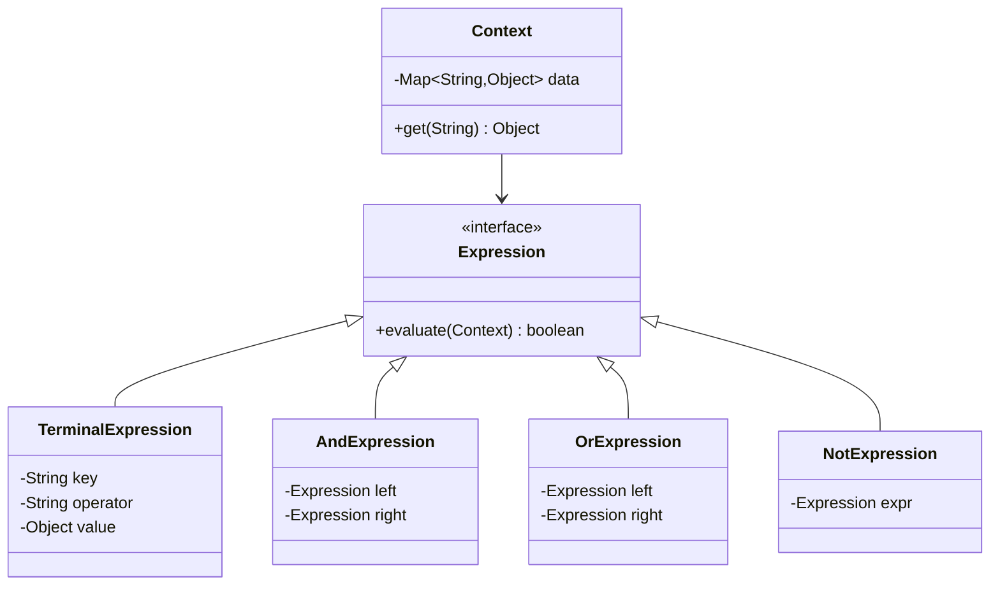

# 🚀 Interpreter Design Pattern – Production Level (Rule Engine)

---

# 🧠 Problem (Real-World)

We want to evaluate dynamic business rules like:

```text
(age > 18 AND country == "IN") OR (premiumUser == true)
```

👉 Used in:

* Feature flags
* Fraud detection
* Access control
* Search filters

---

# 🎯 Production Requirements

* ✅ Dynamic rule evaluation
* ✅ Extensible operators
* ✅ Reusable expressions (AST)
* ✅ Context-based evaluation
* ✅ Safe + maintainable

---

# 🧩 Architecture (AST-Based Interpreter)

---

## 🔥 Key Idea

👉 Instead of simple objects → build an **AST (Abstract Syntax Tree)**

---

## 🧩 UML Diagram



---

# ⚙️ Code (Production Ready)

---

## 1️⃣ Context (Runtime Data)

```java
import java.util.Map;

public class Context {

    private Map<String, Object> data;

    public Context(Map<String, Object> data) {
        this.data = data;
    }

    public Object get(String key) {
        return data.get(key);
    }
}
```

---

## 2️⃣ Expression Interface

```java
public interface Expression {
    boolean evaluate(Context context);
}
```

---

## 3️⃣ Terminal Expression (Condition)

```java
public class ConditionExpression implements Expression {

    private String key;
    private String operator;
    private Object value;

    public ConditionExpression(String key, String operator, Object value) {
        this.key = key;
        this.operator = operator;
        this.value = value;
    }

    @Override
    public boolean evaluate(Context context) {

        Object actual = context.get(key);

        switch (operator) {
            case ">":
                return ((Number) actual).doubleValue() > ((Number) value).doubleValue();

            case "<":
                return ((Number) actual).doubleValue() < ((Number) value).doubleValue();

            case "==":
                return actual.equals(value);

            case "!=":
                return !actual.equals(value);

            default:
                throw new RuntimeException("Unsupported operator");
        }
    }
}
```

---

## 4️⃣ Non-Terminal Expressions

---

### AND

```java
public class AndExpression implements Expression {

    private Expression left;
    private Expression right;

    public AndExpression(Expression left, Expression right) {
        this.left = left;
        this.right = right;
    }

    @Override
    public boolean evaluate(Context context) {
        return left.evaluate(context) && right.evaluate(context);
    }
}
```

---

### OR

```java
public class OrExpression implements Expression {

    private Expression left;
    private Expression right;

    public OrExpression(Expression left, Expression right) {
        this.left = left;
        this.right = right;
    }

    @Override
    public boolean evaluate(Context context) {
        return left.evaluate(context) || right.evaluate(context);
    }
}
```

---

### NOT

```java
public class NotExpression implements Expression {

    private Expression expr;

    public NotExpression(Expression expr) {
        this.expr = expr;
    }

    @Override
    public boolean evaluate(Context context) {
        return !expr.evaluate(context);
    }
}
```

---

# 🧪 Client Usage (REAL)

```java
import java.util.Map;

public class Main {
    public static void main(String[] args) {

        // Rule: (age > 18 AND country == "IN") OR premiumUser == true

        Expression rule =
            new OrExpression(
                new AndExpression(
                    new ConditionExpression("age", ">", 18),
                    new ConditionExpression("country", "==", "IN")
                ),
                new ConditionExpression("premiumUser", "==", true)
            );

        Context context = new Context(Map.of(
            "age", 20,
            "country", "IN",
            "premiumUser", false
        ));

        System.out.println(rule.evaluate(context)); // true
    }
}
```

---

# 🔄 Execution Flow

```mermaid
sequenceDiagram
    participant Client
    participant Or
    participant And
    participant Condition

    Client->>Or: evaluate()
    Or->>And: evaluate()
    And->>Condition: age > 18
    And->>Condition: country == IN
    Or->>Condition: premiumUser == true
```

---

# 🧠 Production Enhancements (IMPORTANT)

---

## ✅ 1. Parser Layer (String → AST)

👉 Input:

```text
age > 18 AND country == "IN"
```

👉 Convert to AST using:

* Tokenizer
* Parser

---

## ✅ 2. Operator Registry (EXTENSIBLE)

```java
Map<String, BiFunction<Object,Object,Boolean>> operators;
```

👉 Add new operator without changing code

---

## ✅ 3. Caching (Performance)

* Cache parsed AST
* Avoid re-parsing

---

## ✅ 4. Validation Layer

* Invalid syntax detection
* Type checking

---

## ✅ 5. Thread Safety

* Immutable expressions
* Stateless evaluation

---

# 🔥 Real Systems Using This Pattern

---

| System         | Usage                      |
| -------------- | -------------------------- |
| Feature Flags  | Enable/disable features    |
| Fraud Engines  | Detect suspicious activity |
| Search Filters | Dynamic queries            |
| Access Control | Policy rules               |

---

# ⚠️ Trade-offs

---

| Problem          | Solution         |
| ---------------- | ---------------- |
| Too many classes | Use parser + AST |
| Performance      | Cache AST        |
| Complex grammar  | Use ANTLR        |

---

# 💀 Staff-Level Insight

👉
“In production, Interpreter pattern evolves into a rule engine with AST, parser, caching, and extensible operator system.”

---

# 🚀 Final One-Liner

👉
“Interpreter pattern enables building rule engines by representing expressions as an AST and evaluating them dynamically using context.”

---
