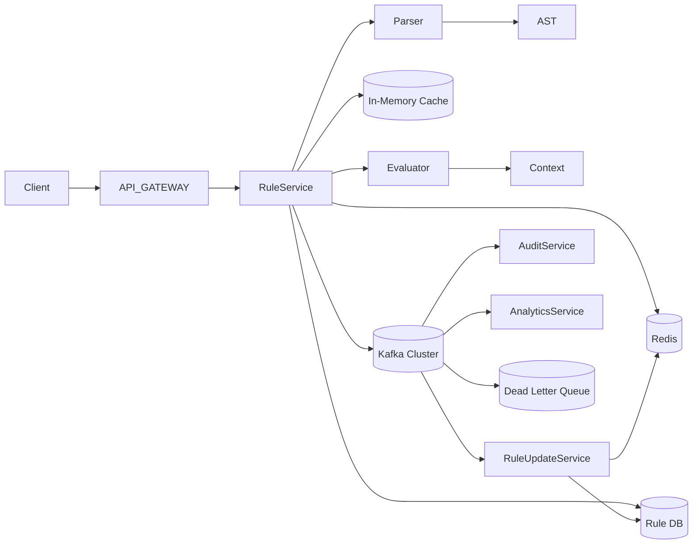
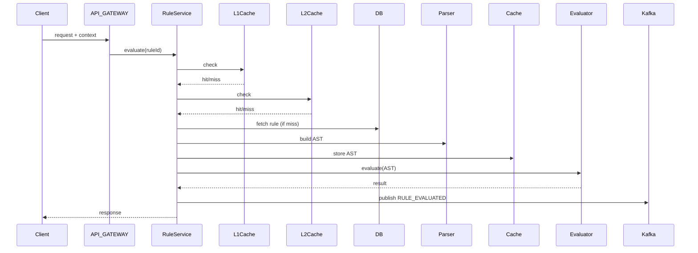
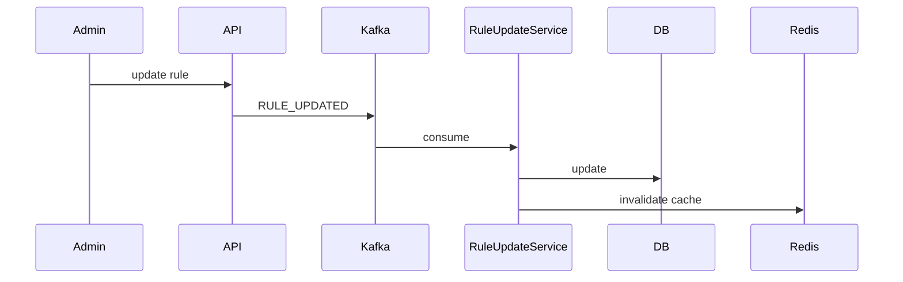

# 💀 Real Rule Engine System Design (Production / FAANG – FINAL)

---

# 🧠 Problem

We need a system that can evaluate rules like:

```json
{
  "rule": {
    "or": [
      {
        "and": [
          { "field": "age", "op": ">", "value": 18 },
          { "field": "country", "op": "==", "value": "IN" }
        ]
      },
      { "field": "premiumUser", "op": "==", "value": true }
    ]
  }
}
```

👉 Used in:

* Feature flags
* Fraud detection
* Personalization
* Access control

---

# 🏗️ High-Level Architecture



---

# 🧩 Core Components

---

## 1️⃣ API Gateway

* Authentication
* Rate limiting
* Routing

---

## 2️⃣ Rule Service (Stateless)

👉 Responsibilities:

* Fetch rule
* Validate
* Parse (if needed)
* Evaluate
* Publish events

---

## 3️⃣ Parser

👉 Converts JSON → AST

---

## 4️⃣ AST (Abstract Syntax Tree)

👉 Tree representation of rules

---

## 5️⃣ Evaluator

👉 Recursively evaluates AST

---

## 6️⃣ Context

```json
{
  "age": 25,
  "country": "IN",
  "premiumUser": false
}
```

---

## 7️⃣ Caching Layer

### L1 Cache (In-Memory)

* Hot rules
* Ultra fast

### L2 Cache (Redis)

* Shared cache
* AST storage

---

## 8️⃣ Database

👉 Stores:

* Rules
* Versions
* Metadata

---

## 9️⃣ Kafka (Event Backbone)

👉 Used for:

* Rule updates
* Audit logging
* Analytics
* Event replay

---

## 🔟 Rule Update Service

👉 Consumes Kafka:

* Updates DB
* Invalidates cache

---

## 1️⃣1️⃣ Audit Service

* Stores execution logs

---

## 1️⃣2️⃣ Analytics Service

* Tracks rule performance

---

# 🧠 LLD (Core Classes)

---

## Expression

```java
public interface Expression {
    boolean evaluate(Context context);
}
```

---

## Context

```java
public class Context {
    private Map<String, Object> data;

    public Object get(String key) {
        return data.get(key);
    }
}
```

---

## ConditionExpression

```java
public class ConditionExpression implements Expression {

    private String field;
    private String op;
    private Object value;

    public boolean evaluate(Context context) {
        Object actual = context.get(field);

        switch (op) {
            case ">":
                return ((Number) actual).doubleValue() > ((Number) value).doubleValue();
            case "==":
                return actual.equals(value);
            default:
                throw new RuntimeException("Invalid operator");
        }
    }
}
```

---

## AND / OR

```java
public class AndExpression implements Expression {
    private Expression left, right;

    public boolean evaluate(Context ctx) {
        if (!left.evaluate(ctx)) return false;
        return right.evaluate(ctx);
    }
}

public class OrExpression implements Expression {
    private Expression left, right;

    public boolean evaluate(Context ctx) {
        if (left.evaluate(ctx)) return true;
        return right.evaluate(ctx);
    }
}
```

---

# 🔄 Rule Evaluation Flow



---

# 🔄 Rule Update Flow



---

# ⚡ Performance Optimizations

* AST caching (Redis + Memory)
* Pre-compilation
* Short-circuit evaluation
* Batch processing

---

# 🔥 Kafka Design (IMPORTANT)

---

## Partition Strategy

```text
ruleId
```

👉 Ensures:

* Ordering
* Scalability

---

## Events

### RULE_EVALUATED

```json
{
  "eventId": "uuid",
  "ruleId": "R1",
  "result": true
}
```

---

### RULE_UPDATED

```json
{
  "ruleId": "R1",
  "version": 2
}
```

---

# 🔒 Production Hardening (CRITICAL)

---

## 1️⃣ Idempotency (Exactly-once behavior)

```java
if (processedEventStore.exists(eventId)) return;
```

---

## 2️⃣ Schema Validation

* JSON schema validation
* Type checking

---

## 3️⃣ Circuit Breaker

* Redis failure fallback
* Kafka retry

---

## 4️⃣ Rate Limiting

* API Gateway level

---

## 5️⃣ Observability

* Metrics (Prometheus)
* Logs
* Tracing

---

## 6️⃣ Cache Strategy

* L1 + L2
* TTL + invalidation

---

# 🚨 Failure Handling

---

## Kafka Down

* Retry queue
* DLQ

---

## Cache Failure

* Fallback to DB

---

## Bad Rule

* Reject at validation

---

# ⚖️ Trade-offs

| Decision | Trade-off    |
| -------- | ------------ |
| Kafka    | Complexity   |
| AST      | Memory       |
| Cache    | Invalidation |

---

# 🧠 Scaling Strategy

---

## Horizontal Scaling

* Stateless services
* Load balanced

---

## Kafka Scaling

* Partitions
* Consumer groups

---

# 💀 Real Systems

* Uber (pricing rules)
* Stripe (fraud detection)
* Amazon (recommendation filters)

---

# 🚀 Final Insight

👉
“This is a distributed rule engine built using Interpreter pattern, enhanced with AST parsing, Redis caching, Kafka-based event-driven architecture, and production-grade reliability features.”

---

# 🔥 Ultimate Interview Line

👉
“I use Interpreter pattern for rule evaluation and evolve it into a distributed system with Kafka for event-driven updates, Redis for caching, idempotency for correctness, and observability for production readiness.”

---
