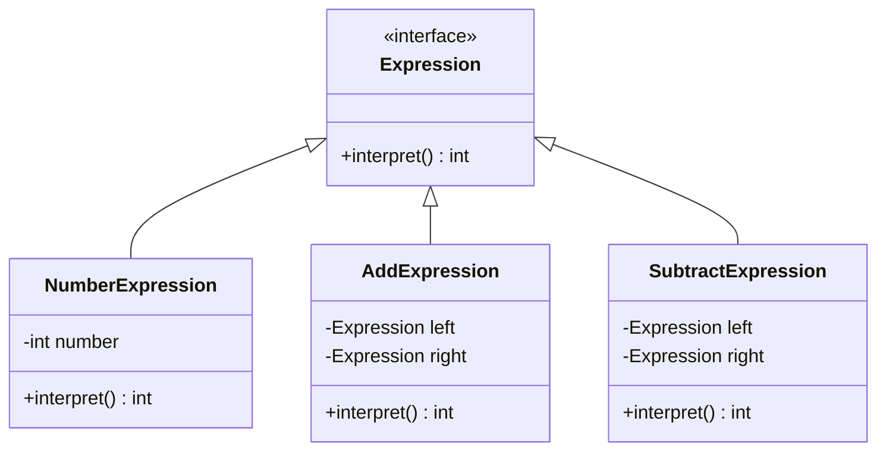
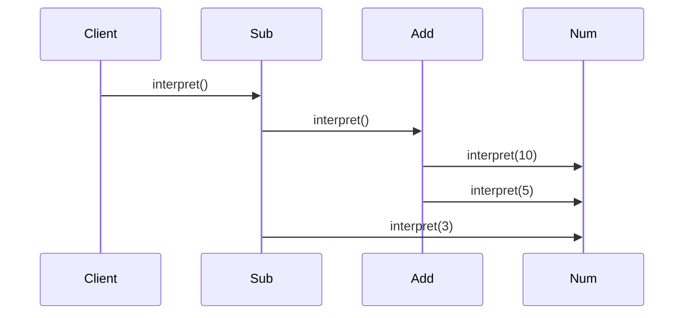

# 🧠 Interpreter Design Pattern – Complete Guide (SDE1/SDE2)

---

# 🔰 Introduction

---

## 🧠 What is Interpreter Pattern?

The **Interpreter Design Pattern** is a **behavioral design pattern** used to:

👉 **Define a grammar for a language and interpret sentences of that language**

---

## 🎯 Intent (GOF)

> Given a language, define a representation for its grammar along with an interpreter that uses the representation to interpret sentences in the language.

---

## ⚡ Real-Life Analogy

👉 Think of **Google Search Query**

* Input: `"apple AND mango"`
* System interprets:

  * AND → intersection
  * OR → union

👉 It parses + evaluates expression

---

## 🧩 When to Use?

* Simple language / DSL
* Expression evaluation
* Rule engines
* Query parsing

---

## ❌ When NOT to Use?

* Complex grammars (use parser generators like ANTLR)
* Performance-critical systems

---

# 🎯 SDE1/SDE2 Example

---

## 🧾 Problem

Evaluate expressions like:

```text
"10 + 5 - 3"
```

👉 We will interpret this using Interpreter Pattern

---

# 🧩 UML Diagram



---

# ⚙️ Code (Java)

---

## 1️⃣ Expression Interface

```java
public interface Expression {
    int interpret();
}
```

---

## 2️⃣ Terminal Expression

```java
public class NumberExpression implements Expression {

    private int number;

    public NumberExpression(int number) {
        this.number = number;
    }

    @Override
    public int interpret() {
        return number;
    }
}
```

---

## 3️⃣ Non-Terminal Expressions

---

### ➕ Addition

```java
public class AddExpression implements Expression {

    private Expression left;
    private Expression right;

    public AddExpression(Expression left, Expression right) {
        this.left = left;
        this.right = right;
    }

    @Override
    public int interpret() {
        return left.interpret() + right.interpret();
    }
}
```

---

### ➖ Subtraction

```java
public class SubtractExpression implements Expression {

    private Expression left;
    private Expression right;

    public SubtractExpression(Expression left, Expression right) {
        this.left = left;
        this.right = right;
    }

    @Override
    public int interpret() {
        return left.interpret() - right.interpret();
    }
}
```

---

## 4️⃣ Client Code

```java
public class Main {
    public static void main(String[] args) {

        // Expression: (10 + 5) - 3

        Expression expression =
            new SubtractExpression(
                new AddExpression(
                    new NumberExpression(10),
                    new NumberExpression(5)
                ),
                new NumberExpression(3)
            );

        System.out.println(expression.interpret()); // Output: 12
    }
}
```

---

# 🔄 Execution Flow



---

# 🧠 Key Concepts

---

## 🧩 Types of Expressions

| Type         | Description          |
| ------------ | -------------------- |
| Terminal     | Leaf node (Number)   |
| Non-Terminal | Combines expressions |

---

# 🔥 Real-World Use Cases (FAANG)

---

* SQL parsers
* Search filters (`AND`, `OR`)
* Rule engines
* Expression evaluators
* Compilers

---

# ⚠️ Limitations

---

* Hard to scale for complex grammar
* Class explosion
* Performance overhead

---

# 🧠 Interview Insights

---

## 💡 When to Use?

* DSL (domain-specific language)
* Expression parsing
* Rule-based systems

---

## 💡 Pattern Insight

👉
“Interpreter pattern represents grammar as class hierarchy and evaluates expressions using recursion.”

---

# 🚀 Summary

---

* Converts grammar → class structure
* Uses recursion to evaluate
* Best for simple expressions

---

# 🔥 One-Liner

👉
“Interpreter pattern is used to evaluate expressions by representing grammar rules as objects.”

---
