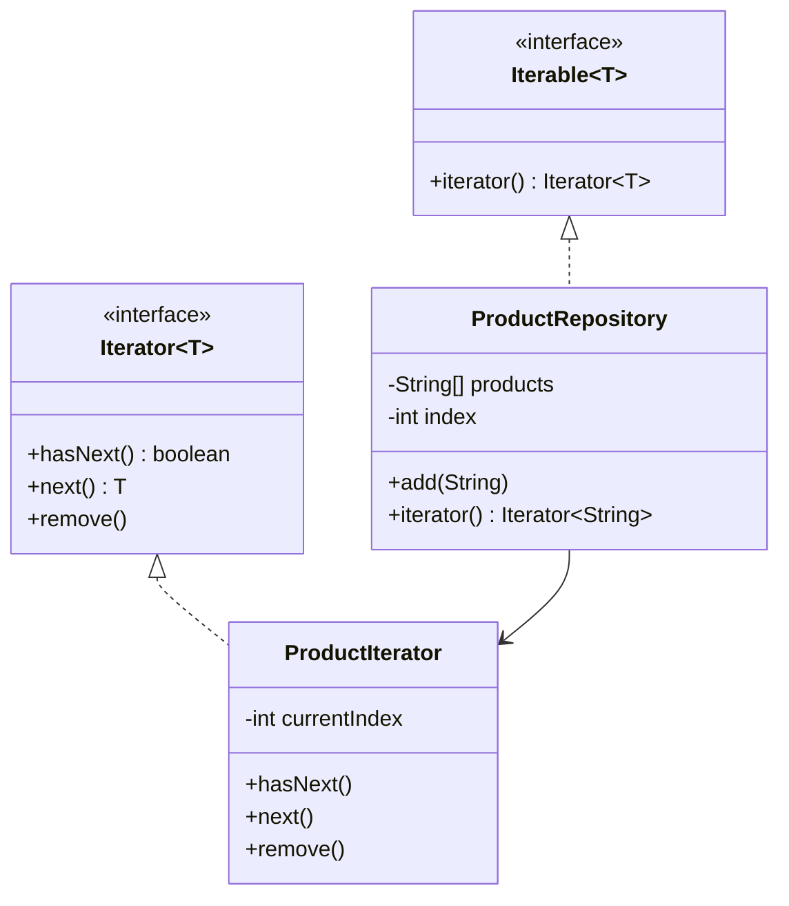
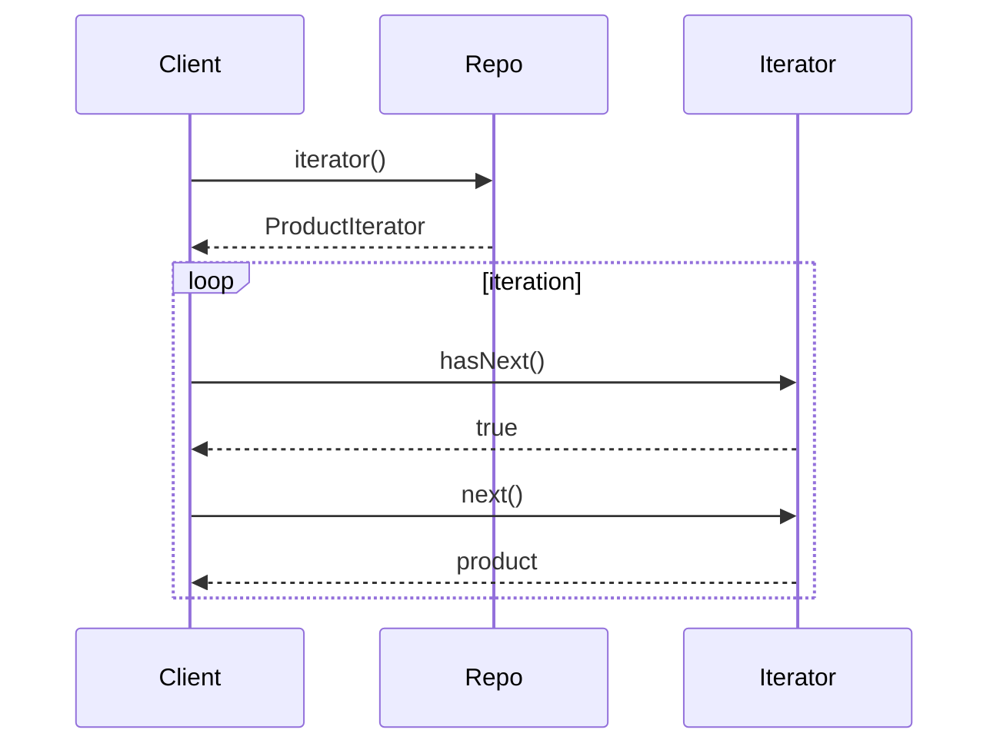

# 🔁 Iterator Design Pattern – ProductRepository (Java)

---

# 🧠 Problem Statement

We need a repository that:

* Stores products
* Dynamically resizes
* Allows safe iteration

👉 Without exposing internal array

---

# 🧩 UML Diagram



---

# ⚙️ Full Code (Clean + Fixed)

## 📦 ProductRepository

```java
package com.designpatternsaga.iterator;

import java.util.Iterator;

public class ProductRepository implements Iterable<String> {

    private String[] products;
    private int index;

    public ProductRepository() {
        products = new String[10];
        index = 0;
    }

    public void add(String product) {
        if (index == products.length) {
            String[] largerProducts = new String[products.length + 5];
            System.arraycopy(products, 0, largerProducts, 0, products.length);
            products = largerProducts;
        }
        products[index++] = product;
    }

    @Override
    public Iterator<String> iterator() {
        return new ProductIterator();
    }

    // 🔁 Inner Iterator Class
    private class ProductIterator implements Iterator<String> {

        private int currentIndex = 0;

        @Override
        public boolean hasNext() {
            return currentIndex < index; // FIXED
        }

        @Override
        public String next() {
            return products[currentIndex++];
        }

        @Override
        public void remove() {
            if (currentIndex <= 0) return;

            int removeIndex = currentIndex - 1;

            int numMoved = index - removeIndex - 1;
            if (numMoved > 0) {
                System.arraycopy(products, removeIndex + 1, products, removeIndex, numMoved);
            }

            products[--index] = null;
            currentIndex--;
        }
    }
}
```

---

# 🚀 Usage Example

```java
public class Main {
    public static void main(String[] args) {

        ProductRepository repo = new ProductRepository();

        repo.add("Laptop");
        repo.add("Phone");
        repo.add("Tablet");

        for (String product : repo) {
            System.out.println(product);
        }
    }
}
```

---

# 🔄 Execution Flow



---

# ⚠️ Key Fixes (INTERVIEW IMPORTANT)

---

## ✅ Fix 1: hasNext()

❌ Old:

```java
currentIndex < products.length && products[currentIndex] != null
```

✅ New:

```java
currentIndex < index
```

---

## ✅ Fix 2: remove()

* Proper shifting
* Updates index
* Avoids duplicate elements

---
# ⚠️ Important Observations (INTERVIEW GOLD)

---

## ❗ Issue 1: `hasNext()` Bug

### ❌ Problematic Code

```java
return currentIndex < products.length && products[currentIndex] != null;
```

---

### 🚨 Why This Is Wrong?

* Iteration depends on **array length**, not actual elements
* If a `null` appears in between, iteration **stops early**
* Breaks correct traversal logic

---

### ✅ Correct Approach

```java
return currentIndex < index;
```

👉 Always iterate till **actual size (`index`)**, not full array

---

## ❗ Issue 2: `remove()` Bug

### ❌ Problematic Code

```java
System.arraycopy(products, currentIndex + 1, products, currentIndex, products.length - 1);
```

---

### 🚨 Problems

* ❌ Wrong length calculation
* ❌ Does not update `index`
* ❌ Leaves duplicate elements
* ❌ Can cause ArrayIndexOutOfBounds

---

## ✅ Fixed Implementation

```java
@Override
public void remove() {
    if (currentIndex <= 0) return;

    int removeIndex = currentIndex - 1;

    int numMoved = index - removeIndex - 1;
    if (numMoved > 0) {
        System.arraycopy(products, removeIndex + 1, products, removeIndex, numMoved);
    }

    products[--index] = null;
    currentIndex--;
}
```

---

## 🧠 Why This Fix Works

* ✔ Shifts only **valid elements**
* ✔ Maintains correct `index`
* ✔ Avoids duplicates
* ✔ Keeps iterator consistent

---

## 🔥 Interview Insight

👉
“Always iterate based on actual collection size, not underlying storage capacity.
And when removing elements, ensure shifting + size update to maintain consistency.”

---

## 💡 Why Iterator Pattern?

* Encapsulation
* Standard traversal
* Clean design

---

## 💡 Where Used?

* Java Collections
* Streams
* Database cursors

---

# 🔥 One-Liner

👉
“Iterator pattern provides a standard way to traverse a collection without exposing its internal structure.”

---
