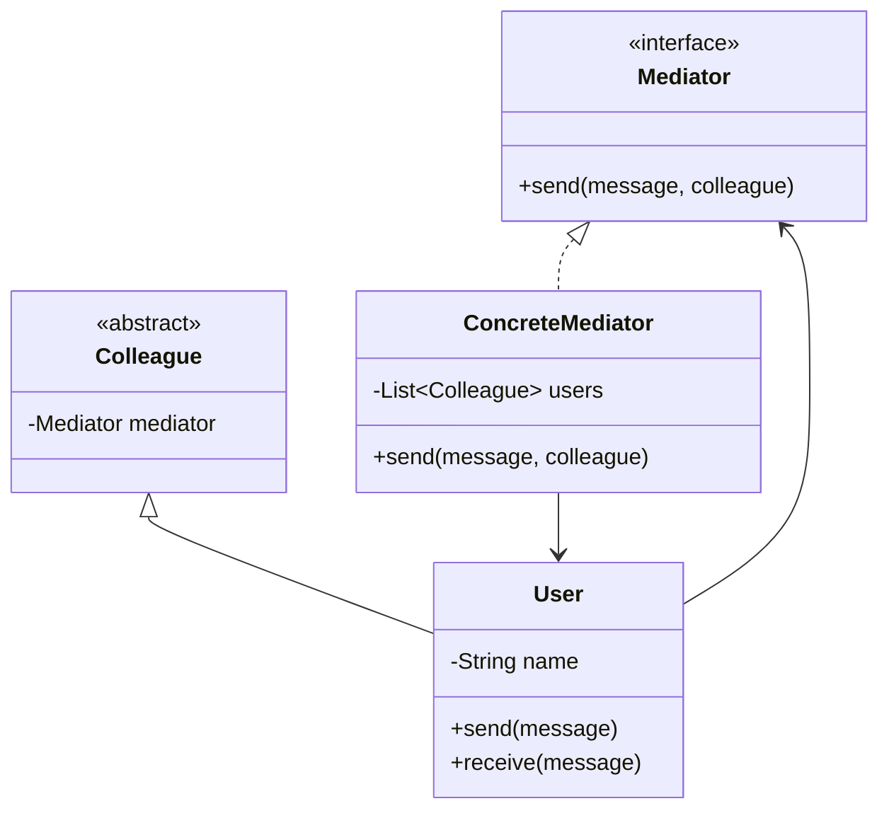
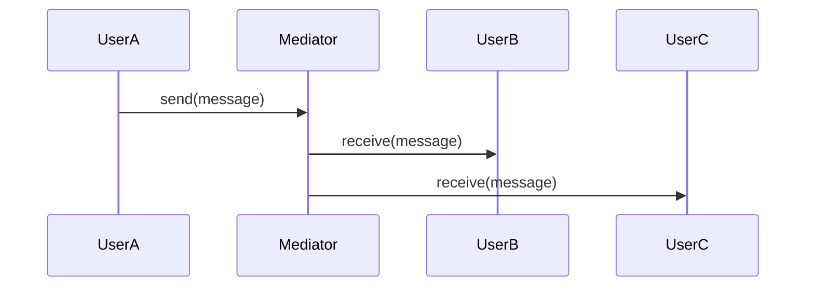
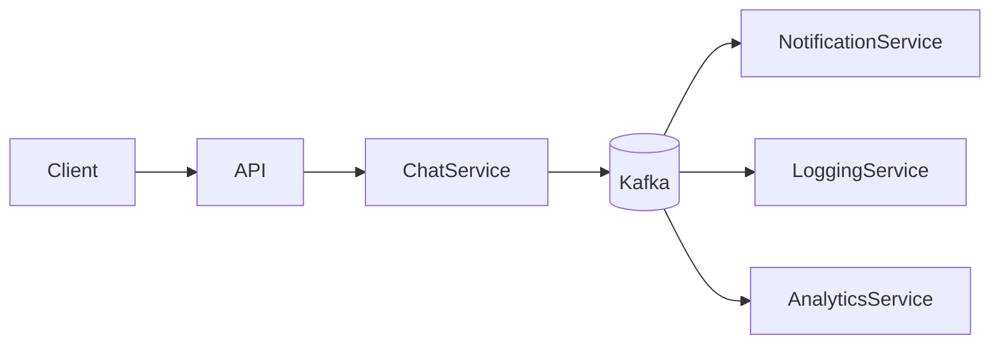
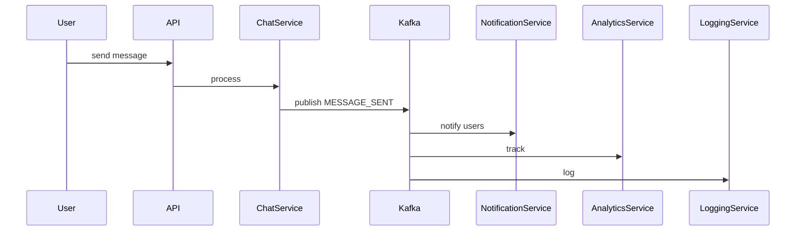

# 💀 Mediator Design Pattern – Production / FAANG (FINAL)

---

# 🧠 Problem

Multiple objects directly communicate → **tight coupling**

Example:

* Chat app (users talk to each other)
* Order system (services interact)
* UI components (button → textbox → form)

👉 Without mediator:

* N² dependencies
* Hard to maintain
* Spaghetti communication

---

# 🎯 Solution

👉 Introduce a **Mediator** that:

* Centralizes communication
* Decouples components
* Controls interaction

---

# 🔰 Introduction

---

## 🧠 What is Mediator Pattern?

A **behavioral design pattern** that:

👉 Defines an object that encapsulates how a set of objects interact

---

## 🎯 Intent (GOF)

> Define an object that encapsulates how a set of objects interact.

---

## ⚡ Real-Life Analogy

👉 Think of **Air Traffic Control**

* Planes don’t talk to each other
* They talk to control tower

👉 Tower = Mediator

---

# 🧩 UML Diagram



---

# ⚙️ Code (Java – Clean)

---

## 1️⃣ Mediator Interface

```java id="med1"
public interface Mediator {
    void send(String message, User sender);
}
```

---

## 2️⃣ Concrete Mediator

```java id="med2"
import java.util.ArrayList;
import java.util.List;

public class ChatMediator implements Mediator {

    private List<User> users = new ArrayList<>();

    public void addUser(User user) {
        users.add(user);
    }

    @Override
    public void send(String message, User sender) {
        for (User user : users) {
            if (user != sender) {
                user.receive(message);
            }
        }
    }
}
```

---

## 3️⃣ Colleague (User)

```java id="med3"
public class User {

    private String name;
    private Mediator mediator;

    public User(String name, Mediator mediator) {
        this.name = name;
        this.mediator = mediator;
    }

    public void send(String message) {
        mediator.send(name + ": " + message, this);
    }

    public void receive(String message) {
        System.out.println(name + " received: " + message);
    }
}
```

---

## 4️⃣ Client Code

```java id="med4"
public class Main {
    public static void main(String[] args) {

        ChatMediator mediator = new ChatMediator();

        User u1 = new User("A", mediator);
        User u2 = new User("B", mediator);
        User u3 = new User("C", mediator);

        mediator.addUser(u1);
        mediator.addUser(u2);
        mediator.addUser(u3);

        u1.send("Hello everyone");
    }
}
```

---

# 🔄 Execution Flow



---

# ⚠️ Without Mediator (Problem)

* User A → User B
* User A → User C
* User B → User C

👉 Explosion of dependencies

---

# ⚡ With Mediator

* All communication via mediator
* Clean structure

---

# 🔥 Production-Level Upgrade

---

# 🏗️ Distributed Mediator System (Event-Based)



---

# 🧩 Components

---

## 1️⃣ Chat Service (Mediator)

* Handles messages
* Publishes events

---

## 2️⃣ Kafka (Mediator Backbone)

👉 Decouples services:

* Messaging
* Notifications
* Analytics

---

## 3️⃣ Consumers

* Notification service
* Logging
* Analytics

---

# 🔄 Distributed Flow



---

# 🔥 Kafka Event

```json id="med8"
{
  "eventId": "uuid",
  "type": "MESSAGE_SENT",
  "sender": "user1",
  "message": "hello"
}
```

---

# ⚡ Production Enhancements

---

## 1️⃣ Idempotency

```java id="med9"
if (processedEventStore.exists(eventId)) return;
```

---

## 2️⃣ Rate Limiting

* Prevent spam

---

## 3️⃣ Persistence

* Store messages in DB

---

## 4️⃣ Retry + DLQ

* Kafka failure handling

---

## 5️⃣ Observability

* Metrics
* Logs
* Tracing

---

# 🔒 Failure Handling

---

## Kafka Down

* Retry
* Queue locally

---

## Service Down

* Replay events

---

# ⚖️ Trade-offs

| Decision | Trade-off          |
| -------- | ------------------ |
| Mediator | Central bottleneck |
| Kafka    | Complexity         |

---

# 🧠 Scaling Strategy

---

## Horizontal Scaling

* Stateless services

---

## Kafka Scaling

* Partition by userId

---

# 💀 Real Systems

* Chat systems
* Microservices communication
* Event buses

---

# 🚀 Final Insight

👉
“Mediator pattern centralizes communication, and in distributed systems it evolves into an event-driven architecture using Kafka.”

---

# 🔥 Interview Killer Line

👉
“I would use Mediator pattern to decouple components, and in production evolve it into an event-driven system using Kafka to remove direct dependencies and enable scalability.”

---
