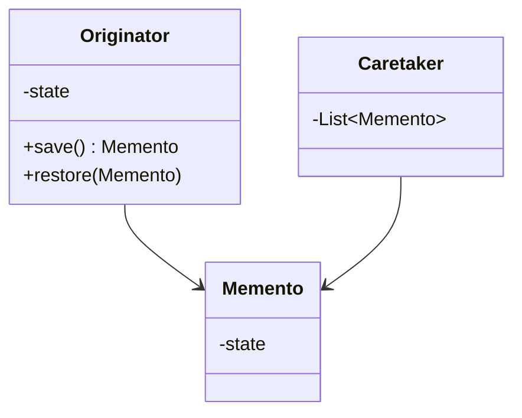
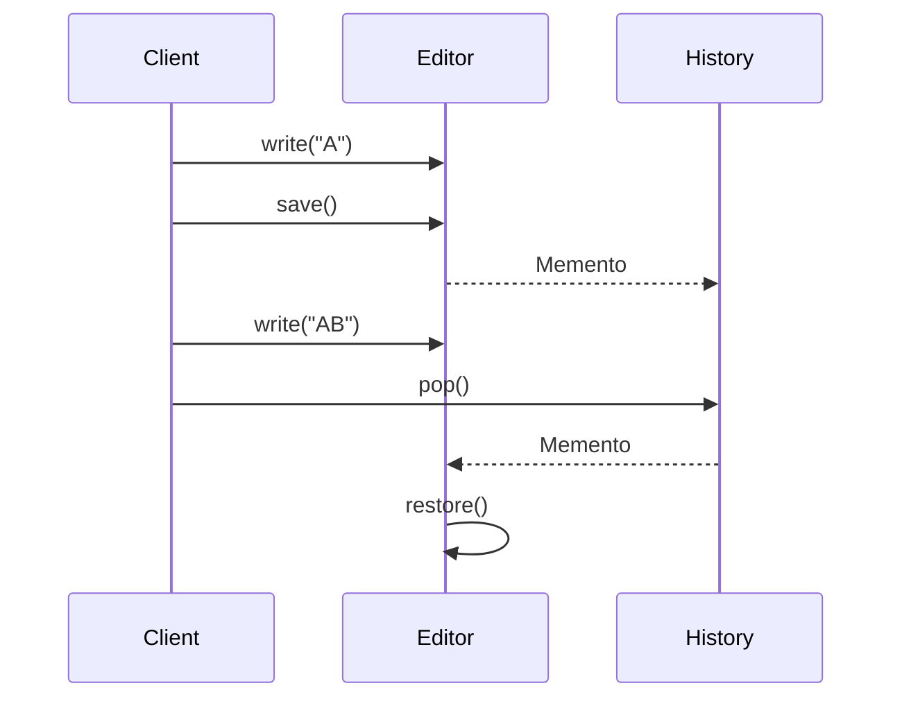
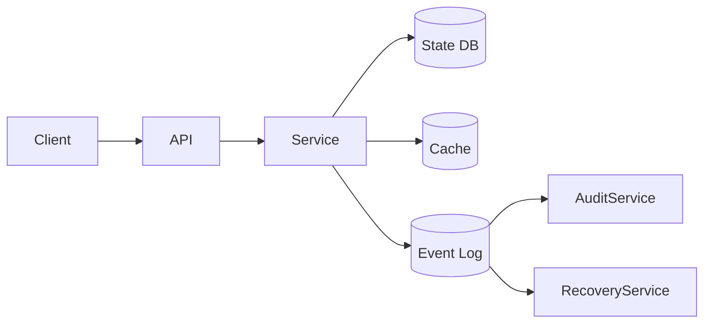
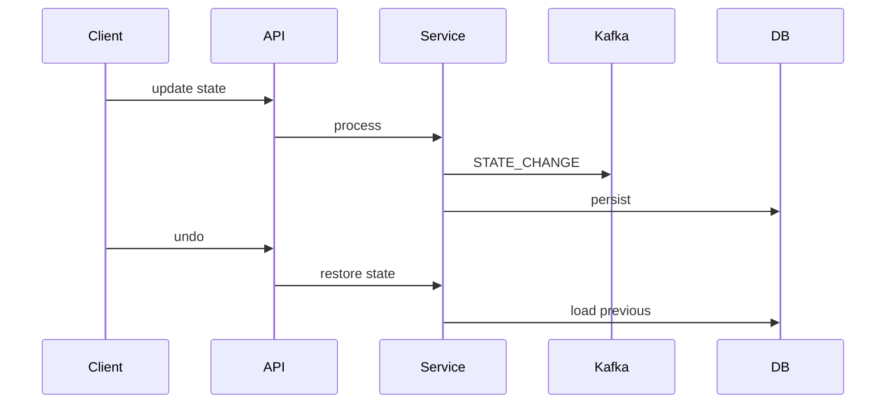

# 💀 Memento Design Pattern – Production / FAANG (FINAL)

---

# 🧠 Problem

We need to:

* Save object state
* Restore previous state (undo)
* Without exposing internal details

---

👉 Example:

* Text editor undo/redo
* Game save/load
* Transaction rollback

---

## ❗ Challenge

* Don’t expose internal state
* Maintain history safely
* Support multiple undo

---

# 🎯 Solution

👉 Use **Memento Pattern**

* Save state externally
* Restore when needed

---

# 🔰 Introduction

---

## 🧠 What is Memento Pattern?

A **behavioral design pattern** that:

👉 Captures and restores an object’s internal state without violating encapsulation

---

## 🎯 Intent (GOF)

> Without violating encapsulation, capture and externalize an object's internal state.

---

## ⚡ Real-Life Analogy

👉 Think of **Undo in Notepad**

* You type → state saved
* Press undo → previous state restored

---

# 🧩 UML Diagram



---

# ⚙️ Code (Java – Core Example: Text Editor)

---

## 1️⃣ Memento

```java id="mem2"
public class Memento {

    private final String state;

    public Memento(String state) {
        this.state = state;
    }

    public String getState() {
        return state;
    }
}
```

---

## 2️⃣ Originator (Editor)

```java id="mem3"
public class Editor {

    private String content;

    public void write(String text) {
        content = text;
    }

    public Memento save() {
        return new Memento(content);
    }

    public void restore(Memento memento) {
        content = memento.getState();
    }

    public String getContent() {
        return content;
    }
}
```

---

## 3️⃣ Caretaker (History Manager)

```java id="mem4"
import java.util.Stack;

public class History {

    private Stack<Memento> stack = new Stack<>();

    public void push(Memento m) {
        stack.push(m);
    }

    public Memento pop() {
        return stack.pop();
    }
}
```

---

## 4️⃣ Client Code

```java id="mem5"
public class Main {

    public static void main(String[] args) {

        Editor editor = new Editor();
        History history = new History();

        editor.write("A");
        history.push(editor.save());

        editor.write("AB");
        history.push(editor.save());

        editor.write("ABC");

        System.out.println(editor.getContent()); // ABC

        editor.restore(history.pop());
        System.out.println(editor.getContent()); // AB

        editor.restore(history.pop());
        System.out.println(editor.getContent()); // A
    }
}
```

---

# 🔄 Execution Flow



---

# ⚠️ Without Memento (Problem)

* Expose internal state ❌
* Hard to maintain history ❌
* Tight coupling ❌

---

# ⚡ With Memento

* Encapsulation preserved ✔
* Easy undo/redo ✔
* Clean history management ✔

---

# 🔥 Production-Level Example

---

# 🏗️ Distributed Undo System (Document Editor / DB)



---

# 🧩 Components

---

## 1️⃣ Service (Originator)

* Maintains state
* Creates mementos

---

## 2️⃣ Memento Store

👉 Stored in:

* DB
* Redis
* Kafka log

---

## 3️⃣ Caretaker

* Manages history
* Undo/redo

---

## 4️⃣ Kafka (Event Sourcing)

👉 Stores:

* State changes
* Enables replay

---

# 🔄 Distributed Flow



---

# 🔥 Functional Requirements

---

* Save state
* Undo/redo
* Restore history
* Support multiple versions

---

# ⚡ Non-Functional Requirements

---

## 1️⃣ Scalability

* Millions of state changes

---

## 2️⃣ Performance

* Fast undo

---

## 3️⃣ Reliability

* No data loss

---

## 4️⃣ Consistency

* Correct state restore

---

# 🔒 Production Enhancements

---

## 1️⃣ Event Sourcing (IMPORTANT)

👉 Store all states in Kafka

---

## 2️⃣ Compression

* Reduce memory usage

---

## 3️⃣ Snapshotting

* Save periodic full states

---

## 4️⃣ Idempotency

```java id="mem9"
if (eventProcessed) return;
```

---

## 5️⃣ Caching

* Store latest state in Redis

---

# 🚨 Failure Handling

---

## DB Failure

* Recover from Kafka

---

## Partial State Loss

* Replay events

---

# ⚖️ Trade-offs

| Decision | Trade-off       |
| -------- | --------------- |
| Memento  | Memory overhead |
| History  | Storage cost    |
| Kafka    | Complexity      |

---

# 💀 Real Systems

* Text editors
* Database rollback
* Version control systems

---

# 🚀 Final Insight

👉
“Memento pattern enables undo/redo by storing state snapshots, and in production it evolves into event sourcing with Kafka for durability and replay.”

---

# 🔥 Interview Killer Line

👉
“I use Memento pattern for state snapshots and extend it into event sourcing using Kafka to enable scalable undo/redo and recovery.”

---
