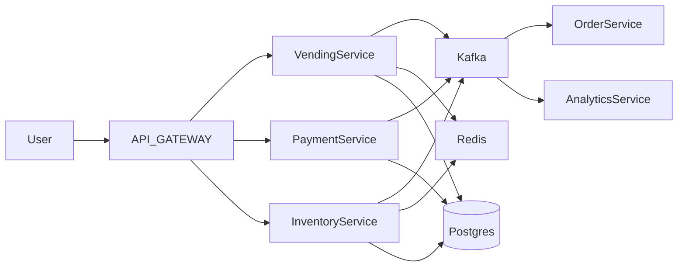
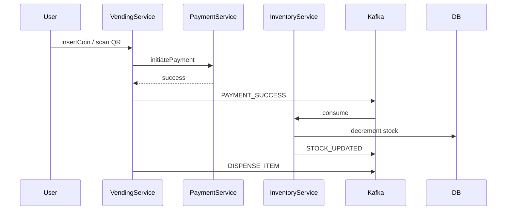

# 🌍 Distributed Vending Machine System (FAANG Level)

---

# 🧠 Problem Upgrade

We now need to support:

* 🏪 Thousands of vending machines
* 🌐 Distributed across cities
* ⚡ Real-time inventory sync
* 💳 Payments (UPI / Cards)
* 📡 Event-driven architecture
* 🔄 Fault tolerance & recovery

---

# 🏗️ High-Level Architecture (Microservices)



---

# 🧩 Core Microservices

## 1️⃣ Vending Service (State Machine Engine)

👉 Handles:

* State transitions
* Machine operations
* User interaction

👉 Internally uses:

* State Pattern (LLD we built)
* Transition validator

---

## 2️⃣ Inventory Service

👉 Tracks:

* Item stock per machine
* Refill events
* Low stock alerts

👉 Optimized using:

* Redis cache (fast reads)
* DB (source of truth)

---

## 3️⃣ Payment Service

👉 Handles:

* UPI / Card / Wallet
* Payment success/failure
* Refunds

👉 Integrations:

* Razorpay / Stripe

---

## 4️⃣ Order Service

👉 Maintains:

* Transaction history
* Order lifecycle

---

## 5️⃣ Analytics Service

👉 Tracks:

* Sales
* Machine usage
* Failure rates

---

# 🔄 Event-Driven Flow (REAL FLOW)



---

# ⚡ Redis Caching Strategy

## 🎯 Why Redis?

* O(1) reads
* Reduce DB load
* Real-time stock checks

---

## 🔥 Example

```java
public int getStock(String machineId, String itemId) {
    String key = "stock:" + machineId + ":" + itemId;

    Integer stock = redis.get(key);
    if (stock != null) return stock;

    stock = db.getStock(machineId, itemId);
    redis.set(key, stock);

    return stock;
}
```

---

# 🔒 Distributed Locking (CRITICAL)

👉 Problem:
Multiple users hitting same machine → race condition

👉 Solution:
**Redis Distributed Lock (Redlock)**

```java
public void purchaseItem(String machineId) {
    String lockKey = "lock:" + machineId;

    if (!redis.tryLock(lockKey)) {
        throw new RuntimeException("Machine busy");
    }

    try {
        // critical section
        processOrder();
    } finally {
        redis.unlock(lockKey);
    }
}
```

---

# 🧠 State Consistency Strategy

## ❗ Problem

* VendingService state
* InventoryService stock

👉 Can go inconsistent

---

## ✅ Solution: Eventual Consistency

* Kafka ensures ordered events
* Services sync asynchronously

---

# 💾 Database Design

## 🧾 Tables

### vending_machine

```sql
machine_id | state | location | last_updated
```

### inventory

```sql
machine_id | item_id | stock
```

### orders

```sql
order_id | machine_id | item_id | status | created_at
```

---

# 🔄 Failure Handling

## 🚨 Case 1: Payment Success but No Dispense

👉 Fix:

* Retry via Kafka consumer
* Idempotent operations

---

## 🚨 Case 2: Machine Crash

👉 Fix:

* Restore state from DB
* Replay Kafka events

---

# ⚡ Scaling Strategy

## Horizontal Scaling

* Stateless services
* Auto-scale via Kubernetes

---

## Partitioning

* Kafka partition by `machine_id`
* Ensures order per machine

---

# 🔐 API Gateway Responsibilities

* Authentication
* Rate limiting
* Routing

---

# 🔥 Advanced Enhancements

## 1️⃣ Real-Time Monitoring

* Prometheus + Grafana
* Machine health dashboard

---

## 2️⃣ ML Integration

* Demand prediction
* Auto-refill optimization

---

## 3️⃣ Edge Computing

👉 Put logic inside machine itself

* Offline mode
* Sync when online

---

# 🧠 FAANG-Level Insights

## 💡 Key Patterns Used

* State Pattern → behavior
* Saga Pattern → distributed transactions
* Event Sourcing → replay system
* CQRS → read/write separation

---

# 🚀 Final Architecture Summary

👉 From simple class design → we built:

* Distributed system
* Event-driven pipeline
* Strong consistency via locks
* High scalability

---

# 🔥 Interview Killer Line

👉
“Initially, I modeled the vending machine using the State Pattern.
In production, I evolved it into a distributed event-driven system using Kafka, Redis, and microservices with eventual consistency and distributed locking.”

---
