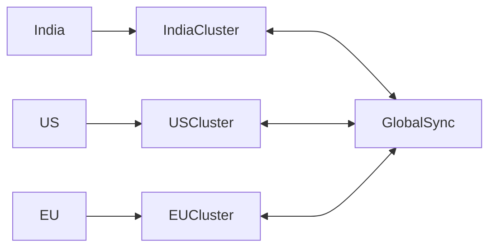

# 🧠 Principal-Level System Design – Vending Platform at Planet Scale

---
Now we’re at Principal Engineer / Architect depth — this is where interviews shift from “can you design?” to “can you run this at scale, efficiently, and safely under chaos?”

This is less about components… more about trade-offs, numbers, cost, and failure psychology.

---

# 🎯 Core Mindset Shift

At this level, focus on:

* 💰 Cost efficiency (₹₹₹ matters)
* 📊 Capacity planning (numbers, not assumptions)
* ⚡ Throughput & backpressure
* 🔥 Failure-first design (chaos-ready)
* 🌍 Global optimization (not just scaling)

---

# 📊 1️⃣ Capacity Planning (MANDATORY)

## 🎯 Assumptions

* 10M machines globally
* Each machine → 50 transactions/day
* Peak factor = 5x

---

## 🔢 Calculations

### Daily Traffic

```
10M × 50 = 500M transactions/day
```

### QPS

```
500M / 86400 ≈ ~5800 QPS (avg)
Peak = ~30K QPS
```

---

## 📡 Kafka Planning

* 30K QPS peak
* 1 partition ≈ 1K QPS

👉 Required partitions:

```
30K / 1K = ~30 partitions minimum
```

👉 Production safe:

```
100–150 partitions (buffer + scaling)
```

---

# 💰 2️⃣ Cost Optimization (REAL WORLD)

---

## ❗ Biggest Cost Drivers

* Kafka clusters
* Storage (event logs)
* Cross-region traffic
* Redis clusters

---

## ✅ Strategies

### 1. Tiered Storage

* Hot data → SSD
* Cold data → S3

---

### 2. Event Compaction

👉 Keep only latest state

Instead of:

```
ITEM_ADDED
ITEM_REMOVED
ITEM_REMOVED
```

Store:

```
FINAL_STATE
```

---

### 3. Reduce Cross-Region Calls

❌ Bad:

* India machine → US DB

✅ Good:

* Regional isolation

---

# ⚡ 3️⃣ Backpressure Handling (CRITICAL)

## ❗ Problem

Traffic spike → system crash

---

## ✅ Multi-layer Backpressure

### Layer 1: API Gateway

* Rate limiting
* Token bucket

---

### Layer 2: Kafka

* Consumer lag detection
* Auto scaling consumers

---

### Layer 3: Service

```java
if (queueSize > THRESHOLD) {
    rejectRequest();
}
```

---

## 🔥 Strategy

* Drop non-critical events
* Prioritize payment & dispense

---

# 🌊 4️⃣ Data Lifecycle Strategy

---

## 🧾 Data Types

| Data         | Retention  |
| ------------ | ---------- |
| Transactions | 1 year     |
| Logs         | 7 days     |
| Metrics      | Aggregated |

---

## 🧠 Strategy

* Kafka → short retention
* DB → long-term
* S3 → archive

---

# 🧠 5️⃣ Chaos Engineering (REAL SYSTEM TEST)

---

## 🔥 Inject Failures

* Kill Kafka brokers
* Drop DB connections
* Simulate network partition

---

## 🛠 Tools

* Chaos Monkey
* Gremlin

---

## 🎯 Goal

👉 System should:

* Degrade gracefully
* Not collapse

---

# 🔄 6️⃣ Multi-Region Strategy (ADVANCED)



---

## 🧠 Data Strategy

* Write → local region
* Read → local
* Global sync → async

---

## ⚖️ Consistency Model

| Component | Consistency |
| --------- | ----------- |
| Payment   | Strong      |
| Inventory | Eventual    |
| Analytics | Eventual    |

---

# ⚡ 7️⃣ Hotspot Handling

## ❗ Problem

Popular machine → overload

---

## ✅ Solutions

* Shard by machine_id
* Virtual partitioning
* Adaptive throttling

---

# 🔐 8️⃣ Security at Scale

---

## 🔑 Machine Authentication

* Each machine has signed token
* Rotated periodically

---

## 🛡️ Protection

* Replay attack prevention
* Encrypted communication (TLS)

---

# 📈 9️⃣ Observability at Scale

---

## 🔍 Golden Signals

* Latency
* Traffic
* Errors
* Saturation

---

## 🧠 Advanced

* Distributed tracing sampling
* Anomaly detection (ML)

---

# 🔥 🔟 SLO / SLA Design

---

## 🎯 Example

* 99.9% success rate
* <200ms latency

---

## 💡 Error Budget

```
0.1% failure allowed
```

👉 Used for:

* Deployments
* Experiments

---

# 🧠 11️⃣ Deployment Strategy

---

## ✅ Safe Deployment

* Blue-Green
* Canary

---

## 🔥 Example

* Release to 5% machines
* Monitor
* Rollout

---

# 💀 Final Architecture Thinking

---

## 🧠 Key Principles

* Avoid unnecessary consistency
* Push logic to edge
* Prefer partitioning over locking
* Design for failure first
* Optimize for cost early

---

# 🚀 Final Evolution

| Level     | Focus                  |
| --------- | ---------------------- |
| LLD       | Classes                |
| SDE1      | Clean code             |
| SDE2      | Distributed system     |
| Staff     | Reliability            |
| Principal | Cost + Scale + Failure |

---

# 💀 Ultimate Principal Closing Line

👉
“I designed the system not just for correctness, but for cost efficiency, failure resilience, and global scalability. I used partitioning to avoid locks, idempotency for correctness, CQRS for scale, and multi-region isolation to minimize latency and cross-region cost.”

---
