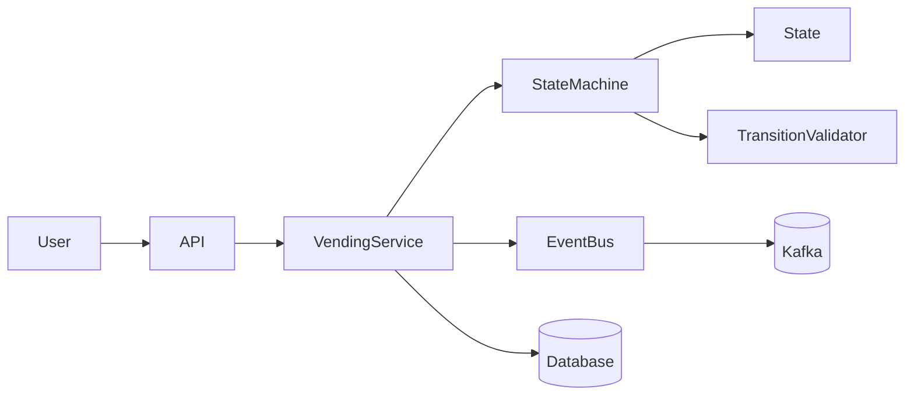
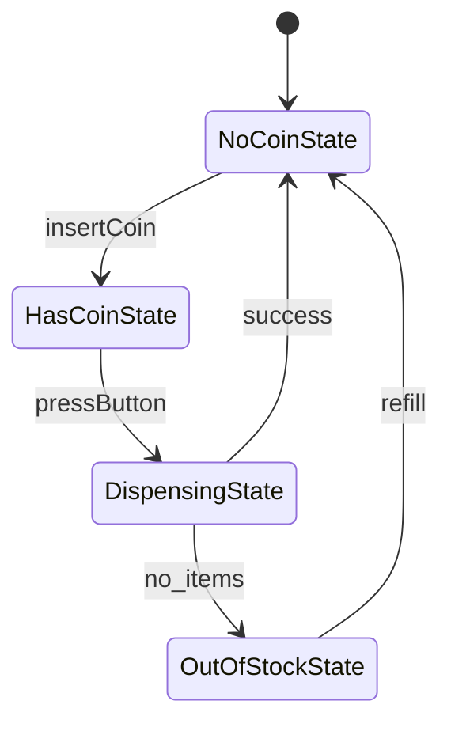

Here’s your **production-level, FAANG-grade upgrade** of the same system — with:

* State validation graph
* Thread safety
* Event-driven (Kafka-style) transitions
* Persistence (DB restore)
* Extensible architecture

---

# 🚀 Production-Grade State Pattern – Vending Machine

---

# 🧠 System Goals

We are upgrading the basic vending machine to:

* Handle **concurrent users (thread-safe)**
* Support **event-driven architecture (Kafka-like)**
* Enable **state persistence (DB restore)**
* Validate **legal state transitions**
* Be **extensible for real production systems**

---

# 🏗️ High-Level Architecture



---

# 🧩 State Transition Graph (STRICT VALIDATION)



---

# ⚠️ Why Transition Validation?

👉 Prevent illegal transitions like:

* NoCoin → Dispensing ❌
* OutOfStock → HasCoin ❌

---

# 🧠 Transition Validator

```java
import java.util.*;

public class StateTransitionValidator {

    private static final Map<Class<?>, Set<Class<?>>> allowedTransitions = new HashMap<>();

    static {
        allowedTransitions.put(NoCoinState.class, Set.of(HasCoinState.class));
        allowedTransitions.put(HasCoinState.class, Set.of(DispensingState.class));
        allowedTransitions.put(DispensingState.class, Set.of(NoCoinState.class, OutOfStockState.class));
        allowedTransitions.put(OutOfStockState.class, Set.of(NoCoinState.class));
    }

    public static boolean isValid(State from, State to) {
        return allowedTransitions
                .getOrDefault(from.getClass(), Collections.emptySet())
                .contains(to.getClass());
    }
}
```

---

# 🔒 Thread-Safe Vending Machine

```java
import java.util.concurrent.locks.ReentrantLock;

public class VendingMachine {

    private final ReentrantLock lock = new ReentrantLock();

    private State currentState;
    private int count;

    public void insertCoin() {
        lock.lock();
        try {
            currentState.insertCoin();
        } finally {
            lock.unlock();
        }
    }

    public void pressButton() {
        lock.lock();
        try {
            currentState.pressButton();
            currentState.dispense();
        } finally {
            lock.unlock();
        }
    }

    public void setState(State newState) {
        if (!StateTransitionValidator.isValid(currentState, newState)) {
            throw new IllegalStateException("Invalid transition");
        }
        this.currentState = newState;
    }
}
```

---

# 📡 Event-Driven Architecture (Kafka Style)

## 🎯 Why?

* Decouple services
* Enable async processing
* Scale independently

---

## 🧾 Event Model

```java
public class VendingEvent {
    public String eventType; // COIN_INSERTED, BUTTON_PRESSED, DISPENSED
    public String machineId;
    public long timestamp;
}
```

---

## 📤 Event Publisher

```java
public class EventPublisher {

    public void publish(VendingEvent event) {
        System.out.println("Publishing event: " + event.eventType);
        // Kafka producer logic here
    }
}
```

---

## 🔄 Usage in State

```java
public class HasCoinState implements State {

    private VendingMachine machine;
    private EventPublisher publisher;

    public HasCoinState(VendingMachine machine, EventPublisher publisher) {
        this.machine = machine;
        this.publisher = publisher;
    }

    @Override
    public void pressButton() {
        publisher.publish(new VendingEvent("BUTTON_PRESSED", "VM1", System.currentTimeMillis()));
        machine.setState(machine.getDispensingState());
    }
}
```

---

# 💾 Persistence Layer (DB Restore)

## 🎯 Why?

* System crash recovery
* Distributed system sync
* Audit logging

---

## 🧾 DB Schema

```sql
CREATE TABLE vending_machine (
    machine_id VARCHAR PRIMARY KEY,
    state VARCHAR,
    item_count INT,
    last_updated TIMESTAMP
);
```

---

## 💾 Repository

```java
public class VendingRepository {

    public void save(String machineId, String state, int count) {
        // DB save logic
    }

    public MachineSnapshot load(String machineId) {
        // DB fetch logic
        return new MachineSnapshot("NoCoinState", 5);
    }
}
```

---

## 🔄 Restore State

```java
public void restoreState(String machineId) {
    MachineSnapshot snapshot = repository.load(machineId);

    switch (snapshot.state) {
        case "NoCoinState" -> currentState = noCoinState;
        case "HasCoinState" -> currentState = hasCoinState;
        case "DispensingState" -> currentState = dispensingState;
        case "OutOfStockState" -> currentState = outOfStockState;
    }

    this.count = snapshot.count;
}
```

---

# 🧠 LLD Improvements (FAANG Level)

## ✅ Separation of Concerns

| Component  | Responsibility      |
| ---------- | ------------------- |
| State      | Behavior logic      |
| Context    | State management    |
| Validator  | Transition rules    |
| Repository | Persistence         |
| EventBus   | Async communication |

---

## ✅ Extensibility

Add new state like:

```java
MaintenanceState
RefundState
PaymentFailedState
```

👉 No change required in existing states → **Open/Closed Principle**

---

# ⚡ Real Production Use Cases

| System | State Example                             |
| ------ | ----------------------------------------- |
| Swiggy | OrderPlaced → Preparing → Delivered       |
| Uber   | Requested → Accepted → InTrip → Completed |
| ATM    | Idle → CardInserted → PinVerified         |
| TCP    | LISTEN → SYN_SENT → ESTABLISHED           |

---

# 🚀 Final Takeaways

* State Pattern becomes **State Machine in production**
* Add:

  * Validation
  * Concurrency control
  * Event streaming
  * Persistence
* Converts simple design → **Distributed scalable system**

---

# 🔥 Interview Punchline

👉 “In production, State Pattern evolves into a **finite state machine with validation, persistence, and event-driven transitions**, enabling scalability and reliability.”

---

---

If you want next level (real FAANG depth), I can take this into:

* ✅ **Distributed vending system (multiple machines sync)**
* ✅ **Rate limiter + cache integration (Redis)**
* ✅ **Full microservices split (Order, Payment, Inventory)**
* ✅ **Kubernetes deployment architecture**

Just say **“go distributed system mode”** 🚀
