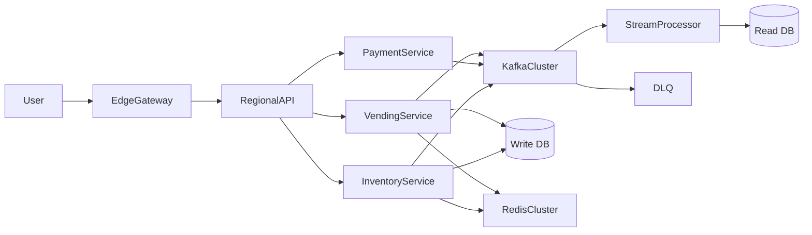
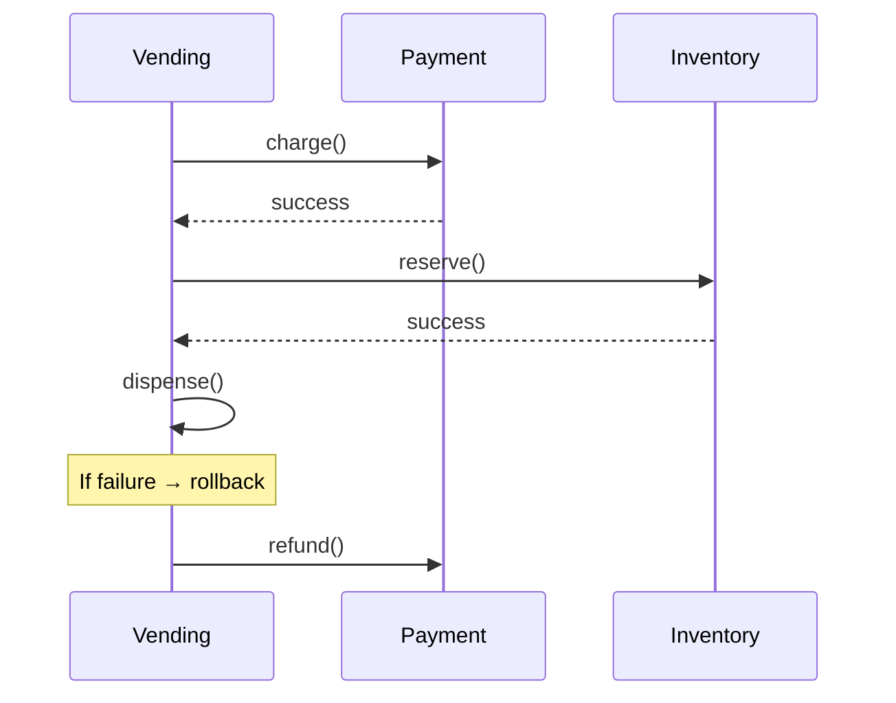
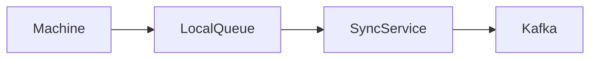

# 💀 Staff-Level System Design – Distributed Vending Platform

---

# 🧠 Problem (Reframed at Scale)

Design a **globally distributed vending ecosystem**:

* 🌍 Millions of machines
* ⚡ 100M+ daily transactions
* 📴 Offline-first machines
* 💳 Payments must be reliable
* 🔄 Strong consistency where needed
* 📡 Event-driven, observable, fault-tolerant

---

# 🏗️ Architecture Evolution (Staff View)



---

# 🔥 Key Staff-Level Upgrades

---

# 1️⃣ Exactly-Once Processing (CRITICAL)

## ❗ Problem

Kafka = at-least-once
→ Duplicate events possible

👉 Example:

* PAYMENT_SUCCESS fired twice
* Item dispensed twice ❌

---

## ✅ Solution: Idempotency + Deduplication

```java
public void handleEvent(Event event) {
    if (processedEventStore.exists(event.id)) {
        return; // duplicate ignore
    }

    process(event);
    processedEventStore.save(event.id);
}
```

---

## 🔑 Idempotency Key

* Generated per transaction
* Stored in DB / Redis
* Ensures **exactly-once effect**

---

# 2️⃣ Saga Pattern (Distributed Transactions)

## ❗ Problem

Payment + Inventory + Dispense
→ Multi-service transaction

---

## ✅ Solution: Saga Orchestration



---

## 💡 Compensation Logic

* Payment success + inventory fail → refund
* Inventory reserved + dispense fail → restock

---

# 3️⃣ Multi-Region Deployment

## 🌍 Strategy

* Deploy per region (India, US, EU)
* Route user → nearest region

---

## 🧠 Data Strategy

| Data Type | Strategy       |
| --------- | -------------- |
| Orders    | Regional       |
| Inventory | Strongly local |
| Analytics | Global async   |

---

## ⚡ Latency Optimization

* Edge gateway (Cloudflare/AWS Edge)
* Regional Kafka clusters

---

# 4️⃣ CQRS + Event Sourcing

## 🔄 Write Path

* Commands → Kafka → Write DB

## 📖 Read Path

* Kafka → Materialized Views

---

## 🧾 Event Store Example

```json
{
  "eventId": "123",
  "type": "ITEM_DISPENSED",
  "machineId": "VM101",
  "timestamp": 123456789
}
```

---

## 💡 Benefits

* Replay system
* Debugging superpower
* Audit trail

---

# 5️⃣ Offline-First Machines (EDGE COMPUTING)

## ❗ Problem

Machine loses internet

---

## ✅ Solution

* Local state machine
* Local queue (SQLite / embedded DB)

---

## 🔄 Sync Flow



---

## 💡 Conflict Resolution

* Last-write-wins OR
* Versioning (vector clocks)

---

# 6️⃣ Distributed Locking vs Partitioning

## ❗ Problem

Multiple requests → same machine

---

## ✅ Better Solution (Staff Insight)

👉 Avoid locks → use **Kafka partitioning**

* Partition by `machine_id`
* Ensures **single consumer per machine**

🔥 This removes need for Redis locks in many cases

---

# 7️⃣ Observability (NON-NEGOTIABLE)

## 🔍 Metrics

* Success rate
* Dispense failures
* Payment latency

---

## 🛠 Stack

* Prometheus → metrics
* Grafana → dashboards
* ELK → logs
* Jaeger → tracing

---

## 🔥 Example Trace

User → API → Payment → Inventory → Dispense

---

# 8️⃣ Failure Design (What Interviewers LOVE)

## 🚨 Case: Double Dispense

👉 Prevented by:

* Idempotency
* Event dedupe

---

## 🚨 Case: Kafka Down

👉 Fallback:

* Local retry queue
* Circuit breaker

---

## 🚨 Case: Partial Failure

👉 Saga rollback

---

# 9️⃣ Rate Limiting (Global + Machine Level)

* Per user → API Gateway
* Per machine → Kafka partition throttle

---

# 🔟 Security (Often Ignored)

* Signed device tokens (machine auth)
* Payment encryption
* Replay attack prevention

---

# 🧠 Trade-offs (VERY IMPORTANT)

| Decision             | Trade-off          |
| -------------------- | ------------------ |
| Eventual consistency | Slight delay       |
| Kafka                | Complexity         |
| Multi-region         | Data sync overhead |
| Idempotency store    | Extra storage      |

---

# 🚀 Final Staff-Level Summary

👉 You evolved:

| Level | System                                               |
| ----- | ---------------------------------------------------- |
| LLD   | State Pattern                                        |
| SDE1  | Thread-safe system                                   |
| SDE2  | Distributed system                                   |
| Staff | Event-sourced, multi-region, fault-tolerant platform |

---

# 💀 Ultimate Interview Closing Line

👉
“I started with a State Pattern for modeling behavior.
Then evolved it into a distributed event-driven system using Kafka.
At scale, I introduced Saga orchestration, idempotency for exactly-once processing, CQRS for scalability, and multi-region deployment with offline-first edge support.”

---
