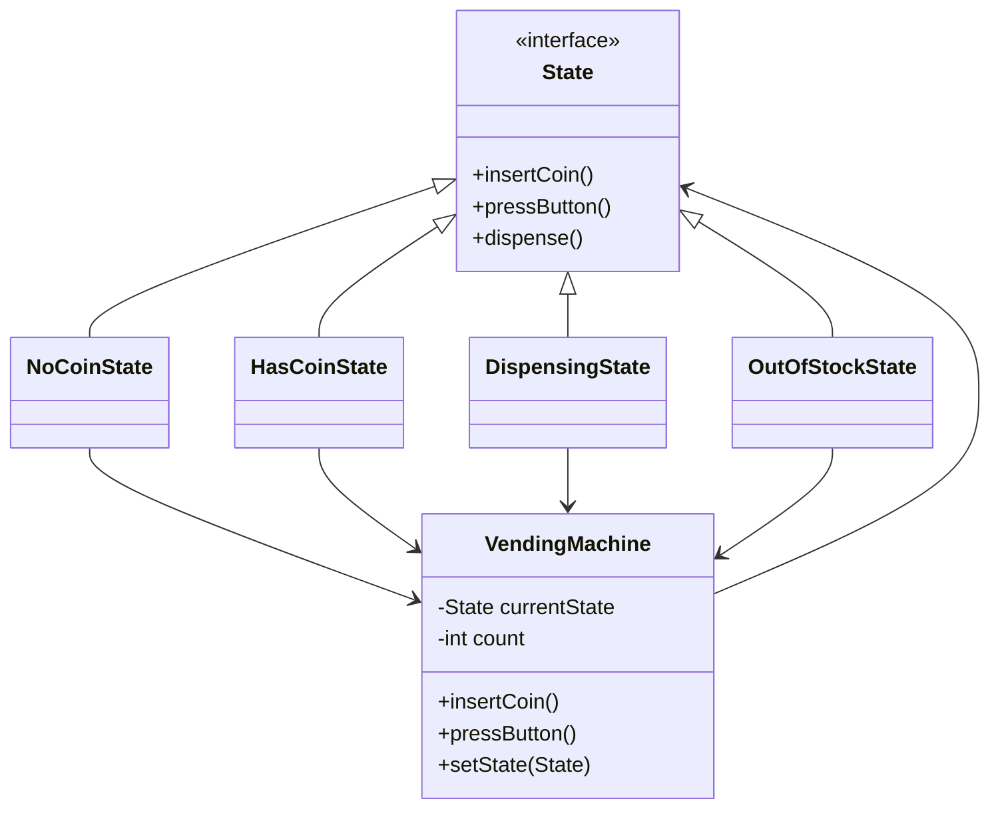

# 🔥 State Design Pattern – Vending Machine (Interview Ready)

---

# 🧠 Problem Statement

We are designing a **Vending Machine** with multiple states:

* NoCoinState → No coin inserted
* HasCoinState → Coin inserted
* DispensingState → Item being dispensed
* OutOfStockState → No items available

👉 The same action behaves differently based on the current state.

---

# 🎯 Why State Pattern?

### ❌ Without State Pattern

* Large `if-else` / `switch` statements
* Difficult to maintain
* Bug-prone

### ✅ With State Pattern

* Each state has its own class
* Clean separation of concerns
* Easy to extend

---

# 🧩 UML Diagram (Mermaid)



---

# ⚙️ Code (Java – Interview Ready)

## 1. State Interface

```java
public interface State {
    void insertCoin();
    void pressButton();
    void dispense();
}
```

---

## 2. Concrete States

### 🟢 NoCoinState

```java
public class NoCoinState implements State {

    private VendingMachine machine;

    public NoCoinState(VendingMachine machine) {
        this.machine = machine;
    }

    @Override
    public void insertCoin() {
        System.out.println("Coin inserted");
        machine.setState(machine.getHasCoinState());
    }

    @Override
    public void pressButton() {
        System.out.println("Insert coin first");
    }

    @Override
    public void dispense() {
        System.out.println("No item dispensed");
    }
}
```

---

### 🟡 HasCoinState

```java
public class HasCoinState implements State {

    private VendingMachine machine;

    public HasCoinState(VendingMachine machine) {
        this.machine = machine;
    }

    @Override
    public void insertCoin() {
        System.out.println("Coin already inserted");
    }

    @Override
    public void pressButton() {
        System.out.println("Button pressed");
        machine.setState(machine.getDispensingState());
    }

    @Override
    public void dispense() {
        System.out.println("Press button first");
    }
}
```

---

### 🔵 DispensingState

```java
public class DispensingState implements State {

    private VendingMachine machine;

    public DispensingState(VendingMachine machine) {
        this.machine = machine;
    }

    @Override
    public void insertCoin() {
        System.out.println("Wait, dispensing in progress");
    }

    @Override
    public void pressButton() {
        System.out.println("Already processing");
    }

    @Override
    public void dispense() {
        System.out.println("Item dispensed");

        if (machine.getCount() > 0) {
            machine.setState(machine.getNoCoinState());
        } else {
            machine.setState(machine.getOutOfStockState());
        }
    }
}
```

---

### 🔴 OutOfStockState

```java
public class OutOfStockState implements State {

    private VendingMachine machine;

    public OutOfStockState(VendingMachine machine) {
        this.machine = machine;
    }

    @Override
    public void insertCoin() {
        System.out.println("Out of stock");
    }

    @Override
    public void pressButton() {
        System.out.println("Out of stock");
    }

    @Override
    public void dispense() {
        System.out.println("No item");
    }
}
```

---

## 3. Context Class

```java
public class VendingMachine {

    private State noCoinState;
    private State hasCoinState;
    private State dispensingState;
    private State outOfStockState;

    private State currentState;
    private int count;

    public VendingMachine(int count) {
        this.count = count;

        noCoinState = new NoCoinState(this);
        hasCoinState = new HasCoinState(this);
        dispensingState = new DispensingState(this);
        outOfStockState = new OutOfStockState(this);

        currentState = (count > 0) ? noCoinState : outOfStockState;
    }

    public void insertCoin() {
        currentState.insertCoin();
    }

    public void pressButton() {
        currentState.pressButton();
        currentState.dispense();
    }

    public void setState(State state) {
        this.currentState = state;
    }

    public State getNoCoinState() { return noCoinState; }
    public State getHasCoinState() { return hasCoinState; }
    public State getDispensingState() { return dispensingState; }
    public State getOutOfStockState() { return outOfStockState; }

    public int getCount() { return count--; }
}
```

---

# 🔄 Execution Flow

```text
Initial State → NoCoinState

User → insertCoin()
→ NoCoinState → HasCoinState

User → pressButton()
→ HasCoinState → DispensingState

System → dispense()
→ DispensingState → NoCoinState / OutOfStockState
```

---

# 🔥 Interview Insights

## 💡 When to Use State Pattern?

* Behavior depends on internal state
* Multiple conditional branches based on state
* Clearly defined state transitions

---

## 💡 Real-World Examples

* ATM Machine
* Order lifecycle (Swiggy / Uber)
* Media Player (Play / Pause / Stop)
* TCP Connection states
* Game character states

---

## 💡 State vs Strategy Pattern

| Feature | State Pattern        | Strategy Pattern             |
| ------- | -------------------- | ---------------------------- |
| Purpose | State-based behavior | Algorithm switching          |
| Change  | Internal (automatic) | External (client controlled) |

---

# 🚀 Summary

* Eliminates complex conditionals
* Makes system modular and extensible
* Ideal for state-driven workflows

---
