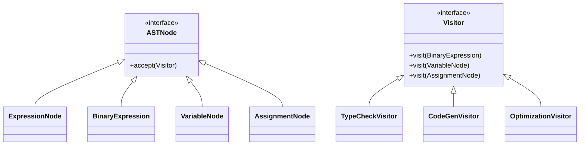
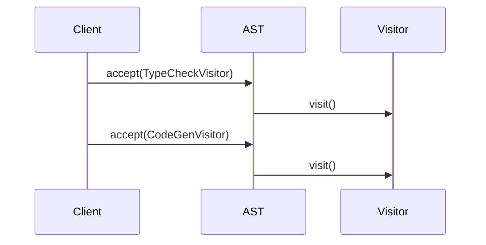
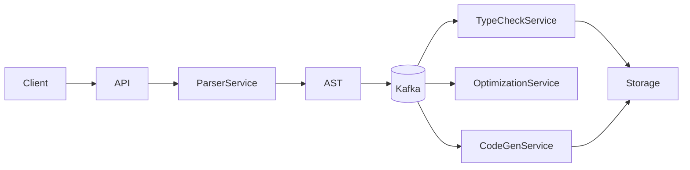
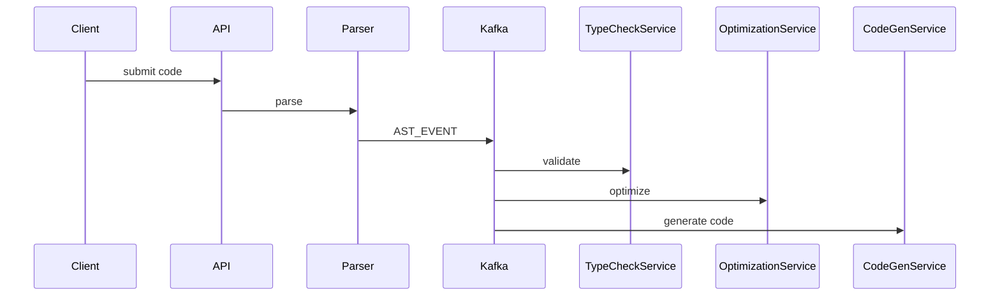

# 💀 Visitor Design Pattern – Compiler AST Visitor (Google-Level Production)

---

# 🧠 Problem

We are building a **compiler / code processing engine** that:

* Parses source code → AST (Abstract Syntax Tree)
* Performs multiple operations on AST

👉 Operations:

* Type checking
* Code generation
* Optimization
* Static analysis

---

## ❗ Challenge

* AST structure is stable
* Operations keep increasing

👉 We don’t want to modify AST classes every time

---

# 🎯 Solution

👉 Use **Visitor Pattern**

* AST nodes = Elements
* Compiler passes = Visitors

---

# 🔰 Introduction

---

## 🧠 What is AST?

👉 Tree representation of code

Example:

```text id="ast1"
a = b + c
```

AST:

```
   =
  / \
 a   +
    / \
   b   c
```

---

# 🧩 UML Diagram



---

# ⚙️ Code (Java – Core AST)

---

## 1️⃣ AST Node Interface

```java id="ast3"
public interface ASTNode {
    void accept(Visitor visitor);
}
```

---

## 2️⃣ Visitor Interface

```java id="ast4"
public interface Visitor {
    void visit(BinaryExpression node);
    void visit(VariableNode node);
    void visit(AssignmentNode node);
}
```

---

## 3️⃣ Concrete Nodes

---

### BinaryExpression

```java id="ast5"
public class BinaryExpression implements ASTNode {

    ASTNode left, right;
    String operator;

    public BinaryExpression(ASTNode left, ASTNode right, String operator) {
        this.left = left;
        this.right = right;
        this.operator = operator;
    }

    public void accept(Visitor visitor) {
        visitor.visit(this);
    }
}
```

---

### VariableNode

```java id="ast6"
public class VariableNode implements ASTNode {

    String name;

    public VariableNode(String name) {
        this.name = name;
    }

    public void accept(Visitor visitor) {
        visitor.visit(this);
    }
}
```

---

### AssignmentNode

```java id="ast7"
public class AssignmentNode implements ASTNode {

    VariableNode variable;
    ASTNode expression;

    public AssignmentNode(VariableNode variable, ASTNode expression) {
        this.variable = variable;
        this.expression = expression;
    }

    public void accept(Visitor visitor) {
        visitor.visit(this);
    }
}
```

---

# 🧠 Visitors (Compiler Passes)

---

## 1️⃣ Type Check Visitor

```java id="ast8"
public class TypeCheckVisitor implements Visitor {

    public void visit(BinaryExpression node) {
        node.left.accept(this);
        node.right.accept(this);
        System.out.println("Type check binary");
    }

    public void visit(VariableNode node) {
        System.out.println("Type check variable: " + node.name);
    }

    public void visit(AssignmentNode node) {
        node.variable.accept(this);
        node.expression.accept(this);
    }
}
```

---

## 2️⃣ Code Generation Visitor

```java id="ast9"
public class CodeGenVisitor implements Visitor {

    public void visit(BinaryExpression node) {
        node.left.accept(this);
        node.right.accept(this);
        System.out.println("ADD instruction");
    }

    public void visit(VariableNode node) {
        System.out.println("LOAD " + node.name);
    }

    public void visit(AssignmentNode node) {
        node.expression.accept(this);
        System.out.println("STORE " + node.variable.name);
    }
}
```

---

# 🔄 Execution Flow



---

# 🔥 Production-Level System Design

---

# 🏗️ Distributed Compiler Architecture



---

# 🧩 Components

---

## 1️⃣ Parser Service

* Converts code → AST

---

## 2️⃣ AST Store

* Stores serialized AST

---

## 3️⃣ Kafka (Pipeline Backbone)

👉 Each visitor = service

---

## 4️⃣ Visitor Services

* TypeCheckService
* OptimizationService
* CodeGenService

---

# 🔄 Distributed Flow



---

# 🔥 Functional Requirements

---

* Parse code into AST
* Perform multiple passes
* Support new compiler passes
* Handle large codebases

---

# ⚡ Non-Functional Requirements

---

## 1️⃣ Scalability

* Millions of lines of code
* Parallel processing

---

## 2️⃣ Performance

* Low latency compilation
* AST caching

---

## 3️⃣ Reliability

* Retry failed passes
* Idempotent processing

---

## 4️⃣ Extensibility

* Add new visitor easily

---

## 5️⃣ Consistency

* Order of passes maintained

---

# 🔒 Production Enhancements

---

## 1️⃣ Idempotency

```java id="ast13"
if (processedEventStore.exists(eventId)) return;
```

---

## 2️⃣ AST Caching

* Redis / memory cache

---

## 3️⃣ Partitioning

```text id="ast14"
fileId
```

---

## 4️⃣ Observability

* Logs
* Metrics
* Tracing

---

## 5️⃣ Versioning

* Different compiler versions

---

# 🚨 Failure Handling

---

## Kafka Down

* Retry
* DLQ

---

## Service Failure

* Reprocess AST

---

## Invalid AST

* Reject early

---

# ⚖️ Trade-offs

| Decision    | Trade-off            |
| ----------- | -------------------- |
| Visitor     | Hard to add new node |
| Kafka       | Complexity           |
| Distributed | Latency              |

---

# 💀 Real Systems

* Google compilers
* Static analyzers
* IDEs (IntelliJ)
* Code formatters

---

# 🚀 Final Insight

👉
“Visitor pattern is used in compilers to implement different passes over AST, and at scale it evolves into distributed processing where each pass becomes a microservice.”

---

# 🔥 Interview Killer Line

👉
“I model compiler passes using Visitor pattern over AST, and scale it by converting each visitor into a distributed service connected via Kafka for parallel and fault-tolerant processing.”

---
