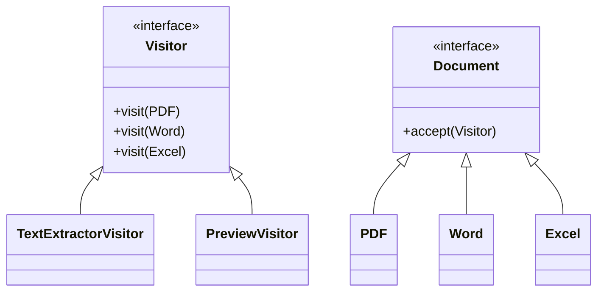
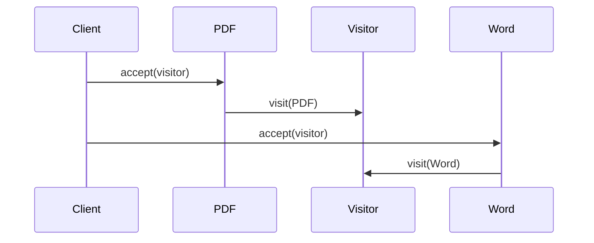

# 💀 Visitor Design Pattern – Real Industry Example (Document Processing Engine)

---

# 🧠 Problem

We have different document types:

* PDF
* Word
* Excel

👉 And we want to perform operations like:

* Extract text
* Generate preview
* Validate content

❗ Problem:

* New operations frequently add hote rehte hain
* Documents ko modify nahi karna chahte

---

# 🎯 Solution

👉 Use **Visitor Pattern**

* Documents = Elements
* Operations = Visitors

---

# 🧩 UML Diagram



---

# ⚙️ Code (Java)

---

## 1️⃣ Visitor Interface

```java id="doc2"
public interface DocumentVisitor {
    void visit(PDF pdf);
    void visit(Word word);
    void visit(Excel excel);
}
```

---

## 2️⃣ Element Interface

```java id="doc3"
public interface Document {
    void accept(DocumentVisitor visitor);
}
```

---

## 3️⃣ Concrete Documents

---

### PDF

```java id="doc4"
public class PDF implements Document {

    public String content;

    public PDF(String content) {
        this.content = content;
    }

    @Override
    public void accept(DocumentVisitor visitor) {
        visitor.visit(this);
    }
}
```

---

### Word

```java id="doc5"
public class Word implements Document {

    public String content;

    public Word(String content) {
        this.content = content;
    }

    @Override
    public void accept(DocumentVisitor visitor) {
        visitor.visit(this);
    }
}
```

---

### Excel

```java id="doc6"
public class Excel implements Document {

    public String content;

    public Excel(String content) {
        this.content = content;
    }

    @Override
    public void accept(DocumentVisitor visitor) {
        visitor.visit(this);
    }
}
```

---

## 4️⃣ Concrete Visitors

---

### Text Extractor

```java id="doc7"
public class TextExtractorVisitor implements DocumentVisitor {

    @Override
    public void visit(PDF pdf) {
        System.out.println("Extracting text from PDF: " + pdf.content);
    }

    @Override
    public void visit(Word word) {
        System.out.println("Extracting text from Word: " + word.content);
    }

    @Override
    public void visit(Excel excel) {
        System.out.println("Extracting text from Excel: " + excel.content);
    }
}
```

---

### Preview Generator

```java id="doc8"
public class PreviewVisitor implements DocumentVisitor {

    @Override
    public void visit(PDF pdf) {
        System.out.println("PDF Preview generated");
    }

    @Override
    public void visit(Word word) {
        System.out.println("Word Preview generated");
    }

    @Override
    public void visit(Excel excel) {
        System.out.println("Excel Preview generated");
    }
}
```

---

## 5️⃣ Client Code

```java id="doc9"
public class Main {
    public static void main(String[] args) {

        Document[] docs = {
            new PDF("PDF Data"),
            new Word("Word Data"),
            new Excel("Excel Data")
        };

        DocumentVisitor extractor = new TextExtractorVisitor();
        DocumentVisitor preview = new PreviewVisitor();

        for (Document doc : docs) {
            doc.accept(extractor);
            doc.accept(preview);
        }
    }
}
```

---

# 🔄 Execution Flow



---

# ⚡ Why This is Industry-Relevant

---

## 🔥 Used in:

* Document processing systems
* Compilers (AST visitors)
* Data pipelines
* Code analysis tools

---

## 🧠 Key Benefit

👉 Add new operation like:

* Virus scan
* OCR
* Encryption

WITHOUT touching document classes

---

# ⚠️ Trade-off

👉 If new document type added → update all visitors

---

# 🚀 Interview Line

👉
“This is useful in systems like document processing engines where structure remains stable but operations evolve frequently.”

---
