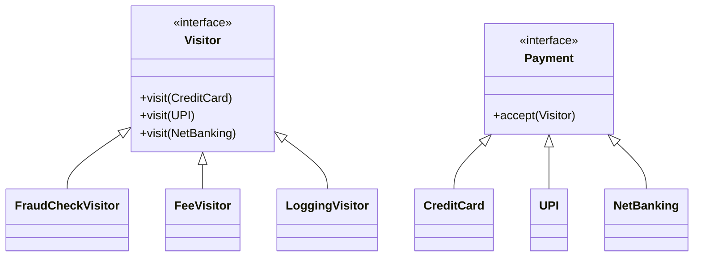
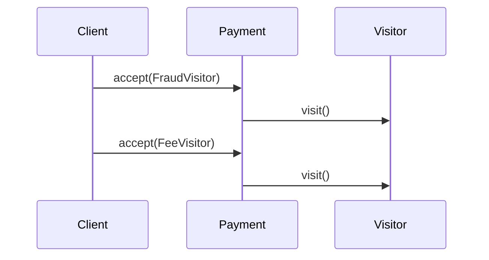
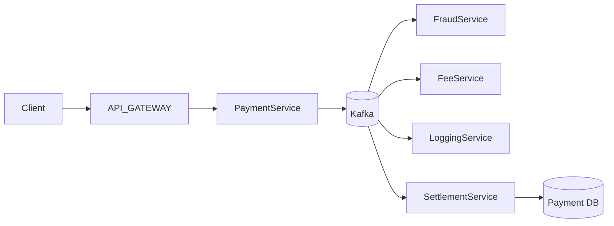
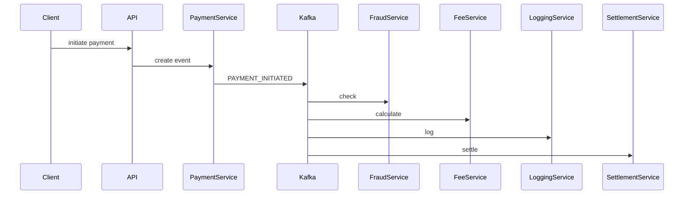

# 💀 Visitor Design Pattern – Payment Processing Pipeline (Production / FAANG)

---

# 🧠 Problem

We need to process different payment types:

* Credit Card
* UPI
* Net Banking

👉 And perform multiple operations:

* Fraud check
* Fee calculation
* Logging
* Settlement

---

## ❗ Challenge

* Payment types stable
* Operations increase frequently

👉 We don’t want to modify payment classes every time

---

# 🎯 Solution

👉 Use **Visitor Pattern**

* Payments = Elements
* Operations = Visitors

---

# 🔰 Introduction

---

## 🧠 What is Visitor Here?

👉 Payment = data
👉 Visitor = processing step

---

## ⚡ Real-Life Analogy

👉 Think of payment pipeline:

* Fraud check
* Fee deduction
* Logging

👉 Each is a **visitor step applied to payment**

---

# 🧩 UML Diagram



---

# ⚙️ Code (Java – Core)

---

## 1️⃣ Visitor Interface

```java id="pay2"
public interface PaymentVisitor {
    void visit(CreditCard payment);
    void visit(UPI payment);
    void visit(NetBanking payment);
}
```

---

## 2️⃣ Payment Interface

```java id="pay3"
public interface Payment {
    void accept(PaymentVisitor visitor);
}
```

---

## 3️⃣ Concrete Payments

---

### CreditCard

```java id="pay4"
public class CreditCard implements Payment {

    public double amount;

    public CreditCard(double amount) {
        this.amount = amount;
    }

    public void accept(PaymentVisitor visitor) {
        visitor.visit(this);
    }
}
```

---

### UPI

```java id="pay5"
public class UPI implements Payment {

    public double amount;

    public UPI(double amount) {
        this.amount = amount;
    }

    public void accept(PaymentVisitor visitor) {
        visitor.visit(this);
    }
}
```

---

### NetBanking

```java id="pay6"
public class NetBanking implements Payment {

    public double amount;

    public NetBanking(double amount) {
        this.amount = amount;
    }

    public void accept(PaymentVisitor visitor) {
        visitor.visit(this);
    }
}
```

---

## 4️⃣ Visitors (Pipeline Steps)

---

### Fraud Check

```java id="pay7"
public class FraudCheckVisitor implements PaymentVisitor {

    public void visit(CreditCard p) {
        System.out.println("Fraud check for CC: " + p.amount);
    }

    public void visit(UPI p) {
        System.out.println("Fraud check for UPI");
    }

    public void visit(NetBanking p) {
        System.out.println("Fraud check for NB");
    }
}
```

---

### Fee Calculation

```java id="pay8"
public class FeeVisitor implements PaymentVisitor {

    public void visit(CreditCard p) {
        System.out.println("CC fee: " + p.amount * 0.02);
    }

    public void visit(UPI p) {
        System.out.println("UPI fee: 0");
    }

    public void visit(NetBanking p) {
        System.out.println("NB fee: " + p.amount * 0.01);
    }
}
```

---

### Logging

```java id="pay9"
public class LoggingVisitor implements PaymentVisitor {

    public void visit(CreditCard p) {
        System.out.println("Logging CC payment");
    }

    public void visit(UPI p) {
        System.out.println("Logging UPI payment");
    }

    public void visit(NetBanking p) {
        System.out.println("Logging NB payment");
    }
}
```

---

## 5️⃣ Client

```java id="pay10"
public class Main {
    public static void main(String[] args) {

        Payment payment = new CreditCard(1000);

        PaymentVisitor fraud = new FraudCheckVisitor();
        PaymentVisitor fee = new FeeVisitor();
        PaymentVisitor log = new LoggingVisitor();

        payment.accept(fraud);
        payment.accept(fee);
        payment.accept(log);
    }
}
```

---

# 🔄 Execution Flow



---

# 🔥 Production-Level System Design

---

# 🏗️ Distributed Payment Pipeline



---

# 🧩 Components

---

## 1️⃣ Payment Service

* Accept request
* Publish event

---

## 2️⃣ Kafka (Pipeline Backbone)

👉 Each visitor = service

---

## 3️⃣ Services (Visitors)

* FraudService
* FeeService
* LoggingService
* SettlementService

---

# 🔄 Distributed Flow



---

# 🔥 Kafka Event

```json id="pay14"
{
  "eventId": "uuid",
  "paymentId": "P123",
  "type": "CREDIT_CARD",
  "amount": 1000
}
```

---

# 🔥 Functional Requirements

---

* Process multiple payment types
* Support multiple processing steps
* Add new steps easily
* Handle failures

---

# ⚡ Non-Functional Requirements

---

## 1️⃣ Scalability

* Millions of transactions

---

## 2️⃣ Reliability

* No money loss
* Retry safe

---

## 3️⃣ Consistency

* Exactly-once processing

---

## 4️⃣ Performance

* Low latency

---

## 5️⃣ Security

* Encryption
* PCI compliance

---

# 🔒 Production Enhancements

---

## 1️⃣ Idempotency

```java id="pay15"
if (processedEventStore.exists(eventId)) return;
```

---

## 2️⃣ Saga Pattern (CRITICAL)

👉 Payment flow = distributed transaction

* Fraud fail → cancel
* Settlement fail → retry

---

## 3️⃣ Partitioning

```text id="pay16"
paymentId
```

---

## 4️⃣ Observability

* Metrics
* Logs
* Tracing

---

## 5️⃣ Retry + DLQ

* Kafka retry
* Dead letter queue

---

# 🚨 Failure Handling

---

## Fraud Fail

* Cancel transaction

---

## Kafka Down

* Retry

---

## Partial Failure

* Saga rollback

---

# ⚖️ Trade-offs

| Decision    | Trade-off                    |
| ----------- | ---------------------------- |
| Kafka       | Complexity                   |
| Distributed | Latency                      |
| Visitor     | Hard to add new payment type |

---

# 💀 Real Systems

* Stripe
* Razorpay
* PayPal

---

# 🚀 Final Insight

👉
“Visitor pattern models payment processing steps, and at scale each step becomes a distributed service connected via Kafka.”

---

# 🔥 Interview Killer Line

👉
“I model payment processing steps using Visitor pattern and scale it into an event-driven pipeline using Kafka, ensuring idempotency and Saga-based consistency for reliability.”

---
