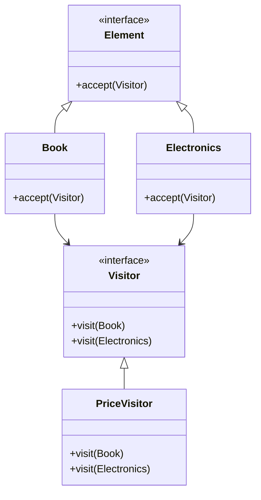
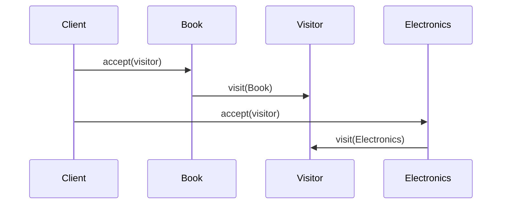
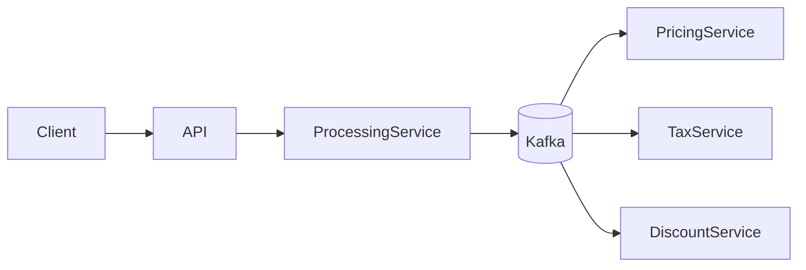
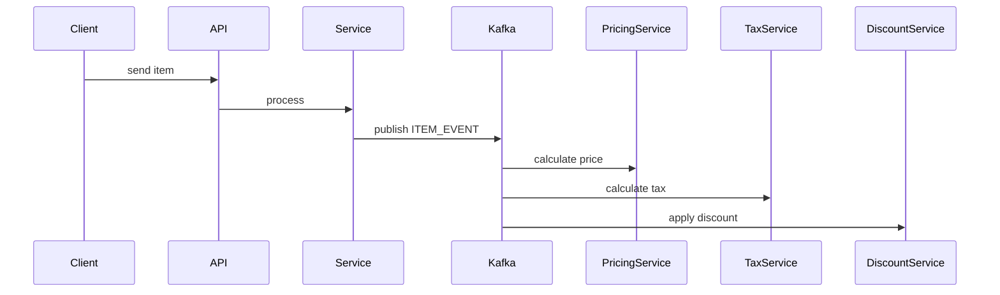

# 💀 Visitor Design Pattern – Production / FAANG (FINAL)

---

# 🧠 Problem

We have a set of objects and want to:

* Perform operations on them
* Add new operations frequently
* Without modifying existing classes

---

👉 Example:

* File system (files, folders)
* Pricing system (different item types)
* AST processing (compiler)

---

# 🎯 Solution

👉 Use **Visitor Pattern**

* Separate operations from object structure
* Add new operations easily

---

# 🔰 Introduction

---

## 🧠 What is Visitor Pattern?

A **behavioral design pattern** that:

👉 Allows adding new operations to objects without modifying them

---

## 🎯 Intent (GOF)

> Represent an operation to be performed on elements of an object structure.

---

## ⚡ Real-Life Analogy

👉 Think of **Tax Calculator**

* Products: Food, Electronics
* Visitor: Tax calculator

👉 Instead of product calculating tax → visitor does

---

# 🧩 UML Diagram



---

# ⚙️ Code (Java – Clean)

---

## 1️⃣ Visitor Interface

```java id="vis2"
public interface Visitor {
    void visit(Book book);
    void visit(Electronics electronics);
}
```

---

## 2️⃣ Element Interface

```java id="vis3"
public interface ItemElement {
    void accept(Visitor visitor);
}
```

---

## 3️⃣ Concrete Elements

---

### Book

```java id="vis4"
public class Book implements ItemElement {

    int price;

    public Book(int price) {
        this.price = price;
    }

    @Override
    public void accept(Visitor visitor) {
        visitor.visit(this);
    }
}
```

---

### Electronics

```java id="vis5"
public class Electronics implements ItemElement {

    int price;

    public Electronics(int price) {
        this.price = price;
    }

    @Override
    public void accept(Visitor visitor) {
        visitor.visit(this);
    }
}
```

---

## 4️⃣ Concrete Visitor

```java id="vis6"
public class PriceVisitor implements Visitor {

    @Override
    public void visit(Book book) {
        System.out.println("Book price: " + book.price);
    }

    @Override
    public void visit(Electronics electronics) {
        System.out.println("Electronics price: " + electronics.price);
    }
}
```

---

## 5️⃣ Client Code

```java id="vis7"
public class Main {
    public static void main(String[] args) {

        ItemElement[] items = {
            new Book(100),
            new Electronics(500)
        };

        Visitor visitor = new PriceVisitor();

        for (ItemElement item : items) {
            item.accept(visitor);
        }
    }
}
```

---

# 🔄 Execution Flow



---

# ⚠️ Without Visitor (Problem)

* Logic inside classes
* Hard to add new operations
* Violates Open/Closed Principle

---

# ⚡ With Visitor

* Add new operation → new visitor
* No change in existing classes

---

# 🔥 Production-Level Upgrade

---

# 🏗️ Distributed Visitor System

👉 Think:

* Different operations = services
* Objects = events/data



---

# 🧩 Components

---

## 1️⃣ Processing Service

* Receives request
* Publishes event

---

## 2️⃣ Kafka (Visitor Dispatcher)

👉 Acts like distributed visitor

---

## 3️⃣ Visitor Services

* Pricing
* Tax
* Discount

---

# 🔄 Distributed Flow



---

# 🔥 Kafka Event

```json id="vis11"
{
  "eventId": "uuid",
  "itemType": "BOOK",
  "price": 100
}
```

---

# ⚡ Production Enhancements

---

## 1️⃣ Idempotency

```java id="vis12"
if (processedEventStore.exists(eventId)) return;
```

---

## 2️⃣ Parallel Processing

* Multiple consumers

---

## 3️⃣ Caching

* Cache computed results

---

## 4️⃣ Versioning

* Support new visitor logic

---

## 5️⃣ Observability

* Logs
* Metrics
* Tracing

---

# 🔒 Failure Handling

---

## Kafka Down

* Retry
* DLQ

---

## Service Failure

* Retry + fallback

---

# ⚖️ Trade-offs

| Decision | Trade-off               |
| -------- | ----------------------- |
| Visitor  | Hard to add new element |
| Kafka    | Complexity              |

---

# 🧠 Scaling Strategy

---

## Horizontal Scaling

* Stateless services

---

## Kafka Scaling

* Partition by itemType

---

# 💀 Real Systems

* Compilers (AST visitors)
* Pricing engines
* Data processing pipelines

---

# 🚀 Final Insight

👉
“Visitor pattern separates operations from object structure, and in distributed systems it evolves into event-driven processing using Kafka.”

---

# 🔥 Interview Killer Line

👉
“I use Visitor pattern to separate operations from data structures, and at scale evolve it into distributed processing where each visitor becomes a microservice consuming events.”

---
