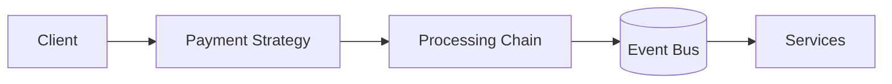

# 💀 Design Pattern Comparison – Payment Pipeline (FAANG Level)


---
Visitor vs Chain of Responsibility vs Strategy vs Mediator” in real systems like payments.

---

# 🧠 Problem Context

We are building a **payment processing pipeline**:

Steps:

* Fraud check
* Fee calculation
* Logging
* Settlement

👉 Question:

Which pattern to use?

---

# 🔥 1️⃣ Visitor Pattern

---

## 🎯 Idea

👉 Apply multiple operations on same object

* Payment = Element
* Steps = Visitors

---

## ✅ When to Use

* Same object → multiple operations
* Operations change frequently

---

## ⚡ Example

```text
Payment.accept(FraudVisitor)
Payment.accept(FeeVisitor)
```

---

## ✅ Pros

* Easy to add new operations
* Clean separation

---

## ❌ Cons

* Hard to add new payment types
* Tight coupling between visitor & elements

---

# 🔥 2️⃣ Chain of Responsibility (MOST USED IN PIPELINES)

---

## 🎯 Idea

👉 Pass request through chain

```text
Fraud → Fee → Logging → Settlement
```

---

## ⚡ Example

```java id="chain1"
handler1.setNext(handler2);
handler2.setNext(handler3);
```

---

## ✅ Pros

* Flexible pipeline
* Easy to reorder
* Each step independent

---

## ❌ Cons

* Hard to debug
* No global view

---

## 💀 Real Use

👉 Payment systems mostly use this

---

# 🔥 3️⃣ Strategy Pattern

---

## 🎯 Idea

👉 Choose algorithm at runtime

---

## ⚡ Example

```text
PaymentStrategy = CreditCard / UPI
```

---

## ✅ Pros

* Swap behavior easily
* Clean abstraction

---

## ❌ Cons

* Not for pipelines
* Only one strategy at a time

---

# 🔥 4️⃣ Mediator Pattern

---

## 🎯 Idea

👉 Central controller handles interaction

---

## ⚡ Example

```text
PaymentMediator coordinates services
```

---

## ✅ Pros

* Decouples components
* Central control

---

## ❌ Cons

* Becomes bottleneck
* Complex mediator

---

# ⚖️ FULL COMPARISON TABLE

---

| Feature           | Visitor             | Chain               | Strategy         | Mediator                   |
| ----------------- | ------------------- | ------------------- | ---------------- | -------------------------- |
| Purpose           | Multiple operations | Sequential pipeline | Choose algorithm | Central coordination       |
| Best For          | Compiler, AST       | Payment pipeline    | Payment method   | Chat/service orchestration |
| Flexibility       | Medium              | High                | High             | Medium                     |
| Add New Operation | Easy                | Medium              | Hard             | Medium                     |
| Add New Type      | Hard                | Easy                | Easy             | Easy                       |
| Control Flow      | Fixed               | Dynamic chain       | Single choice    | Centralized                |

---

# 🧠 What to Use in Payment System?

---

## 💀 Correct Answer (Interview)

👉 Combination:

---

### ✅ Strategy

* Select payment type (CC / UPI)

---

### ✅ Chain of Responsibility

* Fraud → Fee → Logging → Settlement

---

### ✅ Visitor (Optional)

* Analytics / reporting

---

### ✅ Mediator (Distributed)

* Kafka / event bus

---

# 🏗️ FINAL ARCHITECTURE



---

# 🔥 Interview Killer Answer

---

👉
“I would use Strategy to select payment type, Chain of Responsibility to implement the processing pipeline, and Kafka as a distributed mediator. Visitor can be used for additional operations like analytics.”

---

# 🚀 Final Insight

---

👉
“No single pattern solves real systems — production systems combine multiple patterns for flexibility, scalability, and maintainability.”

---
