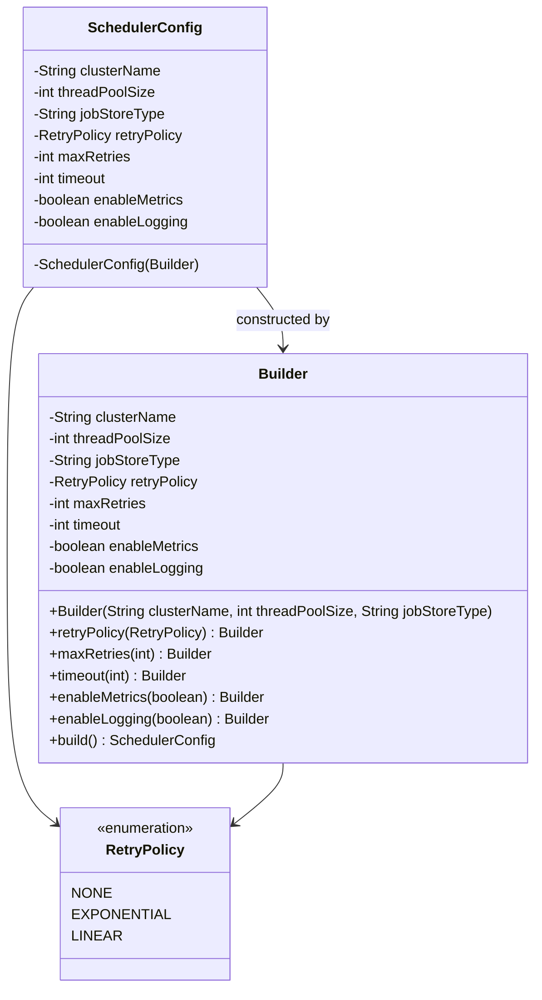

Imagine you are building:

- A distributed task scheduler
- Like internal version of Kubernetes CronJobs
- Supports retry policies, timeouts, thread pools, queue backpressure, logging, monitoring

Creating this config via constructor would be insane.

## 🎯 Problem

SchedulerConfig has:

- Required:
    - clusterName
    - threadPoolSize
    - jobStoreType
- Optional:
    - retryPolicy
    - maxRetries
    - timeout
    - backoffStrategy
    - enableMetrics
    - enableLogging
    - deadLetterQueue
    - rateLimit
    - prioritySupport



```java
public class SchedulerConfig {

    private final String clusterName;
    private final int threadPoolSize;
    private final String jobStoreType;
    private final RetryPolicy retryPolicy;
    private final int maxRetries;
    private final int timeout;
    private final boolean enableMetrics;
    private final boolean enableLogging;

    private SchedulerConfig(Builder builder) {
        this.clusterName = builder.clusterName;
        this.threadPoolSize = builder.threadPoolSize;
        this.jobStoreType = builder.jobStoreType;
        this.retryPolicy = builder.retryPolicy;
        this.maxRetries = builder.maxRetries;
        this.timeout = builder.timeout;
        this.enableMetrics = builder.enableMetrics;
        this.enableLogging = builder.enableLogging;
    }

    public static class Builder {

        private final String clusterName;
        private final int threadPoolSize;
        private final String jobStoreType;

        private RetryPolicy retryPolicy = RetryPolicy.NONE;
        private int maxRetries = 0;
        private int timeout = 3000;
        private boolean enableMetrics = false;
        private boolean enableLogging = false;

        public Builder(String clusterName, int threadPoolSize, String jobStoreType) {
            this.clusterName = clusterName;
            this.threadPoolSize = threadPoolSize;
            this.jobStoreType = jobStoreType;
        }

        public Builder retryPolicy(RetryPolicy retryPolicy) {
            this.retryPolicy = retryPolicy;
            return this;
        }

        public Builder maxRetries(int maxRetries) {
            this.maxRetries = maxRetries;
            return this;
        }

        public Builder timeout(int timeout) {
            this.timeout = timeout;
            return this;
        }

        public Builder enableMetrics(boolean enableMetrics) {
            this.enableMetrics = enableMetrics;
            return this;
        }

        public Builder enableLogging(boolean enableLogging) {
            this.enableLogging = enableLogging;
            return this;
        }

        public SchedulerConfig build() {
            if (threadPoolSize <= 0) {
                throw new IllegalArgumentException("Thread pool size must be positive");
            }
            return new SchedulerConfig(this);
        }
    }
}
```

Usage : -

```java
SchedulerConfig config = new SchedulerConfig.Builder(
        "Cluster-A",
        20,
        "REDIS"
)
.retryPolicy(RetryPolicy.EXPONENTIAL)
.maxRetries(5)
.timeout(5000)
.enableMetrics(true)
.enableLogging(true)
.build();
```

This pattern is used in:

- OkHttp request building
- Retrofit client config
- Spring Framework configuration beans
- Java Stream collectors