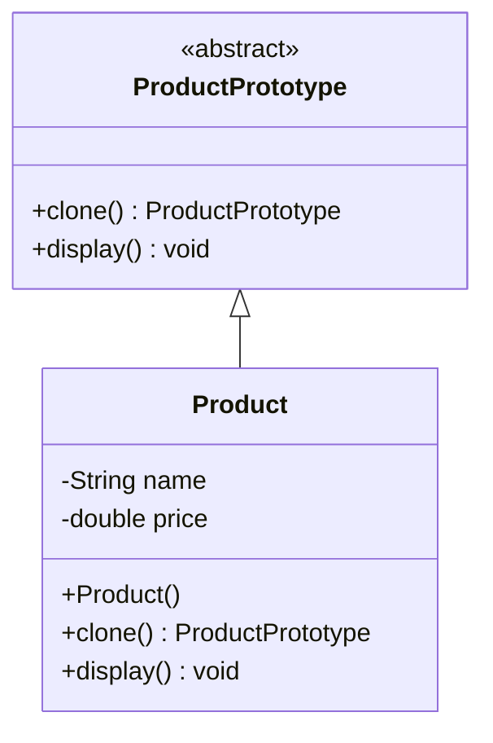
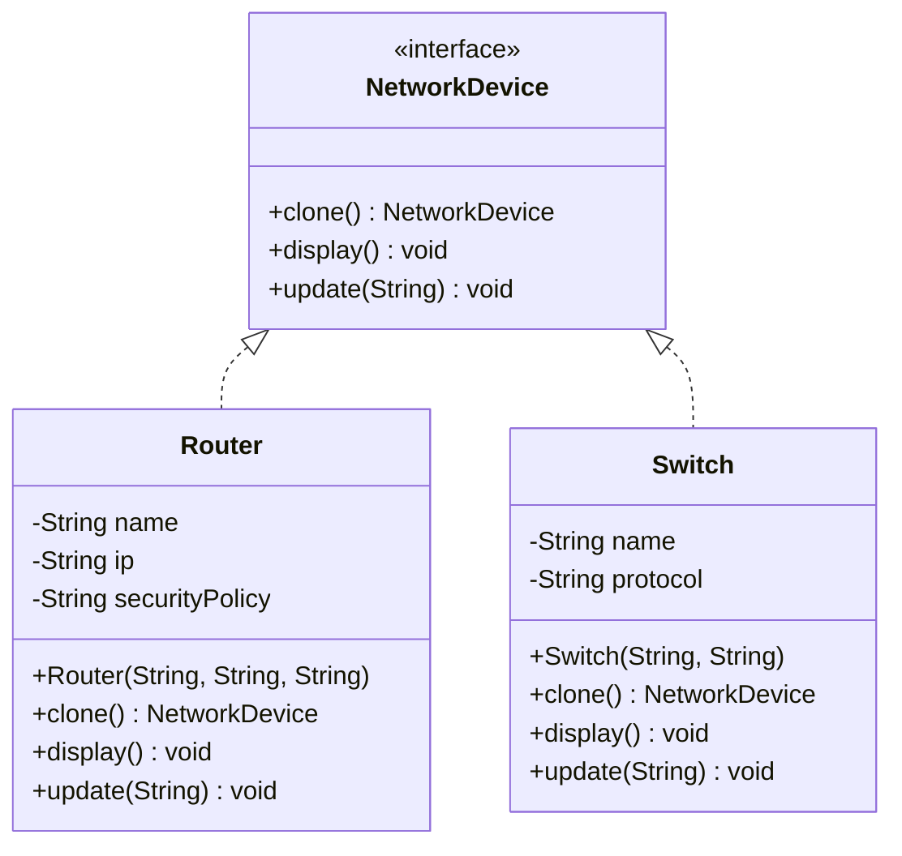

1 ) ProductPrototype Example : -



```java
// Abstract base class representing a prototype for products
abstract class ProductPrototype {
    public abstract ProductPrototype clone();
    public abstract void display();
}

// Concrete prototype class representing a product
class Product extends ProductPrototype {
    private String name;
    private double price;

    public Product(String name, double price) {
        this.name = name;
        this.price = price;
    }

    @Override
    public ProductPrototype clone() {
        return new Product(name, price);
    }

    @Override
    public void display() {
        System.out.println("Product: " + name);
        System.out.println("Price: $" + price);
    }
}

public class ProductDemo {
    public static void main(String[] args) {
        // Create prototype instances of products
        ProductPrototype product1 = new Product("Laptop", 999.99);
        ProductPrototype product2 = new Product("Smartphone", 499.99);

        // Clone the prototypes to create new product instances
        ProductPrototype newProduct1 = product1.clone();
        ProductPrototype newProduct2 = product2.clone();

        System.out.println("Original Products:");
        product1.display();
        product2.display();

        System.out.println("\nCloned Products:");
        newProduct1.display();
        newProduct2.display();
    }
}
```

2 ) UML – Router / Switch Prototype Example : -


```java
abstract class NetworkDevice {
    public abstract NetworkDevice clone();

    public abstract void display();

    public abstract void update(String newName);
}

class Router extends NetworkDevice {
    private String name;
    private String ip;
    private String securityPolicy;

    public Router(String name, String ip, String securityPolicy) {
        this.name = name;
        this.ip = ip;
        this.securityPolicy = securityPolicy;
    }

    @Override
    public NetworkDevice clone() {
        return new Router(name, ip, securityPolicy);
    }

    @Override
    public void display() {
        System.out.println("Router - Name: " + name + ", IP: " + ip + ", Security Policy: " + securityPolicy);
    }

    @Override
    public void update(String newName) {
        name = newName;
    }
}

class Switch extends NetworkDevice {
    private String name;
    private String protocol;

    public Switch(String name, String protocol) {
        this.name = name;
        this.protocol = protocol;
    }

    @Override
    public NetworkDevice clone() {
        return new Switch(name, protocol);
    }

    @Override
    public void display() {
        System.out.println("Switch - Name: " + name + ", Protocol: " + protocol);
    }

    @Override
    public void update(String newName) {
        name = newName;
    }
}

public class RouterDemo {
    public static void main(String[] args) {
        // Create prototype instances of a router and a switch
        NetworkDevice routerPrototype = new Router("Router A", "192.168.1.1", "Firewall Enabled");
        NetworkDevice switchPrototype = new Switch("Switch X", "Ethernet");

        // Clone and display router and switch devices
        NetworkDevice routerClone = routerPrototype.clone();
        NetworkDevice switchClone = switchPrototype.clone();

        System.out.println("Router Clone:");
        routerClone.display();

        System.out.println("\nSwitch Clone:");
        switchClone.display();

        // Update the names of the clones
        routerClone.update("Router B");
        switchClone.update("Switch Y");

        System.out.println("\nUpdated Router Clone:");
        routerClone.display();

        System.out.println("\nUpdated Switch Clone:");
        switchClone.display();
    }
}
```