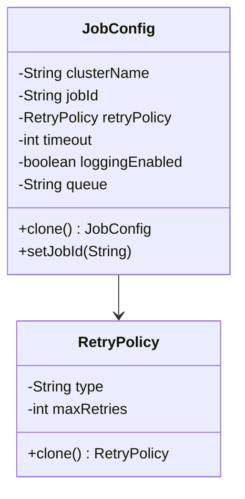

# 🎯 Problem Statement

You are building a distributed job scheduler.

Each job requires:

- JobConfig
- RetryPolicy
- Timeout
- LoggingConfig
- QueueConfig
- MetricsConfig

Most jobs share the same base configuration.

Only difference:

- `jobId`
- maybe `priority`
- maybe `payload`

You need to schedule **100 similar jobs quickly**.

# ❌ Without Prototype

You would do:

```java
for (int i = 1; i <= 100; i++) {
    JobConfig config = new JobConfig.Builder("Cluster-A")
            .retryPolicy(RetryPolicy.EXPONENTIAL)
            .timeout(5000)
            .loggingEnabled(true)
            .queue("PAYMENT_QUEUE")
            .build();

    config.setJobId("JOB_" + i);
    scheduler.submit(config);
}
```

Problem:

- Repeating builder logic 100 times
- Costly object construction
- Risk of config mismatch
- Harder to maintain

# ✅ With Prototype

Step 1: Create base template once.

```java
JobConfig baseConfig = new JobConfig.Builder("Cluster-A")
        .retryPolicy(RetryPolicy.EXPONENTIAL)
        .timeout(5000)
        .loggingEnabled(true)
        .queue("PAYMENT_QUEUE")
        .build();
```

Step 2: Clone and modify lightweight fields.

```java
for (int i = 1; i <= 100; i++) {
    JobConfig cloned = baseConfig.clone();   // Prototype
    cloned.setJobId("JOB_" + i);
    scheduler.submit(cloned);
}
```

# 🏗 LLD Class Design

## 1️⃣ JobConfig (Prototype)

```java
public class JobConfig implements Cloneable {

    private String clusterName;
    private String jobId;
    private RetryPolicy retryPolicy;
    private int timeout;
    private boolean loggingEnabled;
    private String queue;

    public JobConfig clone() {
        try {
            return (JobConfig) super.clone(); // shallow copy
        } catch (CloneNotSupportedException e) {
            throw new RuntimeException(e);
        }
    }

    public void setJobId(String jobId) {
        this.jobId = jobId;
    }
}
```

# 🧠 Important: Deep Copy Case

If RetryPolicy is mutable:

```java
public JobConfig clone() {
    JobConfig copy = new JobConfig();
    copy.clusterName = this.clusterName;
    copy.retryPolicy = this.retryPolicy.clone(); // deep copy
    copy.timeout = this.timeout;
    copy.loggingEnabled = this.loggingEnabled;
    copy.queue = this.queue;
    return copy;
}
```

In production, deep copy is usually required.



# Why This Is Powerful in Distributed Systems

In real distributed systems:

- Job configs may load metadata from DB
- Security tokens may be attached
- Validation rules applied
- Circuit breaker settings configured

Building this repeatedly is expensive.

Prototype allows:

- Base configuration template
- Fast duplication
- Safe variation

# 🧩 Even More Practical: Prototype Registry

In real systems, we store templates.

Example:

```java
Map<String,JobConfig>jobTemplates=newHashMap<>();

jobTemplates.put("PAYMENT",paymentBaseConfig);
jobTemplates.put("EMAIL",emailBaseConfig);

JobConfignewJob=jobTemplates.get("PAYMENT").clone();
newJob.setJobId("PAY_101");
```

This is called **Prototype Registry Pattern**.

Very useful in:

- Game engines
- Distributed schedulers
- Workflow systems
- Microservice orchestration