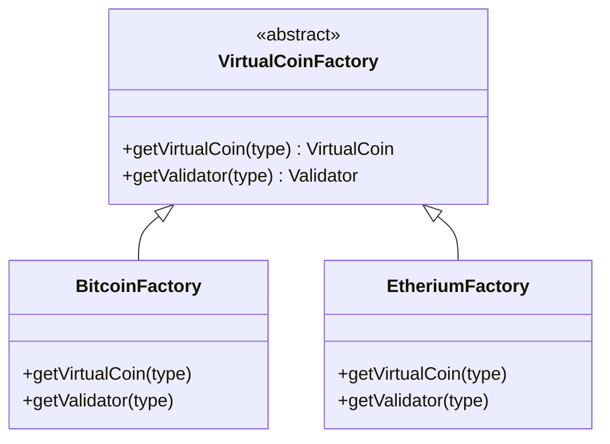
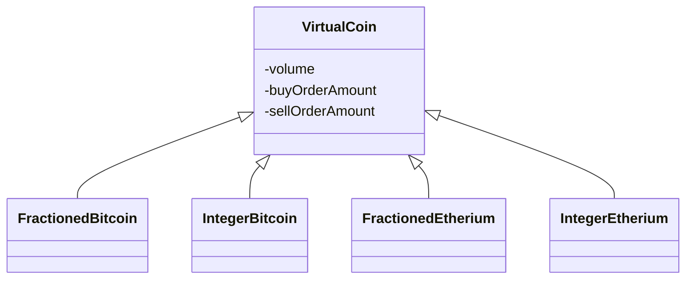
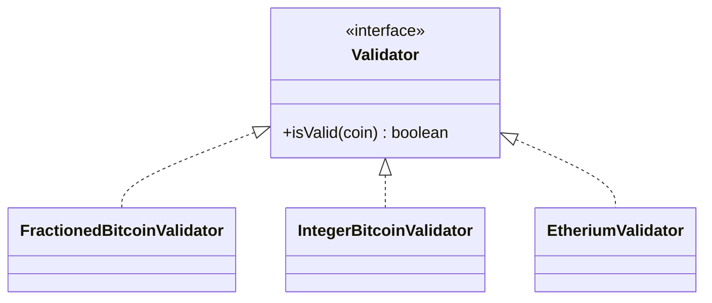
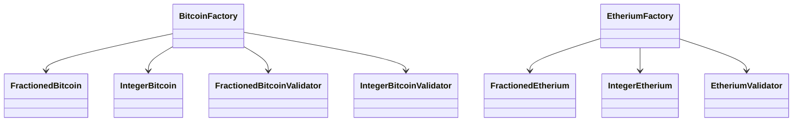
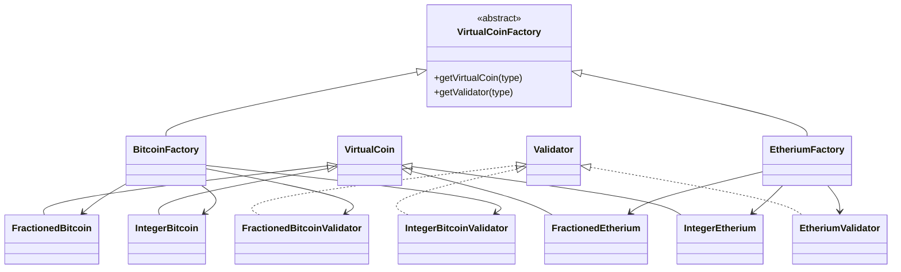
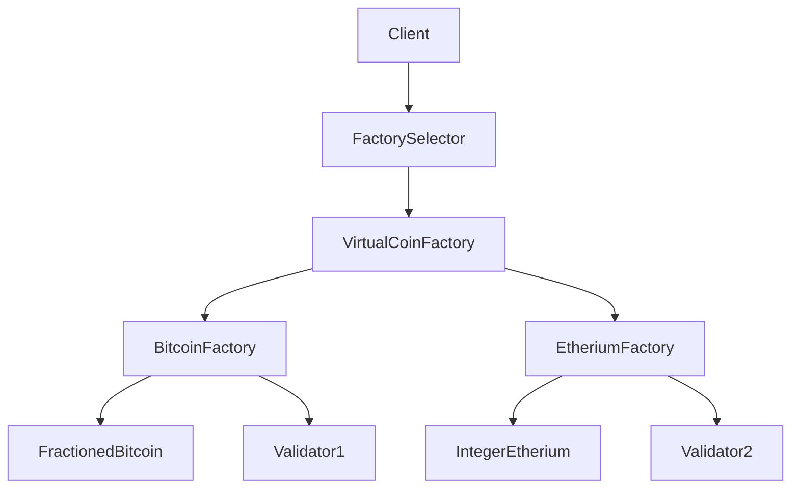
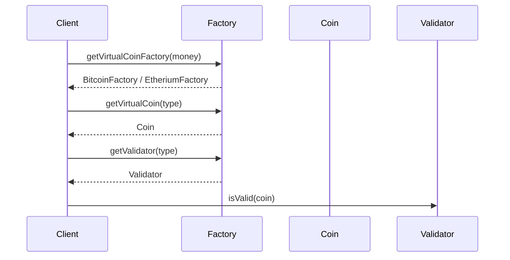

## 🔷 1. UML CLASS DIAGRAM (ABSTRACT FACTORY CORE)



---

## 🧠 Samajh

👉 `VirtualCoinFactory` = abstract factory
👉 `BitcoinFactory / EtheriumFactory` = concrete factories

---

# 🔷 2. PRODUCT HIERARCHY (COINS)



---

# 🔷 3. VALIDATOR HIERARCHY



---

# 🔷 4. FACTORY → PRODUCT RELATION (MOST IMPORTANT 🔥)



---

## 🧠 Insight

👉 Each factory creates:

* Related objects (coin + validator)
  👉 This is **Abstract Factory core concept**

---

# 🔷 5. FULL UML (COMPLETE SYSTEM 🔥🔥)



---

# 🔷 6. OBJECT CREATION FLOW (VERY IMPORTANT)



---

# 🔷 7. EXECUTION FLOW (SEQUENCE DIAGRAM 🔥)



---

# 🔷 8. INTERVIEW DRAWING (IMPORTANT)

👉 Board pe aise draw kar:

```text
                VirtualCoinFactory
                   ▲
         ┌─────────┴─────────┐
   BitcoinFactory     EtheriumFactory
        │                     │
   (creates)             (creates)
        │                     │
   Bitcoin Coins        Etherium Coins
        │                     │
   Validators            Validators
```

---

# 🔥 GOLD UNDERSTANDING

👉 Abstract Factory ka core:

```text
Family of related objects create karna
without exposing concrete classes
```

---

# ⚡ KEY DIFFERENCE (INTERVIEW TRAP)

| Pattern          | Difference                |
| ---------------- | ------------------------- |
| Factory          | Creates 1 object          |
| Abstract Factory | Creates family of objects |

---

# 🔥 INTERVIEW LINE

> “I used Abstract Factory pattern to create families of related objects like virtual coins and their validators. Each factory ensures consistency between product variants, such as Bitcoin and Ethereum implementations.”
