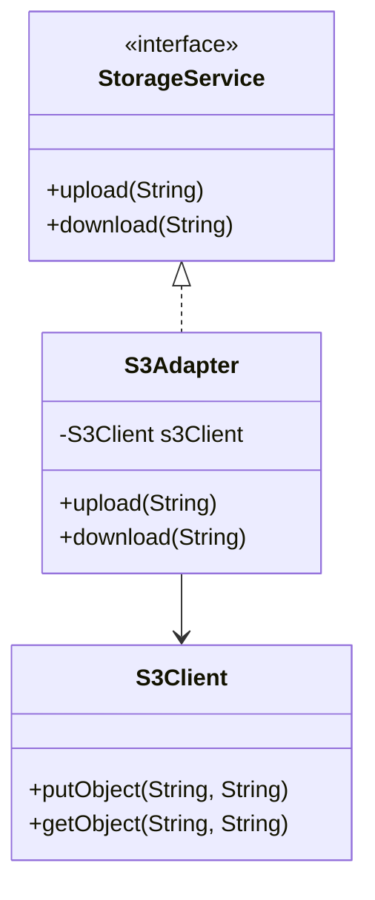
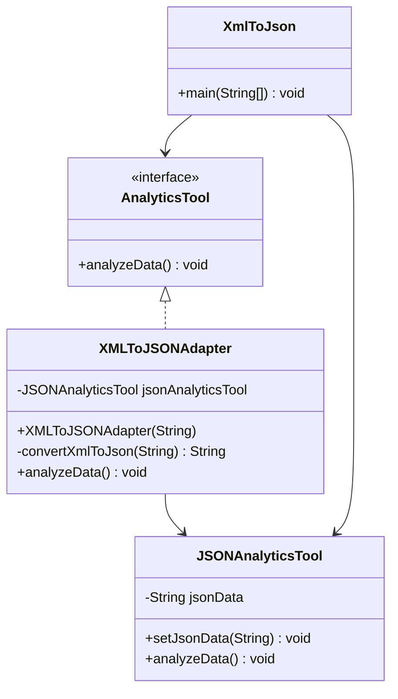

## Example with code : -
# 🏗 Architecture

Client → StorageService (interface)

Adapters → wrap provider SDK

Provider SDK → untouched

UML Diagram – Adapter Pattern : -



1️⃣ Target Interface (What your system expects)

```java
public interface StorageService {
    void upload(String fileName);
    void download(String fileName);
}
```

2️⃣ Adapter

```java
public class S3Adapter implements StorageService {

    private S3Client s3Client;

    public S3Adapter(S3Client s3Client) {
        this.s3Client = s3Client;
    }

    public void upload(String fileName) {
        s3Client.putObject("prod-bucket", fileName);
    }

    public void download(String fileName) {
        s3Client.getObject("prod-bucket", fileName);
    }
}
```

3️⃣ Adaptee (Third-party SDK)

```java
public class S3Client {
    public void putObject(String bucket, String key) { }
    public void getObject(String bucket, String key) { }
}
```

Now client uses:

```java
StorageService storage = new S3Adapter(new S3Client());
storage.upload("resume.pdf");
```

Client has no idea it’s S3.

That’s decoupling.

UML Diagram – **XML to JSON Adapter**



XmlToJson.java

```java
class JSONAnalyticsTool {
    private String jsonData;

    public void setJsonData(String jsonData) {
        this.jsonData = jsonData;
    }

    public void analyzeData() {
        if (jsonData != null && jsonData.contains("json")) {
            System.out.println("Analyzing JSON Data - " + jsonData);
        } else {
            System.out.println("Not in the correct format. Can't analyze!");
        }
    }
}

interface AnalyticsTool {
    void analyzeData();
}

class XMLToJSONAdapter implements AnalyticsTool {
    private JSONAnalyticsTool jsonAnalyticsTool;

    public XMLToJSONAdapter(String xmlData) {
        System.out.println("Converting the XML Data '" + xmlData + "' to JSON Data!");
        String newData = convertXmlToJson(xmlData);
        jsonAnalyticsTool = new JSONAnalyticsTool();
        jsonAnalyticsTool.setJsonData(newData);
    }

    private String convertXmlToJson(String xmlData) {
        // Simulating XML to JSON conversion (in real-world, use a library like org.json or Jackson)
        return "{ \"data\": \"" + xmlData + "\" } in json";
    }

    @Override
    public void analyzeData() {
        jsonAnalyticsTool.analyzeData();
    }
}

public class XmlToJson {
    public static void main(String[] args) {
        String xmlData = "Sample Data";

        // Directly analyzing JSON data (incorrect format case)
        JSONAnalyticsTool tool1 = new JSONAnalyticsTool();
        tool1.setJsonData(xmlData);
        tool1.analyzeData();

        System.out.println("----------------------------------------------");

        // Using Adapter to convert XML to JSON and analyze it
        AnalyticsTool tool2 = new XMLToJSONAdapter(xmlData);
        tool2.analyzeData();
    }
}
```

# What This Diagram Shows

### 1️⃣ Target Interface

`AnalyticsTool`

This is what the client expects.

---

### 2️⃣ Adaptee

`JSONAnalyticsTool`

This is the existing class that only understands JSON.

---

### 3️⃣ Adapter

`XMLToJSONAdapter`

- Implements `AnalyticsTool`
- Internally uses `JSONAnalyticsTool`
- Converts XML → JSON
- Delegates `analyzeData()` call

---

### 4️⃣ Client

`XmlToJson` (main class)

- Directly uses `JSONAnalyticsTool` (incorrect case)
- Uses `XMLToJSONAdapter` (correct usage)

---

# 🔥 Pattern Structure Mapping

| Role | Class |
| --- | --- |
| Target | AnalyticsTool |
| Adaptee | JSONAnalyticsTool |
| Adapter | XMLToJSONAdapter |
| Client | XmlToJson |

---

# 🔥 Real Architecture Mapping

In microservices:

API Layer → Service Layer → Adapter → External SDK

Adapter isolates third-party dependencies.