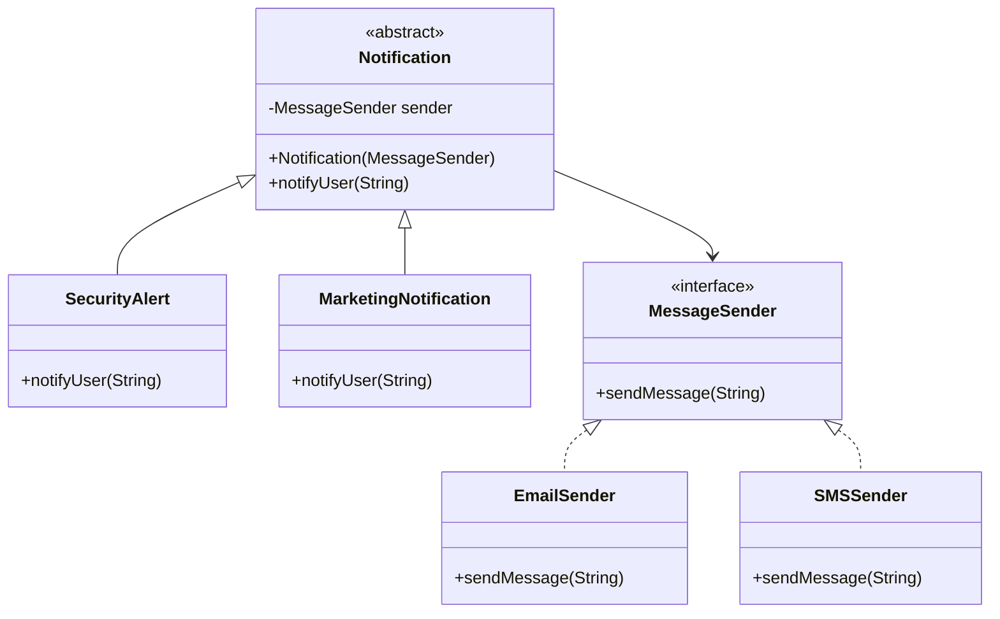

Here’s your **clean, GitHub-ready README.md with proper Mermaid diagram** 👇

---

# 🌉 Bridge Design Pattern – Multi-Channel Notification Service

## 📌 Overview

This example demonstrates how the **Bridge Design Pattern** helps design a scalable **enterprise notification system** where:

* Notification types evolve independently
* Delivery channels evolve independently

---

## 🏢 Problem Statement

You are building a **multi-channel notification service** used by:

* Banking systems
* E-commerce platforms
* Ride-sharing apps

---

## 🔄 Two Independent Dimensions

### 1️⃣ Notification Type (Abstraction)

* TransactionNotification
* MarketingNotification
* SecurityAlert

---

### 2️⃣ Delivery Channel (Implementation)

* EmailSender
* SMSSender
* PushSender

Future additions:

* WhatsAppSender
* SlackSender

---

## ❌ Without Bridge (Problem)

Inheritance leads to **combinatorial explosion**:

* SecurityAlertEmail
* SecurityAlertSMS
* MarketingEmail
* MarketingSMS

👉 Not scalable ❌

---

## ✅ With Bridge Pattern (Solution)

Separate into:

* **Abstraction → Notification**
* **Implementation → MessageSender**

👉 Combine dynamically using composition

---

## 🏗️ UML Diagram (Mermaid)



---

## ⚙️ Code Implementation

### 🔧 Implementation Layer

```java
interface MessageSender {
    void sendMessage(String message);
}
```

```java
class EmailSender implements MessageSender {
    public void sendMessage(String message) {
        System.out.println("Sending Email: " + message);
    }
}
```

```java
class SMSSender implements MessageSender {
    public void sendMessage(String message) {
        System.out.println("Sending SMS: " + message);
    }
}
```

---

### 🧠 Abstraction Layer

```java
abstract class Notification {
    protected MessageSender sender;

    public Notification(MessageSender sender) {
        this.sender = sender;
    }

    abstract void notifyUser(String message);
}
```

```java
class SecurityAlert extends Notification {

    public SecurityAlert(MessageSender sender) {
        super(sender);
    }

    void notifyUser(String message) {
        sender.sendMessage("SECURITY ALERT: " + message);
    }
}
```

---

## 🚀 Usage Example

```java
Notification alert = new SecurityAlert(new EmailSender());
alert.notifyUser("Unauthorized login detected");
```

---

## 🔥 Why This Is Powerful in Large Systems

### ➕ Add new channel

```text
WhatsAppSender
```

👉 No change in Notification classes ✅

---

### ➕ Add new notification type

```text
FraudAlertNotification
```

👉 No change in sender classes ✅

---

## 🧠 Key Insight

> Bridge allows both sides to evolve independently.

---

## 🎯 Benefits

* Eliminates class explosion
* Improves scalability
* Promotes clean architecture
* Enables runtime flexibility

---


## 🧩 Summary

Bridge Pattern is ideal when:

* Two dimensions vary independently
* You want to avoid exponential subclass growth
* You prefer composition over inheritance

---
