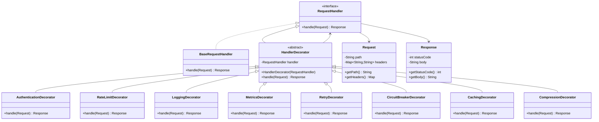

# Distributed Workflow Orchestration Engine (Like Temporal / Airflow) : -

Imagine you're building:

- A distributed workflow engine
- Supports DAG execution
- Supports retries
- Supports parallel execution
- Supports conditional branching
- Supports nested workflows
- Supports rollback (compensation tasks)
- Supports monitoring

This is where Composite becomes extremely powerful.

---

# 🎯 Problem Statement

A Workflow may contain:

- Single atomic tasks
- Sequential groups
- Parallel groups
- Conditional branches
- Nested workflows
- Compensation groups

All must behave uniformly:

```
node.execute(context);
```

Client must NOT care whether it’s:

- Single task
- Parallel group of 50 tasks
- Nested workflow inside another

That is exactly Composite.

---

# 🏗 Architecture Overview

### Component (Common Interface)

`WorkflowNode`

### Leaf

`AtomicTask`

### Composite Types

- `SequentialGroup`
- `ParallelGroup`
- `ConditionalGroup`
- `CompensationGroup`
- `Workflow` (root composite)

Each composite contains children of type `WorkflowNode`.

---

# 🧩 Execution Model (Realistic)

### AtomicTask

- Calls external microservice
- Supports retry
- Logs metrics

### SequentialGroup

- Executes children one by one
- Stops on failure

### ParallelGroup

- Executes children in thread pool
- Waits for completion

### ConditionalGroup

- Evaluates condition
- Executes selected branch

### CompensationGroup

- Runs rollback tasks on failure

---

# 🔥 Why Composite is Mandatory Here

Without Composite:

- You’d need separate execution logic for each structure
- Massive instanceof checks
- Code duplication
- Impossible to scale hierarchy

Composite allows recursive structure.

---

# 📊 UML Diagram (Mermaid) – Advanced Composite System

classDiagram

class WorkflowNode {
    <<interface>>
    +execute(ExecutionContext) void
    +getName() String
}

class AtomicTask {
    -String taskName
    -RetryPolicy retryPolicy
    +execute(ExecutionContext) void
    +getName() String
}

class WorkflowComposite {
    <<abstract>>
    -List~WorkflowNode~ children
    +addNode(WorkflowNode)
    +removeNode(WorkflowNode)
    +execute(ExecutionContext) void
    +getName() String
}

class SequentialGroup {
    +execute(ExecutionContext) void
}

class ParallelGroup {
    -ExecutorService executor
    +execute(ExecutionContext) void
}

class ConditionalGroup {
    -Condition condition
    +execute(ExecutionContext) void
}

class CompensationGroup {
    +execute(ExecutionContext) void
}

class Workflow {
    +execute(ExecutionContext) void
}

class ExecutionContext {
    -Map~String,Object~ data
    +get(String) Object
    +put(String,Object)
}

class RetryPolicy {
    -int maxRetries
    -long backoff
}

class Condition {
    <<interface>>
    +evaluate(ExecutionContext) boolean
}

WorkflowNode <|.. AtomicTask
WorkflowNode <|-- WorkflowComposite

WorkflowComposite <|-- SequentialGroup
WorkflowComposite <|-- ParallelGroup
WorkflowComposite <|-- ConditionalGroup
WorkflowComposite <|-- CompensationGroup
WorkflowComposite <|-- Workflow

WorkflowComposite --> WorkflowNode
AtomicTask --> RetryPolicy
ConditionalGroup --> Condition
WorkflowNode --> ExecutionContext

🚀 Complex Project: API Gateway Middleware Pipeline (Decorator)

---

Uml Diagram : -



# 1️⃣ Core Models

Request.java

```java
import java.util.Map;

public class Request {
    private String path;
    private Map<String, String> headers;

    public Request(String path, Map<String, String> headers) {
        this.path = path;
        this.headers = headers;
    }

    public String getPath() { return path; }
    public Map<String, String> getHeaders() { return headers; }
}
```

**Response.java**

```java
public class Response {
    private int statusCode;
    private String body;

    public Response(int statusCode, String body) {
        this.statusCode = statusCode;
        this.body = body;
    }

    public int getStatusCode() { return statusCode; }
    public String getBody() { return body; }
}
```

---

# 2️⃣ Component Interface

## RequestHandler.java

```java
public interface RequestHandler {
	Response handle(Request request);
}
```

---

# 3️⃣ Concrete Component

## BaseRequestHandler.java

```java
public class BaseRequestHandler implements RequestHandler {

    @Override
    public Response handle(Request request) {
        System.out.println("Processing request at core handler...");
        return new Response(200,"Success from "+request.getPath());
    }
}
```

---

# 4️⃣ Abstract Decorator

## HandlerDecorator.java

```java
public abstract class HandlerDecorator implements RequestHandler {

	protected RequestHandler handler;

	public HandlerDecorator(RequestHandler handler) {
			this.handler = handler;
    }

    @Override
    public Response handle(Request request) {
				return handler.handle(request);
    }
}
```

---

# 5️⃣ Logging Decorator

```java
public class LoggingDecorator extends HandlerDecorator {

		public LoggingDecorator(RequestHandler handler) {
        super(handler);
    }

    @Override
    public Response handle(Request request) {
				System.out.println("[LOG] Incoming request: "+request.getPath());
				Response response = handler.handle(request);
				System.out.println("[LOG] Response status: "+response.getStatusCode());
				return response;
    }
}
```

---

# 6️⃣ Authentication Decorator

```java
public class AuthenticationDecorator extends HandlerDecorator {

		public AuthenticationDecorator(RequestHandler handler) {
		    super(handler);
    }

    @Override
		public Response handle(Request request) {
				if (!request.getHeaders().containsKey("Authorization")) {
							return new Response(401,"Unauthorized");
        }
        return handler.handle(request);
    }
}
```

---

# 7️⃣ Rate Limiting Decorator

```java
import java.util.concurrent.atomic.AtomicInteger;

public class RateLimitDecorator extends HandlerDecorator {

		private AtomicInteger requestCount = new AtomicInteger(0);
    private static final int LIMIT = 5;

    public RateLimitDecorator(RequestHandler handler) {
         super(handler);
    }

    @Override
    public Response handle(Request request) {
         if (requestCount.incrementAndGet() > LIMIT) {
              return new Response(429,"Too Many Requests");
        }
        return handler.handle(request);
    }
}
```

---

# 8️⃣ Retry Decorator

```java
public class RetryDecorator extends HandlerDecorator {

		private int maxRetries = 3;

    public RetryDecorator(RequestHandler handler) {
         super(handler);
    }

    @Override
public Response handle(Request request) {
    int attempts = 0;

    while (attempts < maxRetries) {
          try {
                returnhandler.handle(request);
            } catch (Exception e) {
                 attempts++;
                 System.out.println("[Retry] Attempt "+attempts);
            }
        }
        return new Response(500,"Retries exhausted");
    }
}
```

---

# 9️⃣ Circuit Breaker Decorator

```java
public class CircuitBreakerDecorator extends HandlerDecorator {

     private int failureCount = 0;
     private static final int FAILURE_THRESHOLD = 3;
     private boolean circuitOpen = false;

			public CircuitBreakerDecorator (RequestHandler handler) {
          super(handler);
    }

    @Override
    public Response handle(Request request) {

         if (circuitOpen) {
              returnnewResponse(503,"Service Unavailable (Circuit Open)");
         }
         
         try {
             Response response = handler.handle(request);
             failureCount = 0;
             return response;
        } catch (Exception e) {
            failureCount++;
             if (failureCount >= FAILURE_THRESHOLD) {
                  circuitOpen = true;
                  System.out.println("[CircuitBreaker] Circuit opened!");
            }
            return new Response(500,"Internal Error");
        }
    }
}
```

---

# 🔟 Main.java (Pipeline Assembly)

```java
import java.util.HashMap;
import java.util.Map;

public class Main {
	  public static void main(String [] args) {

			RequestHandler handler = 
			new LoggingDecorator(
			new AuthenticationDecorator(
      new RateLimitDecorator(
      new RetryDecorator(
      new CircuitBreakerDecorator(
      new BaseRequestHandler()
                )))));

		Map<String, String> headers = new HashMap<>();
		headers.put("Authorization","Bearer token");

		Request request = new Request("/api/orders",headers);

		Response response = handler.handle(request);
    System.out.println("Final Response: "+response.getBody());
    }
}
```

# 🔥 How Execution Works (Real Flow)

Imagine this workflow:

```
Root Workflow
 ├── SequentialGroup
 │     ├── ValidateOrderTask
 │     ├── ParallelGroup
 │     │      ├── ChargePaymentTask
 │     │      ├── UpdateInventoryTask
 │     ├── SendConfirmationTask
 ├── CompensationGroup
        ├── RefundTask
        ├── RestoreInventoryTask
```

Client just does:

```
workflow.execute(context);
```

Internally:

- SequentialGroup runs step-by-step
- ParallelGroup uses thread pool
- CompensationGroup triggers on failure

All via same interface.

---

# 🔥 Why This is Enterprise-Level

This design supports:

- Arbitrary nesting depth
- Recursive execution
- Scalable execution
- Dynamic workflow building
- DAG modeling
- Transaction-like rollback
- Plugin execution policies

This is how:

- Airflow DAGs
- Temporal workflows
- Netflix Conductor
- Kubernetes operators

conceptually structure execution trees.

---

# 🧠 Where Composite Shines in This Project

1. Recursive structure
2. Uniform execution
3. Hierarchical composition
4. Removal of conditional logic
5. Open/Closed compliance
6. Dynamic workflow building at runtime

---

# ❌ What Happens Without Composite?

You’d have:

```
if (nodeinstanceofTask)
if (nodeinstanceofParallelGroup)
if (nodeinstanceofConditionalGroup)
```

That becomes a nightmare.

Composite removes that completely.

---

# 🎯 When to Use Composite (Advanced Level)

Use when:

- System is hierarchical
- Structure is recursive
- Objects form tree
- Need uniform operations
- Want extensibility
- Want scalable nesting

---

# ❌ When NOT to Use

Avoid if:

- Structure is flat
- No recursive relationship
- No grouping required
- Adds unnecessary complexity

---

# 🧠 Advanced Insight

Composite often combines with:

- Visitor (for reporting or metrics)
- Strategy (for execution policy)
- Command (task encapsulation)
- Observer (monitoring state)

Enterprise systems use these together.

---

# 🎯 Interview-Level Summary (Strong Answer)

If interviewer asks:

Where would you use Composite in distributed systems?

You say:

> In workflow orchestration engines, rule engines, file systems, and UI trees where hierarchical structures exist and both individual nodes and groups must be treated uniformly. Composite enables recursive composition and scalable architecture.
> 

That’s senior-level thinking.

---

If you want next, I can:

- Add Visitor on top of this system
- Add monitoring & metrics design
- Convert this to event-driven async architecture
- Or compare Composite vs Decorator confusion deeply

Tell me your next level.
