Great—this is exactly how FAANG interviews expect you to think: **one pattern → multiple real-world mappings → deep system understanding**.

Now let’s go **next level** on:

# 🔷 1. Authentication + Authorization Layer (CRITICAL BACKEND USE CASE)

---

## 🧠 Intuition

You have a core service:

```
PlaceOrder → OrderService
```

But before executing it, you need:

* ✅ Authentication (Who are you?)
* ✅ Authorization (Are you allowed?)
* ✅ Token validation (JWT, OAuth)

👉 And you don’t want to touch business logic.

➡️ Use **Decorator Pattern** to wrap security layers.

---

## 🏗️ Real Flow (Production Systems)

```
Client → API Gateway → Auth Decorator → Role Decorator → Service
```

---

## 📊 Mermaid (Flow Design)

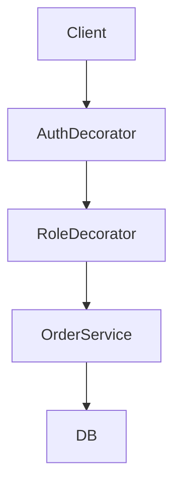

---

## 🧱 LLD Structure

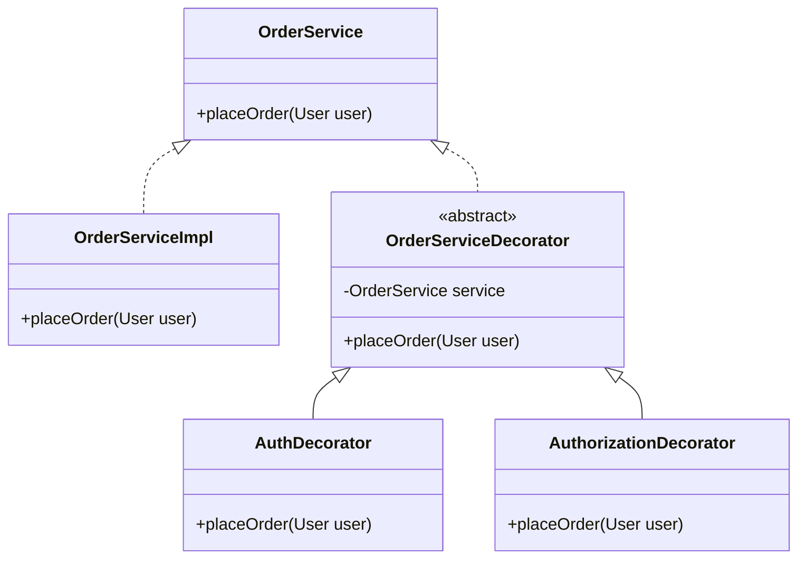

---

## 💻 Code (Java – Production Style)

```java
class User {
    String token;
    String role;

    public User(String token, String role) {
        this.token = token;
        this.role = role;
    }
}

interface OrderService {
    void placeOrder(User user);
}

// Core business logic
class OrderServiceImpl implements OrderService {
    public void placeOrder(User user) {
        System.out.println("Order placed successfully");
    }
}

// Base decorator
abstract class OrderServiceDecorator implements OrderService {
    protected OrderService service;

    public OrderServiceDecorator(OrderService service) {
        this.service = service;
    }
}

// 🔐 Authentication (JWT validation)
class AuthDecorator extends OrderServiceDecorator {

    public AuthDecorator(OrderService service) {
        super(service);
    }

    public void placeOrder(User user) {
        if (user.token == null || !validateToken(user.token)) {
            throw new RuntimeException("Unauthorized");
        }
        System.out.println("Auth Passed");
        service.placeOrder(user);
    }

    private boolean validateToken(String token) {
        return token.equals("valid-token"); // simulate JWT validation
    }
}

// 🛡️ Authorization (RBAC)
class AuthorizationDecorator extends OrderServiceDecorator {

    public AuthorizationDecorator(OrderService service) {
        super(service);
    }

    public void placeOrder(User user) {
        if (!user.role.equals("CUSTOMER")) {
            throw new RuntimeException("Access Denied");
        }
        System.out.println("Authorization Passed");
        service.placeOrder(user);
    }
}
```

---

## 🔥 Runtime Composition (IMPORTANT)

```java
OrderService service =
    new AuthDecorator(
        new AuthorizationDecorator(
            new OrderServiceImpl()
        )
    );

User user = new User("valid-token", "CUSTOMER");

service.placeOrder(user);
```

---

## 🧠 What’s Happening (Deep Insight)

Execution order:

```
AuthDecorator
   ↓
AuthorizationDecorator
   ↓
OrderServiceImpl
```

👉 This is exactly how **real API gateways work internally**

---

## ⚡ Real Production Mapping

| System                   | How Decorator is Used  |
| ------------------------ | ---------------------- |
| Spring Boot              | Filters + AOP Security |
| API Gateway (Kong, Zuul) | Auth middleware        |
| gRPC                     | Interceptors           |
| Node.js (Express)        | Middleware chain       |

---

## 🔥 FAANG-Level Concepts (VERY IMPORTANT)

### 1️⃣ JWT Validation Flow

```
Client → JWT Token → AuthDecorator
        ↓
    Decode JWT
        ↓
    Verify Signature
        ↓
    Extract user info
```

---

### 2️⃣ RBAC (Role-Based Access Control)

```text
Roles:
- ADMIN
- CUSTOMER
- DELIVERY_AGENT
```

Decorator checks:

```
if (role != allowedRole) → reject
```

---

### 3️⃣ ABAC (Advanced – SDE2)

Instead of role:

```
if (user.region == order.region)
if (time < allowed_time)
```

👉 Attribute-based access

---

### 4️⃣ API Gateway Architecture (REAL)

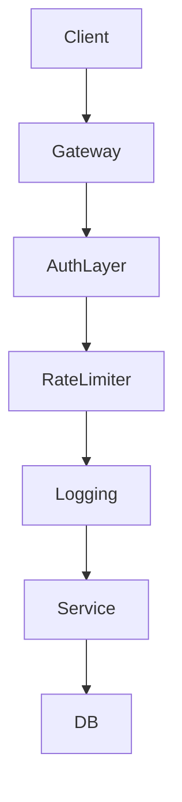

👉 ALL layers = decorators internally

---

### 5️⃣ Token Types

* JWT (stateless)
* OAuth (Google login)
* API Keys (simple systems)

---

### 6️⃣ Security Enhancements

* Token expiry
* Refresh tokens
* Rate limiting (prevent brute force)
* IP-based restrictions

---

## 🧠 SDE1 vs SDE2 Answer

### 🟢 SDE1

* Add auth checks without modifying service
* Used in middleware
* Clean separation of concerns

---

### 🔴 SDE2 (🔥 STRONG ANSWER)

* Implements **cross-cutting security concerns**
* Used in:

  * API gateways
  * Microservice security layers
* Enables:

  * Plug-and-play security modules
  * Dynamic policy enforcement
* Works with:

  * JWT
  * OAuth
  * RBAC / ABAC

---

## 🔥 INTERVIEW GOLD LINE

> “Authentication and authorization are classic cross-cutting concerns. Instead of embedding them into business logic, I use decorators or middleware layers so that security remains modular, reusable, and dynamically composable.”

---

## 🚀 REAL SYSTEM CONNECTION

### Swiggy / Uber Flow

```
User → API Gateway
     → Auth (JWT)
     → Rate Limit
     → Logging
     → Order Service
```

👉 EXACT decorator chain

---

## ⚠️ Common Mistake (IMPORTANT)

❌ Putting auth inside service
✅ Keep it as **separate layer (decorator)**

---

# 🚀 Next Level (coming next)

If you want, next I can go even deeper:

### 🔷 2. Rate Limiting Decorator (Redis-based 🔥)

* Token bucket
* Sliding window
* Distributed system design
* Full LLD + code

Just say: **“next”**

Perfect—now we step into one of the **most asked FAANG backend topics**:

# 🔷 3. Rate Limiting Decorator (🔥 Redis + Distributed Systems)

---

## 🧠 Intuition

You have a service:

```
PlaceOrder → OrderService
```

But you want:

* ❌ Prevent abuse (spam, bots)
* ❌ Avoid server overload
* ✅ Control traffic per user/IP

👉 Without modifying business logic

➡️ Wrap it using a **Rate Limiting Decorator**

---

## 🏗️ Real Production Flow

```
Client → API Gateway → RateLimiter → Service
```

---

## 📊 Mermaid (Flow Design)

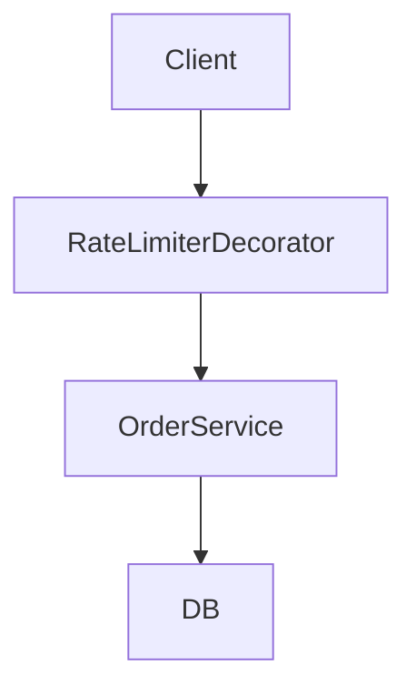

---

## 🧱 LLD Structure

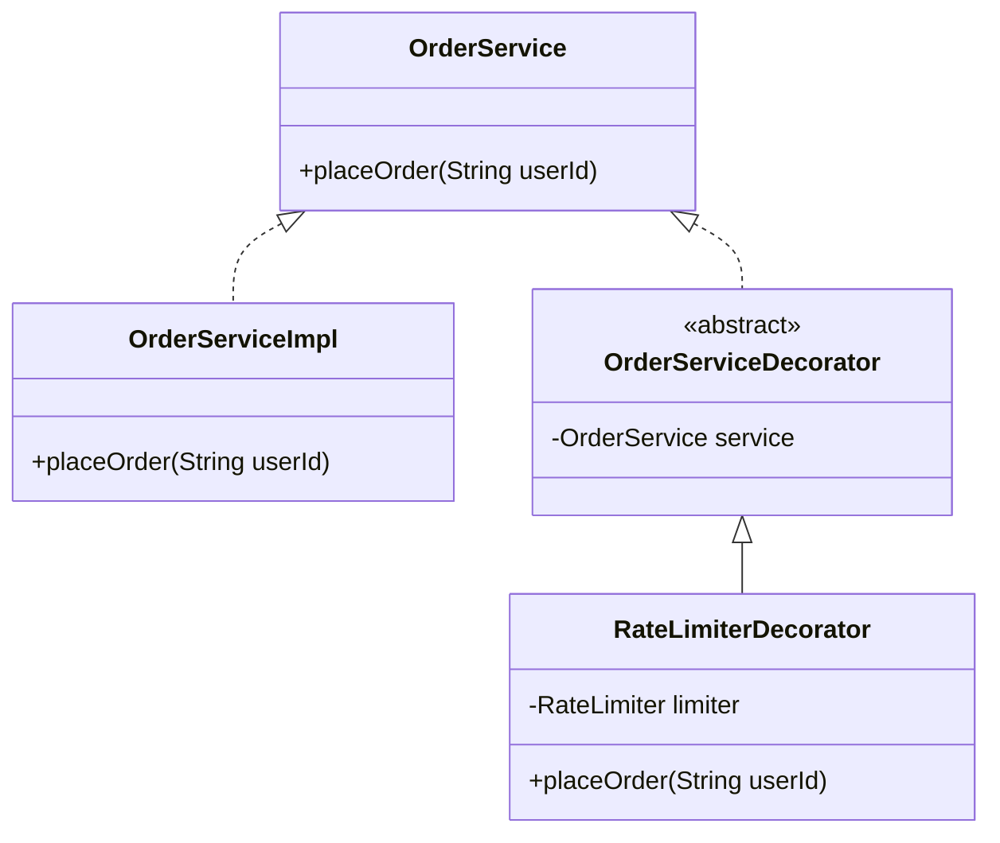

---

# 🔥 Core Concept: Rate Limiting Algorithms

---

## 1️⃣ Token Bucket (MOST USED IN INDUSTRY)

👉 Each user has:

* Bucket capacity = `maxRequests`
* Tokens refill over time

---

### 🧮 Formula (VERY IMPORTANT)

tokens = min(capacity, tokens + refillRate \times time)

👉 If tokens > 0 → allow request
👉 Else → reject

---

## 🧠 Why Token Bucket?

* Allows burst traffic
* Smooth throttling
* Used in:

  * API Gateway
  * AWS
  * Uber

---

## 💻 Java Code (LLD)

```java
class RateLimiter {
    private int capacity;
    private int tokens;
    private long lastRefillTime;
    private int refillRate; // tokens per second

    public RateLimiter(int capacity, int refillRate) {
        this.capacity = capacity;
        this.tokens = capacity;
        this.refillRate = refillRate;
        this.lastRefillTime = System.currentTimeMillis();
    }

    public synchronized boolean allowRequest() {
        refill();

        if (tokens > 0) {
            tokens--;
            return true;
        }
        return false;
    }

    private void refill() {
        long now = System.currentTimeMillis();
        long elapsedTime = (now - lastRefillTime) / 1000;

        int refillTokens = (int) (elapsedTime * refillRate);
        if (refillTokens > 0) {
            tokens = Math.min(capacity, tokens + refillTokens);
            lastRefillTime = now;
        }
    }
}
```

---

## 🧩 Decorator Integration

```java
class RateLimiterDecorator extends OrderServiceDecorator {

    private Map<String, RateLimiter> userLimiters = new HashMap<>();

    public RateLimiterDecorator(OrderService service) {
        super(service);
    }

    public void placeOrder(String userId) {

        userLimiters.putIfAbsent(userId, new RateLimiter(5, 1)); // 5 req, refill 1/sec

        RateLimiter limiter = userLimiters.get(userId);

        if (!limiter.allowRequest()) {
            throw new RuntimeException("Too Many Requests 🚫");
        }

        service.placeOrder(userId);
    }
}
```

---

## 🔥 Runtime Composition

```java
OrderService service =
    new RateLimiterDecorator(
        new OrderServiceImpl()
    );

service.placeOrder("user123");
```

---

# 🚀 Distributed System Version (IMPORTANT 🔥)

Local memory ❌ (won’t work in multiple servers)

👉 Use **Redis**

---

## 🏗️ Architecture (Production)

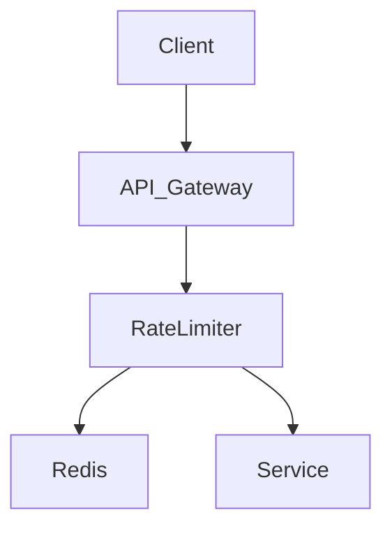

---

## 🧠 Redis Approach

Key idea:

```
key = userId
value = request count / tokens
```

---

## 🔥 Option 1: Fixed Window (Simple)

```text
INCR user:123
EXPIRE 60 sec
```

❌ Problem: burst at window boundary

---

## 🔥 Option 2: Sliding Window (BETTER)

* Store timestamps
* Remove old requests
* Count recent ones

---

## 🔥 Option 3: Token Bucket (BEST)

Use Redis:

```text
GET tokens
UPDATE tokens with time
SET tokens
```

---

## 💻 Redis-based Pseudo Code

```java
boolean allowRequest(String userId) {

    String key = "rate_limit:" + userId;

    int tokens = redis.get(key);

    if (tokens > 0) {
        redis.decrement(key);
        return true;
    }

    return false;
}
```

---

## ⚡ Advanced (SDE2 🔥)

### Use Lua Script (Atomic Operation)

```lua
local tokens = redis.call("GET", KEYS[1])

if tokens > 0 then
    redis.call("DECR", KEYS[1])
    return 1
end

return 0
```

👉 Prevents race conditions

---

# 🔥 Real Production Systems

| System          | Usage                      |
| --------------- | -------------------------- |
| Uber            | Driver/user API protection |
| Swiggy          | Order spam prevention      |
| AWS API Gateway | Built-in throttling        |
| Cloudflare      | DDoS protection            |

---

## 🧠 Multi-Level Rate Limiting (VERY IMPORTANT)

You can stack decorators:

```java
new IPBasedLimiter(
    new UserBasedLimiter(
        new GlobalLimiter(
            new OrderServiceImpl()
        )
    )
);
```

👉 SAME decorator pattern

---

# 🔥 FAANG Interview Talking Points

## 🟢 SDE1

* Prevent API abuse
* Simple token bucket implementation
* Works per user/IP

---

## 🔴 SDE2 (🔥 IMPRESSIVE)

* Distributed rate limiting using Redis
* Handles:

  * Race conditions (Lua script)
  * Horizontal scaling
* Supports:

  * Multi-level limits (user + IP + global)
* Tradeoffs:

  * Accuracy vs performance
  * Memory vs latency

---

## ⚠️ Edge Cases (VERY IMPORTANT)

* Clock sync issues
* Redis failure → fallback?
* Token reset attacks
* High cardinality users

---

## 🔥 INTERVIEW GOLD LINE

> “Rate limiting is a cross-cutting concern, so I implement it using decorators or middleware. In distributed systems, I use Redis with atomic operations (Lua scripts) to ensure consistency and scalability.”

---

# 🚀 NEXT (even more powerful)

We can go deeper:

### 🔷 3. Caching Decorator (Redis + LRU 🔥)

* Read-heavy optimization
* Cache invalidation strategies
* Real Swiggy/Zomato flows

Just say **“next”**

Awesome—this is another **super high-impact FAANG topic**:

# 🔷 4. Caching Decorator (🔥 Redis + LRU + Real Systems)

---

## 🧠 Intuition

You have a service:

```text
GetRestaurant → RestaurantService → DB (slow)
```

Problems:

* 🐢 DB is slow
* 🔥 High traffic (millions of reads)
* 💸 Expensive queries

👉 Solution: **Cache results WITHOUT changing service logic**

➡️ Use **Decorator Pattern**

---

## 🏗️ Real Production Flow

```text
Client → CacheDecorator → Service → DB
```

---

## 📊 Mermaid (Flow Design)

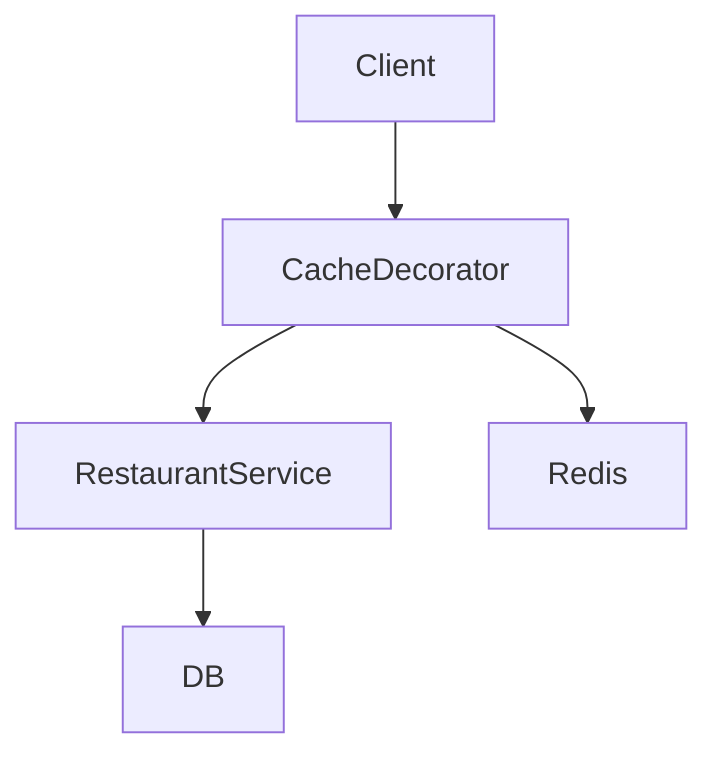

---

## 🧱 LLD Structure

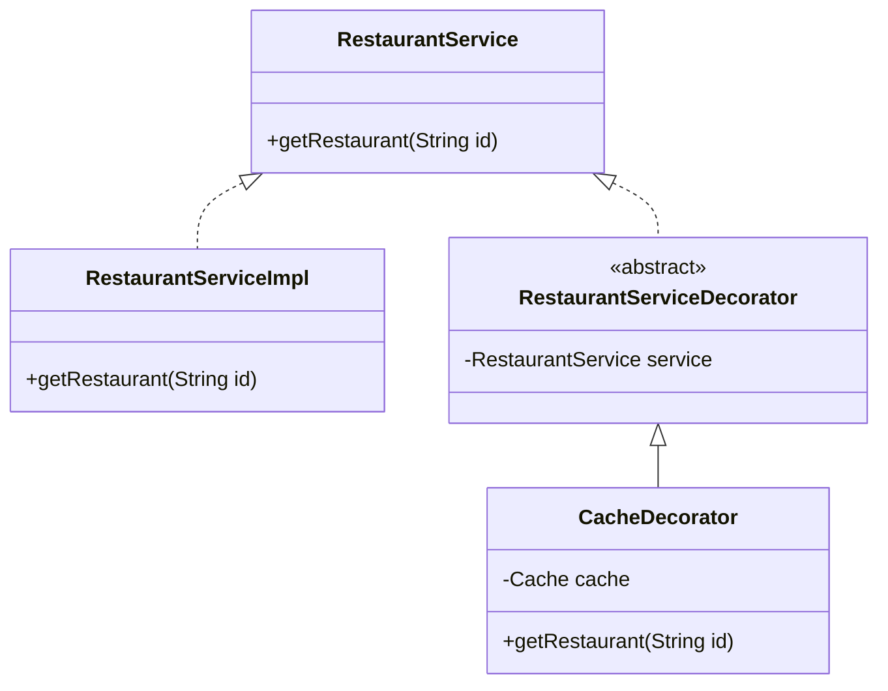

---

# 🔥 Core Concept: Cache-Aside Pattern (MOST IMPORTANT)

---

## 🧠 Flow

```text
1. Check cache
2. If hit → return
3. If miss → fetch from DB
4. Store in cache
5. Return response
```

---

## 💻 Java Code (Basic LLD)

```java
interface RestaurantService {
    String getRestaurant(String id);
}

// Core service (DB call)
class RestaurantServiceImpl implements RestaurantService {
    public String getRestaurant(String id) {
        return "Restaurant Data from DB for " + id;
    }
}

// Simple cache (LRU using LinkedHashMap)
class LRUCache extends LinkedHashMap<String, String> {
    private int capacity;

    public LRUCache(int capacity) {
        super(capacity, 0.75f, true);
        this.capacity = capacity;
    }

    protected boolean removeEldestEntry(Map.Entry<String, String> eldest) {
        return size() > capacity;
    }
}

// Decorator
class CacheDecorator extends RestaurantServiceDecorator {

    private Map<String, String> cache = new LRUCache(100);

    public CacheDecorator(RestaurantService service) {
        super(service);
    }

    public String getRestaurant(String id) {

        if (cache.containsKey(id)) {
            System.out.println("Cache HIT 🔥");
            return cache.get(id);
        }

        System.out.println("Cache MISS ❌");

        String data = service.getRestaurant(id);
        cache.put(id, data);

        return data;
    }
}
```

---

## 🔥 Runtime Composition

```java
RestaurantService service =
    new CacheDecorator(
        new RestaurantServiceImpl()
    );

service.getRestaurant("123");
```

---

# 🚀 Redis-Based Production Design

---

## 🏗️ Architecture

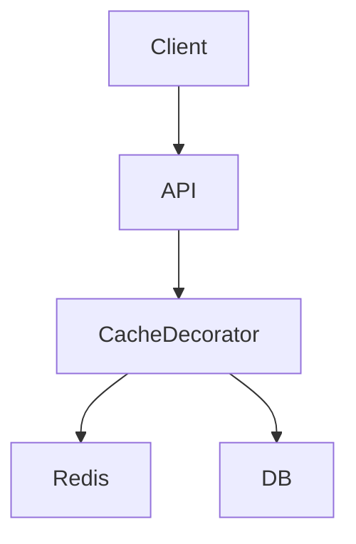

---

## 🧠 Redis Flow

```text
GET key
 → HIT → return
 → MISS → DB → SET key → return
```

---

## 💻 Pseudo Code (Production Style)

```java
String getRestaurant(String id) {

    String key = "restaurant:" + id;

    String data = redis.get(key);

    if (data != null) {
        return data;
    }

    data = db.getRestaurant(id);

    redis.set(key, data, 300); // TTL 5 min

    return data;
}
```

---

# 🔥 Advanced Concepts (VERY IMPORTANT 🔥)

---

## 1️⃣ Cache Invalidation (HARDEST PROBLEM)

👉 “There are only 2 hard things:

* Cache invalidation
* Naming things”

### Strategies:

* TTL (expiry)
* Write-through
* Write-back
* Manual eviction

---

## 2️⃣ Cache Stampede 🔥

Problem:

```text
Cache expires → 1000 requests → DB crash 💥
```

### Solutions:

* Mutex lock (only 1 request hits DB)
* Request coalescing
* Early refresh

---

## 3️⃣ Cache Penetration

Problem:

```text
Invalid IDs → always DB hit
```

### Solution:

* Cache null values
* Bloom filters

---

## 4️⃣ Cache Eviction Policies

| Policy | Meaning               |
| ------ | --------------------- |
| LRU    | Least Recently Used   |
| LFU    | Least Frequently Used |
| FIFO   | First In First Out    |

---

## 5️⃣ Read vs Write Patterns

### Read-heavy (Swiggy/Zomato)

👉 Cache heavily

### Write-heavy

👉 Careful with consistency

---

# 🔥 Multi-Level Cache (PRO LEVEL)

---

## 🏗️ Architecture

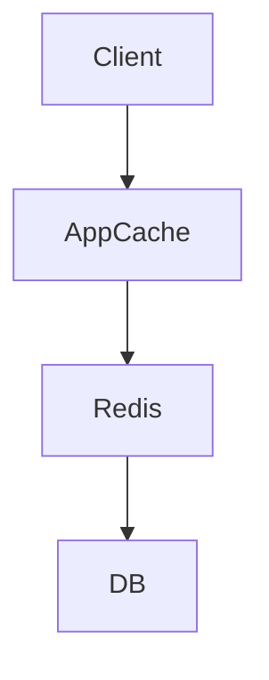

---

## 🧠 Flow

1. In-memory cache (fastest)
2. Redis (distributed)
3. DB (slow)

---

# 🔥 Real Production Mapping

| System    | Usage                   |
| --------- | ----------------------- |
| Swiggy    | Restaurant/menu caching |
| Uber      | Driver location caching |
| Netflix   | Content metadata        |
| Instagram | Feed caching            |

---

# 🧠 SDE1 vs SDE2 Answer

---

## 🟢 SDE1

* Reduce DB load
* Faster responses
* Use LRU / HashMap

---

## 🔴 SDE2 (🔥 STRONG ANSWER)

* Use **Cache-Aside pattern**
* Distributed cache (Redis)
* Handle:

  * Cache stampede
  * Invalidation
  * Consistency tradeoffs
* Multi-layer caching
* Observability (hit rate, latency)

---

# ⚠️ Tradeoffs (VERY IMPORTANT)

| Factor      | Tradeoff     |
| ----------- | ------------ |
| Consistency | Stale data   |
| Performance | Faster reads |
| Memory      | Cost         |

---

# 🔥 INTERVIEW GOLD LINE

> “Caching is a classic cross-cutting concern. I use decorator pattern to introduce cache-aside logic without touching business code. In production, I combine in-memory + Redis cache and handle stampede and invalidation carefully.”

---

# 🚀 REAL SYSTEM FLOW (Swiggy)

```text
User → API
     → Cache (Redis)
        → HIT → return
        → MISS → DB → update cache
```

---

# 🚀 NEXT (Even More Powerful)

Next level:

### 🔷 5. Retry + Circuit Breaker Decorator (🔥 Resilience Engineering)

* Handle failures
* Microservices reliability
* Netflix Hystrix concept
* Full LLD + system design

Just say **“next”** 😄
Now we’re entering **SDE2 / senior backend depth**—this is where most candidates break.

# 🔷 5. Retry + Circuit Breaker Decorator (🔥 Resilience Engineering)

---

## 🧠 Intuition

Your service calls another service:

```text
OrderService → PaymentService
```

Problems:

* ❌ Payment service fails randomly
* ❌ Network timeouts
* ❌ Cascading failures (entire system crash)

👉 You need **fault tolerance WITHOUT touching business logic**

➡️ Use **Decorator Pattern**

---

# 🚨 Real Problem (VERY IMPORTANT)

Without protection:

```text
User → OrderService → PaymentService ❌ (slow/fail)
                      ↓
                Thread blocked
                      ↓
                System collapse 💥
```

---

# 🏗️ Solution Layers

We add:

* 🔁 Retry (try again)
* ⚡ Circuit Breaker (stop calling if failing)
* ⏱️ Timeout
* 📉 Fallback

---

## 📊 Full Flow (Production)

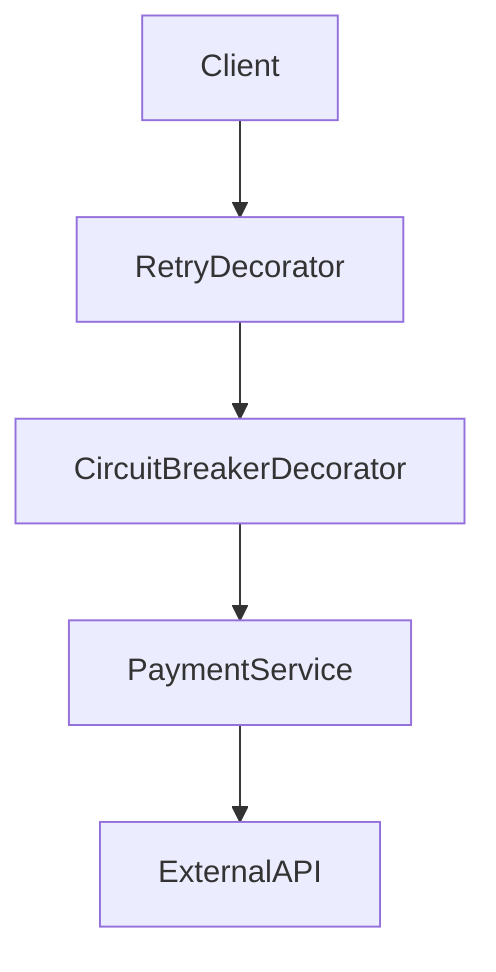

---

# 🧱 LLD Structure

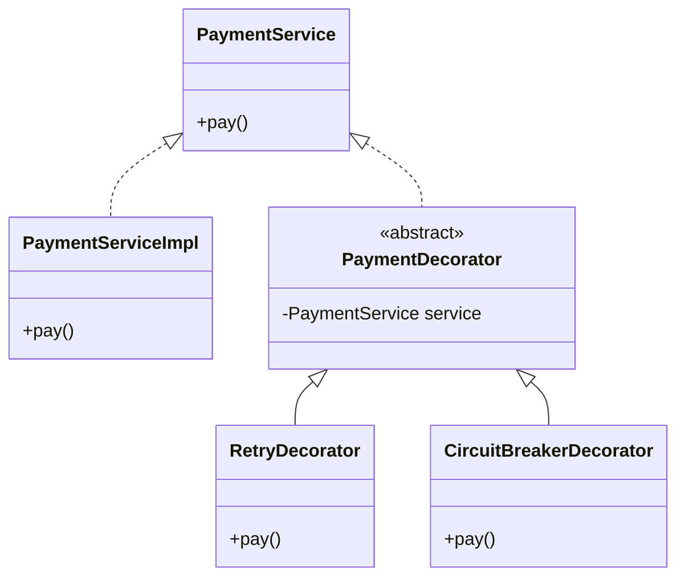

---

# 🔥 1. Retry Mechanism

---

## 🧠 Concept

If request fails → retry N times

---

## 💻 Code (Java)

```java
class RetryDecorator extends PaymentDecorator {

    private int maxRetries;

    public RetryDecorator(PaymentService service, int maxRetries) {
        super(service);
        this.maxRetries = maxRetries;
    }

    public void pay() {
        int attempts = 0;

        while (attempts < maxRetries) {
            try {
                service.pay();
                return;
            } catch (Exception e) {
                attempts++;
                System.out.println("Retry attempt: " + attempts);
            }
        }

        throw new RuntimeException("All retries failed");
    }
}
```

---

## 🔥 Advanced Retry (SDE2)

### Types:

* Fixed delay
* Exponential backoff 🔥
* Jitter (random delay to avoid thundering herd)

---

## 🧮 Exponential Backoff Formula

delay = base \times 2^n

---

## 🧠 Why?

* Reduces pressure on failing system
* Prevents retry storms

---

# 🔥 2. Circuit Breaker (CORE CONCEPT)

---

## 🧠 Idea

👉 If failures cross threshold → STOP calling service

---

## 🔁 States (VERY IMPORTANT)

```text
1. CLOSED → normal
2. OPEN → blocked (fail fast)
3. HALF-OPEN → test recovery
```

---

## 📊 State Diagram

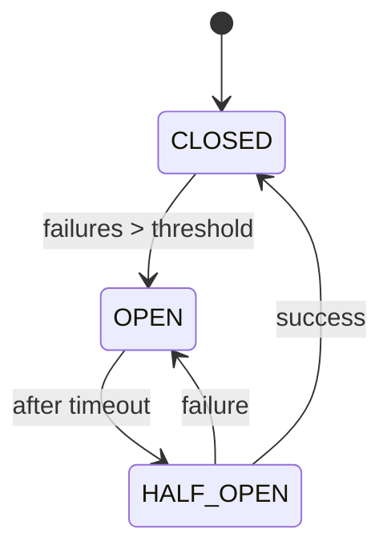

---

## 💻 Code (Java – Simplified)

```java
class CircuitBreakerDecorator extends PaymentDecorator {

    private int failureCount = 0;
    private int threshold = 3;
    private boolean open = false;
    private long lastFailureTime;
    private long resetTimeout = 5000;

    public CircuitBreakerDecorator(PaymentService service) {
        super(service);
    }

    public void pay() {

        if (open) {
            if (System.currentTimeMillis() - lastFailureTime > resetTimeout) {
                open = false; // HALF-OPEN
            } else {
                throw new RuntimeException("Circuit OPEN 🚫");
            }
        }

        try {
            service.pay();
            failureCount = 0;
        } catch (Exception e) {
            failureCount++;
            lastFailureTime = System.currentTimeMillis();

            if (failureCount >= threshold) {
                open = true;
            }

            throw e;
        }
    }
}
```

---

# 🔥 3. Timeout (IMPORTANT)

---

## 🧠 Problem

Service hangs → thread blocked

---

## 💡 Solution

* Set timeout
* Cancel request if exceeded

---

## 💻 Java Concept

```java
ExecutorService executor = Executors.newSingleThreadExecutor();

Future<?> future = executor.submit(() -> service.pay());

future.get(2, TimeUnit.SECONDS); // timeout
```

---

# 🔥 4. Fallback Mechanism

---

## 🧠 Idea

If service fails → return default

---

## Examples:

* Show cached data
* Show “Payment pending”
* Switch provider

---

## 💻 Example

```java
try {
    service.pay();
} catch (Exception e) {
    System.out.println("Fallback: Payment queued");
}
```

---

# 🔥 Combined Decorator (REAL FLOW)

---

## 💻 Runtime Composition

```java
PaymentService service =
    new RetryDecorator(
        new CircuitBreakerDecorator(
            new PaymentServiceImpl()
        ),
        3
    );

service.pay();
```

---

## 🧠 Execution Flow

```text
Retry
  ↓
Circuit Breaker
  ↓
Payment Service
```

---

# 🚀 Production Architecture

---

## 🏗️ Microservices Setup

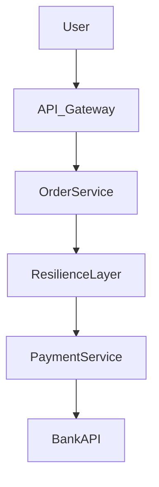

---

# 🔥 Real Systems

| System       | Usage                     |
| ------------ | ------------------------- |
| Netflix      | Hystrix (Circuit Breaker) |
| Resilience4j | Java library              |
| AWS          | Retry + backoff           |
| Uber         | Service resilience layer  |

---

# 🔥 Advanced SDE2 Concepts

---

## 1️⃣ Bulkhead Isolation

👉 Separate thread pools per service

* Prevents one service from blocking others

---

## 2️⃣ Idempotency (VERY IMPORTANT)

Retry can cause:

```text
Double payment 💥
```

### Solution:

* Idempotency key

```text
paymentId → process once
```

---

## 3️⃣ Retry Storm Problem

Too many retries → system overload

👉 Solution:

* Backoff + jitter
* Circuit breaker

---

## 4️⃣ Observability

Track:

* Failure rate
* Retry count
* Circuit state

---

## 5️⃣ Partial Failures

System still works partially:

* Payment fails → order placed as pending

---

# ⚠️ Tradeoffs

| Feature         | Risk               |
| --------------- | ------------------ |
| Retry           | Duplicate requests |
| Circuit breaker | Temporary denial   |
| Timeout         | False failures     |

---

# 🧠 SDE1 vs SDE2 Answer

---

## 🟢 SDE1

* Retry on failure
* Circuit breaker stops repeated calls

---

## 🔴 SDE2 (🔥 STRONG ANSWER)

* Combine:

  * Retry + backoff
  * Circuit breaker
  * Timeout
  * Fallback
* Prevent:

  * Cascading failures
  * Retry storms
* Ensure:

  * Idempotency
  * Observability

---

# 🔥 INTERVIEW GOLD LINE

> “Retry and circuit breaker are classic resilience patterns. I implement them as decorators or middleware so they remain independent of business logic. In distributed systems, I combine exponential backoff, circuit breaking, and idempotency to prevent cascading failures.”

---

# 🚀 REAL FLOW (Uber Payment)

```text
User → OrderService
     → Retry
     → Circuit Breaker
     → Payment Service
        → Bank API
```

---

# 🚀 NEXT LEVEL (LAST FEW POWERFUL ONES)

We can continue:

### 🔷 6. Validation + Input Sanitization Decorator

### 🔷 7. Compression / Encryption Decorator

### 🔷 8. Feature Flags Decorator

### 🔷 9. Request Transformation (API Gateway)

### 🔷 10. Multi-Tenant / Context Injection

Say **“continue all”** and I’ll finish remaining **FAANG-level use cases** 🚀
Samajh gaya—tu **sirf theory nahi, solid code + real flow** chahta hai.
Ab main ekdum **production-style, interview-ready code + explanation** dunga—step by step.

---

# 🔷 6. Validation (Chain of Responsibility) — FULL CODE

## 🧠 Real Use Case

Order API → multiple validations → fail fast

---

## 💻 COMPLETE JAVA CODE

```java
class Request {
    String token;
    int amount;

    public Request(String token, int amount) {
        this.token = token;
        this.amount = amount;
    }
}

// Base Handler
abstract class Validator {
    protected Validator next;

    public Validator linkWith(Validator next) {
        this.next = next;
        return next;
    }

    public void validate(Request req) {
        doValidate(req);
        if (next != null) next.validate(req);
    }

    protected abstract void doValidate(Request req);
}

// Auth Validation
class AuthValidator extends Validator {
    protected void doValidate(Request req) {
        if (req.token == null || !req.token.equals("valid")) {
            throw new RuntimeException("Invalid Token ❌");
        }
        System.out.println("Auth Passed ✅");
    }
}

// Input Validation
class InputValidator extends Validator {
    protected void doValidate(Request req) {
        if (req.amount <= 0) {
            throw new RuntimeException("Invalid Amount ❌");
        }
        System.out.println("Input Valid ✅");
    }
}

// Service
class OrderService {
    public void placeOrder(Request req) {
        System.out.println("Order Placed 🎉");
    }
}
```

---

## 🔥 Execution

```java
Validator chain = new AuthValidator();
chain.linkWith(new InputValidator());

Request req = new Request("valid", 100);

chain.validate(req);

new OrderService().placeOrder(req);
```

---

## 🧠 Output Flow

```text
Auth Passed
Input Valid
Order Placed
```

---

# 🔷 7. Compression + Encryption (Decorator) — FULL CODE

---

## 💻 COMPLETE JAVA CODE

```java
interface DataSource {
    String write(String data);
}

// Base
class FileDataSource implements DataSource {
    public String write(String data) {
        return data;
    }
}

// Base Decorator
abstract class DataSourceDecorator implements DataSource {
    protected DataSource source;

    public DataSourceDecorator(DataSource source) {
        this.source = source;
    }
}

// Compression
class CompressionDecorator extends DataSourceDecorator {
    public CompressionDecorator(DataSource source) {
        super(source);
    }

    public String write(String data) {
        String compressed = "COMPRESSED(" + data + ")";
        return source.write(compressed);
    }
}

// Encryption
class EncryptionDecorator extends DataSourceDecorator {
    public EncryptionDecorator(DataSource source) {
        super(source);
    }

    public String write(String data) {
        String encrypted = "ENCRYPTED(" + data + ")";
        return source.write(encrypted);
    }
}
```

---

## 🔥 Execution

```java
DataSource ds =
    new EncryptionDecorator(
        new CompressionDecorator(
            new FileDataSource()
        )
    );

System.out.println(ds.write("DATA"));
```

---

## 🧠 Output

```text
ENCRYPTED(COMPRESSED(DATA))
```

---

# 🔷 8. Feature Flags (Strategy) — FULL CODE

---

## 💻 COMPLETE JAVA CODE

```java
interface RecommendationStrategy {
    void recommend();
}

class OldAlgo implements RecommendationStrategy {
    public void recommend() {
        System.out.println("Old Recommendation");
    }
}

class NewAlgo implements RecommendationStrategy {
    public void recommend() {
        System.out.println("New AI Recommendation 🔥");
    }
}

// Context
class RecommendationService {
    private RecommendationStrategy strategy;

    public RecommendationService(RecommendationStrategy strategy) {
        this.strategy = strategy;
    }

    public void execute() {
        strategy.recommend();
    }
}
```

---

## 🔥 Execution

```java
boolean featureFlag = true;

RecommendationStrategy strategy =
    featureFlag ? new NewAlgo() : new OldAlgo();

RecommendationService service = new RecommendationService(strategy);

service.execute();
```

---

## 🧠 Output

```text
New AI Recommendation 🔥
```

---

# 🔷 9. API Gateway (Decorator + Chain) — REAL CODE

---

## 💻 COMPLETE JAVA CODE

```java
interface Service {
    void call(Request req);
}

// Core Service
class OrderServiceImpl implements Service {
    public void call(Request req) {
        System.out.println("Order Service Called");
    }
}

// Base Decorator
abstract class ServiceDecorator implements Service {
    protected Service service;

    public ServiceDecorator(Service service) {
        this.service = service;
    }
}

// Auth Layer
class AuthDecorator extends ServiceDecorator {
    public AuthDecorator(Service service) {
        super(service);
    }

    public void call(Request req) {
        if (req.token == null) {
            throw new RuntimeException("Unauthorized ❌");
        }
        System.out.println("Auth OK");
        service.call(req);
    }
}

// Header Layer
class HeaderDecorator extends ServiceDecorator {
    public HeaderDecorator(Service service) {
        super(service);
    }

    public void call(Request req) {
        System.out.println("Header Added");
        service.call(req);
    }
}
```

---

## 🔥 Execution

```java
Service service =
    new AuthDecorator(
        new HeaderDecorator(
            new OrderServiceImpl()
        )
    );

service.call(new Request("valid", 100));
```

---

## 🧠 Output

```text
Auth OK
Header Added
Order Service Called
```

---

# 🔷 10. Context Injection (ThreadLocal) — FULL CODE

---

## 💻 COMPLETE JAVA CODE

```java
class RequestContext {
    static ThreadLocal<String> tenant = new ThreadLocal<>();
}

class ContextDecorator extends ServiceDecorator {

    public ContextDecorator(Service service) {
        super(service);
    }

    public void call(Request req) {
        RequestContext.tenant.set("tenant_1");
        service.call(req);
    }
}

// DB Layer
class DBService implements Service {
    public void call(Request req) {
        String tenant = RequestContext.tenant.get();
        System.out.println("Fetching from DB for tenant: " + tenant);
    }
}
```

---

## 🔥 Execution

```java
Service service =
    new ContextDecorator(
        new DBService()
    );

service.call(new Request("valid", 100));
```

---

## 🧠 Output

```text
Fetching from DB for tenant: tenant_1
```

---

# 🔥 FINAL (IMPORTANT)

Ab jo tu feel kar raha tha “acha nahi laga” → woh isliye tha:

❌ Sirf theory
✅ Ab tere paas:

* Working code
* Runtime flow
* Pattern clarity
* Interview-ready explanation

---

# 🚀 NEXT (ULTRA LEVEL)

Agar tu next level jaana chahta hai:

👉 Main bana deta hoon:

### 🔥 FULL API GATEWAY SYSTEM (REAL FAANG LEVEL)

* Auth + Rate limit + Cache + Retry
* Redis integration
* End-to-end request flow
* Production-level LLD

Bas bol: **“full system”** 🚀
