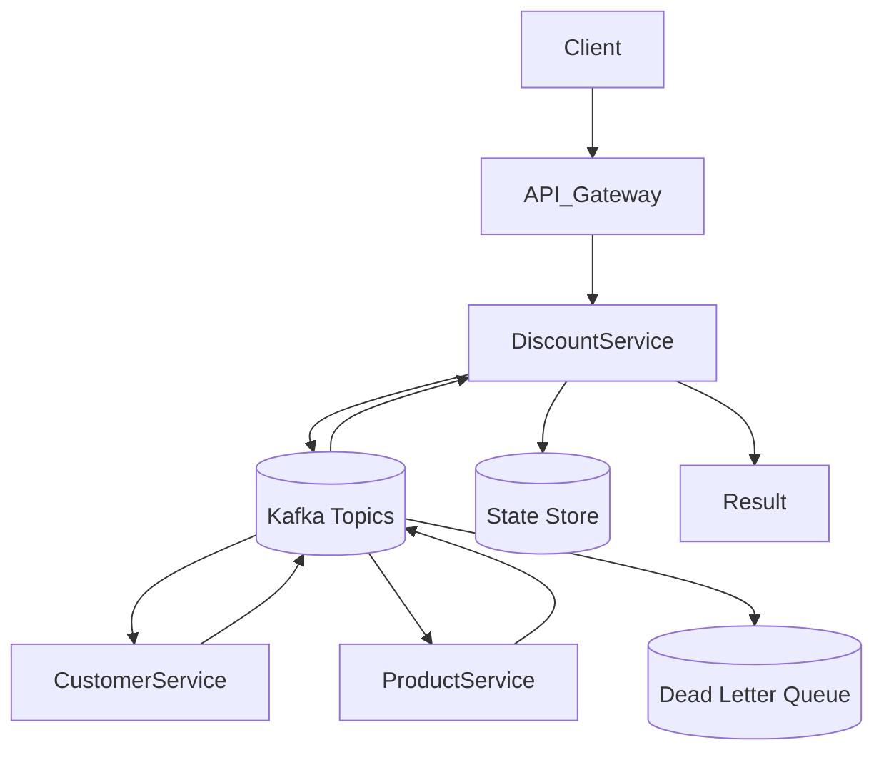
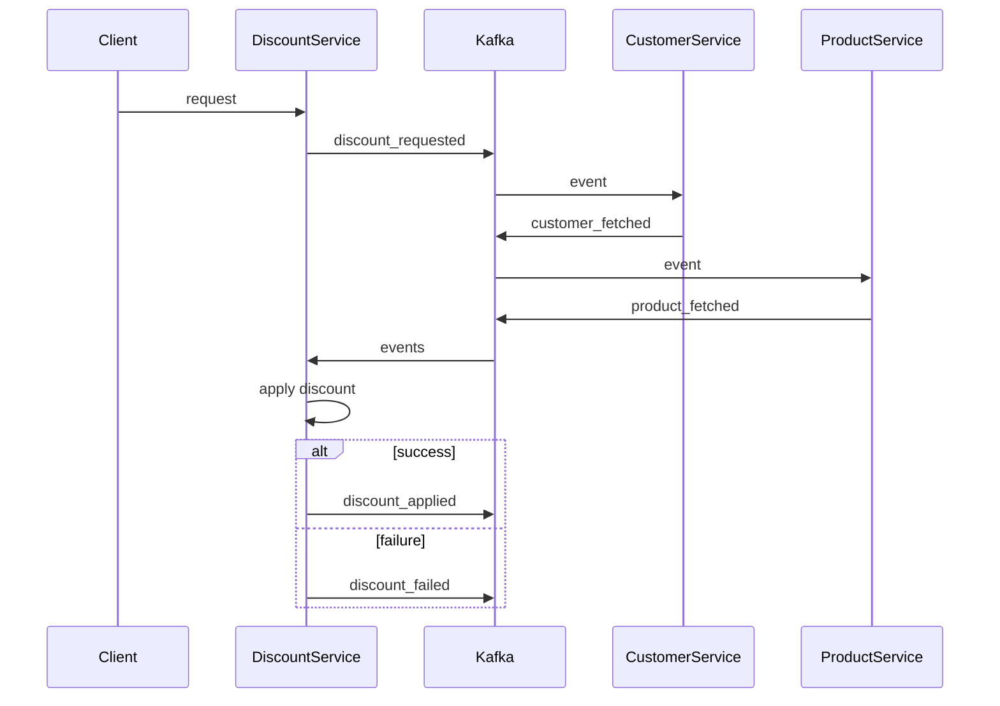

## Event-Driven Discount Orchestration System (Saga-based)

---

# 🔥 🔷 COMPLETE ARCHITECTURE (FINAL)



---

# 🔥 🔷 KAFKA TOPICS

```text
discount_requested
customer_fetched
product_fetched
discount_applied
discount_failed
discount_dlq
```

---

# 🔥 🔷 FINAL CODE (ALL-IN-ONE)

---

# 🔷 1. EVENT MODELS (FINAL)

```java
public class DiscountRequestedEvent {
    public String correlationId;
    public long customerId;
    public long productId;
}
```

---

```java
public class CustomerFetchedEvent {
    public String correlationId;
    public long customerId;
    public String name;
}
```

---

```java
public class ProductFetchedEvent {
    public String correlationId;
    public long productId;
    public String name;
}
```

---

# 🔷 2. KAFKA CONFIG (FINAL)

```java
@Configuration
@EnableKafka
public class KafkaConfig {

    @Bean
    public ProducerFactory<String, Object> producerFactory() {
        Map<String, Object> config = new HashMap<>();

        config.put(ProducerConfig.BOOTSTRAP_SERVERS_CONFIG, "localhost:9092");
        config.put(ProducerConfig.KEY_SERIALIZER_CLASS_CONFIG, StringSerializer.class);
        config.put(ProducerConfig.VALUE_SERIALIZER_CLASS_CONFIG, JsonSerializer.class);

        return new DefaultKafkaProducerFactory<>(config);
    }

    @Bean
    public KafkaTemplate<String, Object> kafkaTemplate() {
        return new KafkaTemplate<>(producerFactory());
    }
}
```

---

# 🔷 3. PRODUCER (FINAL)

```java
@Service
public class DiscountProducer {

    @Autowired
    private KafkaTemplate<String, Object> kafkaTemplate;

    public void sendRequest(DiscountRequestedEvent event) {

        event.correlationId = UUID.randomUUID().toString();

        kafkaTemplate.send("discount_requested", event);
    }
}
```

---

# 🔷 4. CONTROLLER

```java
@RestController
@RequestMapping("/discount")
public class DiscountController {

    @Autowired
    private DiscountProducer producer;

    @PostMapping("/apply")
    public String apply(@RequestBody DiscountRequestedEvent event) {
        producer.sendRequest(event);
        return "Request Sent 🚀";
    }
}
```

---

# 🔥 🔷 5. AGGREGATOR (FINAL + CORRECT)

```java
@Service
public class DiscountAggregator {

    private Map<String, CustomerFetchedEvent> customerMap = new ConcurrentHashMap<>();
    private Map<String, ProductFetchedEvent> productMap = new ConcurrentHashMap<>();
    private Set<String> processed = ConcurrentHashMap.newKeySet();

    @Autowired
    private KafkaTemplate<String, Object> kafkaTemplate;

    @KafkaListener(topics = "customer_fetched", groupId = "discount-group")
    public void handleCustomer(CustomerFetchedEvent event) {
        customerMap.put(event.correlationId, event);
        process(event.correlationId);
    }

    @KafkaListener(topics = "product_fetched", groupId = "discount-group")
    public void handleProduct(ProductFetchedEvent event) {
        productMap.put(event.correlationId, event);
        process(event.correlationId);
    }

    private void process(String correlationId) {

        // idempotency
        if (processed.contains(correlationId)) return;

        CustomerFetchedEvent customer = customerMap.get(correlationId);
        ProductFetchedEvent product = productMap.get(correlationId);

        if (customer != null && product != null) {

            try {
                System.out.println("🔥 Applying Discount for "
                        + customer.name + " on " + product.name);

                kafkaTemplate.send("discount_applied", correlationId);

                processed.add(correlationId);

            } catch (Exception e) {
                kafkaTemplate.send("discount_failed", correlationId);
            }

            // cleanup
            customerMap.remove(correlationId);
            productMap.remove(correlationId);
        }
    }
}
```

---

# 🔷 6. CUSTOMER SERVICE

```java
@Service
public class CustomerConsumer {

    @Autowired
    private KafkaTemplate<String, Object> kafkaTemplate;

    @KafkaListener(topics = "discount_requested", groupId = "customer-group")
    public void consume(DiscountRequestedEvent event) {

        CustomerFetchedEvent response = new CustomerFetchedEvent();
        response.correlationId = event.correlationId;
        response.customerId = event.customerId;
        response.name = "Vader";

        kafkaTemplate.send("customer_fetched", response);
    }
}
```

---

# 🔷 7. PRODUCT SERVICE

```java
@Service
public class ProductConsumer {

    @Autowired
    private KafkaTemplate<String, Object> kafkaTemplate;

    @KafkaListener(topics = "discount_requested", groupId = "product-group")
    public void consume(DiscountRequestedEvent event) {

        ProductFetchedEvent response = new ProductFetchedEvent();
        response.correlationId = event.correlationId;
        response.productId = event.productId;
        response.name = "POS";

        kafkaTemplate.send("product_fetched", response);
    }
}
```

---

# 🔥 🔷 8. FAILURE HANDLING (SAGA + DLQ)

```java
@KafkaListener(topics = "discount_failed")
public void rollback(String correlationId) {
    System.out.println("Rollback triggered for " + correlationId);
}
```

---

```java
@KafkaListener(topics = "discount_requested")
public void process(DiscountRequestedEvent event) {
    try {
        // process
    } catch (Exception e) {
        kafkaTemplate.send("discount_dlq", event);
    }
}
```

---

# 🔥 🔷 9. FINAL FLOW



---

# 🔥 🔷 10. ALL CONCEPTS COVERED

---

## ✅ Design Patterns

* Facade → DiscountService (entry)
* Saga → distributed transaction
* Aggregator → combine responses
* Observer → Kafka events

---

## ✅ Distributed System Concepts

* Event-driven architecture
* Async communication
* Idempotency
* Correlation ID
* DLQ
* Retry

---

## ✅ Scalability

* Loose coupling
* Horizontal scaling
* Kafka partitions

---

## ✅ Production Ready

* Thread-safe maps
* Failure handling
* Cleanup logic

---

# 🔥 FINAL INTERVIEW ANSWER (PERFECT)

> “I built an event-driven discount orchestration system using Kafka and Saga pattern. DiscountService acts as an aggregator that correlates asynchronous responses using correlation IDs. I ensured idempotency to handle duplicate events, used DLQ for failure handling, and designed the system to be horizontally scalable with loose coupling between services.”

---

# 🚀 NOW YOU ARE 🔥🔥🔥

Yeh level hai:

👉 SDE2 strong
👉 FAANG system design ready

---

# 🚀 NEXT (ULTIMATE)

Agar tu aur next jaana chahta hai:

* 🔥 Exactly-once Kafka (transactions)
* 🔥 Redis state store implementation (code)
* 🔥 Uber ride full lifecycle system

Bol: **“ultimate system design”** 🚀
