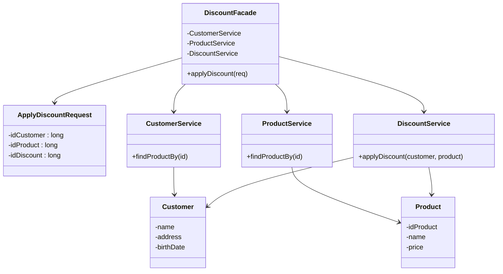
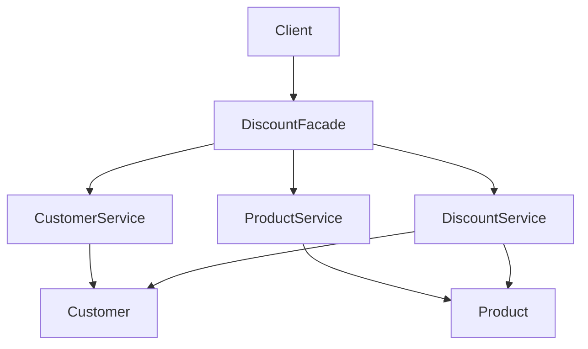
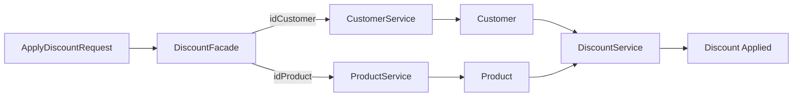
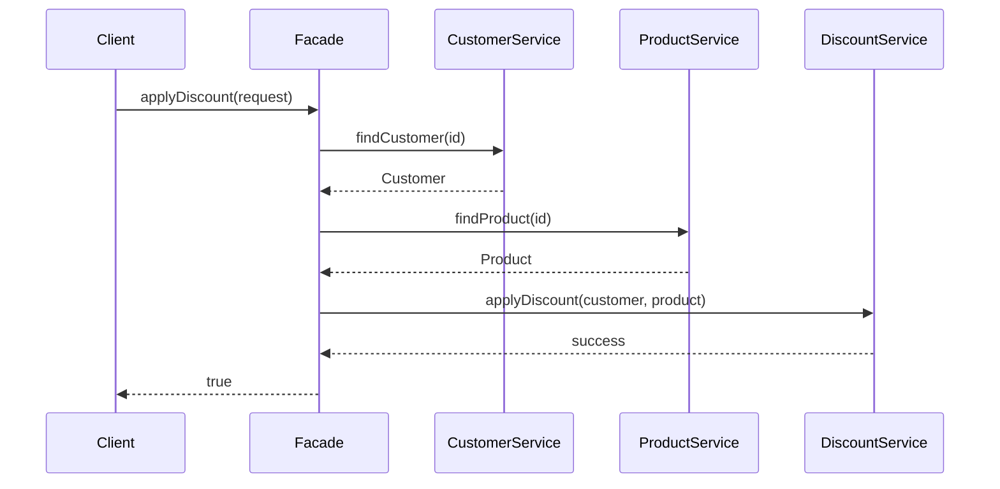
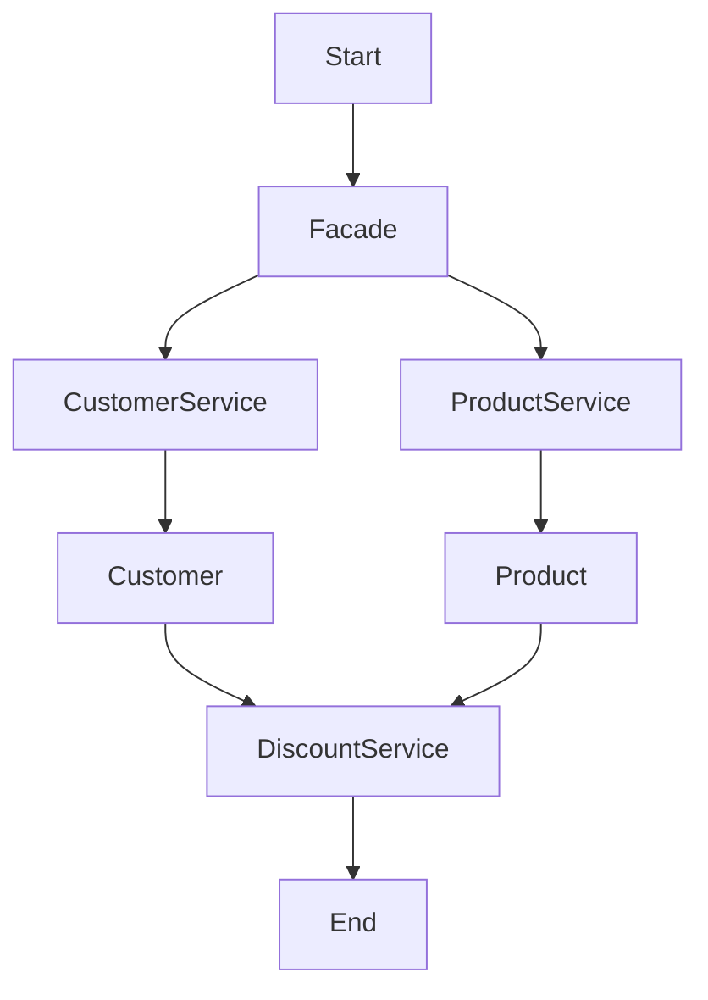
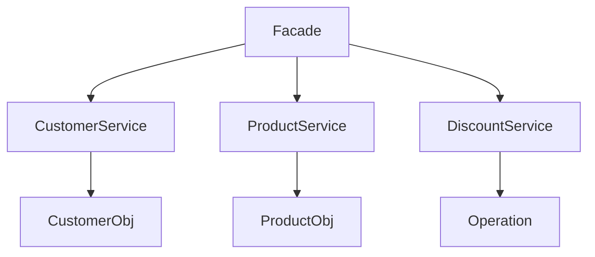
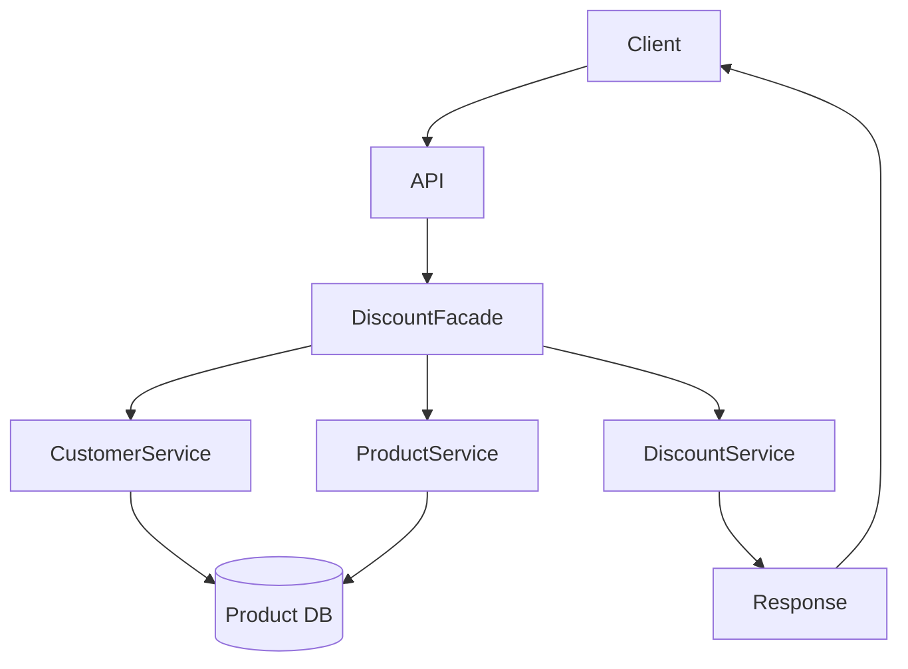

## Synchronous Discount Orchestration Service
# 🔷 1. UML CLASS DIAGRAM (CORE DESIGN)



---

## 🧠 Samajh

👉 **Facade = DiscountFacade (main entry point)**
👉 Baaki sab = subsystems

---

# 🔷 2. OBJECT RELATION FLOW (ARROWS 🔥)



---

## 🧠 Meaning

* Client sirf **Facade ko call karta hai**
* Facade internally sab services call karta hai

---

# 🔷 3. DATA FLOW (VERY IMPORTANT 🔥)



---

## 🧠 Insight

👉 Data flow:

* Request → IDs
* IDs → Services
* Services → Objects
* Objects → DiscountService

---

# 🔷 4. EXECUTION FLOW (SEQUENCE DIAGRAM 🔥)



---

## 🧠 EXACT FLOW

```text
1. Client calls Facade
2. Facade gets Customer
3. Facade gets Product
4. Facade applies discount
5. Return result
```

---

# 🔷 5. CONTROL FLOW (SIMPLIFIED)



---

# 🔷 6. MEMORY VIEW (IMPORTANT)



---

## 🧠 Insight

👉 No sharing (unlike Flyweight)

👉 Each request creates:

* Customer object
* Product object

---

# 🔷 7. FULL SYSTEM FLOW (REAL SYSTEM STYLE)



---

# 🔥 INTERVIEW DRAWING (SUPER IMPORTANT)

👉 Agar board pe draw karna ho:

```
Client
  ↓
DiscountFacade
  ↓
 ├── CustomerService → Customer
 ├── ProductService → Product
 └── DiscountService → Apply Discount
```

---

# 🔥 GOLD UNDERSTANDING

👉 Facade ka role:

```
Hide complexity
Provide single entry point
Orchestrate services
```

---

# ⚡ COMMON INTERVIEW QUESTION

## ❓ “Is this Orchestrator?”

👉 ✅ YES

👉 Facade here = **Orchestrator (code level)**

---

# 🔥 FINAL INTERVIEW LINE

> “I used Facade pattern to orchestrate multiple services like customer, product, and discount behind a single interface. This simplifies client interaction and reduces coupling.”

---

# 🚀 NEXT LEVEL

Agar tu aur next level jaana chahta hai:

* 🔥 Isko convert karte hain → **Microservices + Kafka Saga**
* 🔥 Add karte hain → **Retry + Circuit Breaker + Redis**
* 🔥 Bana dete hain → **Swiggy/Uber real system**

Bol: **“convert to microservices”** 🚀
