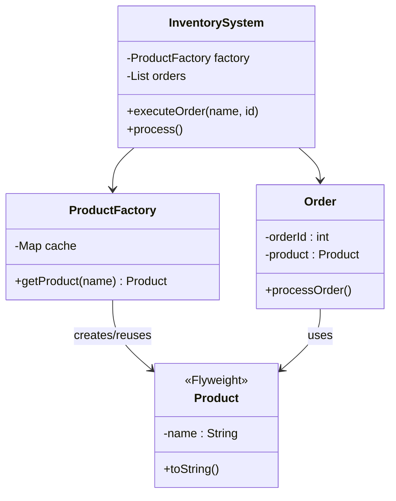
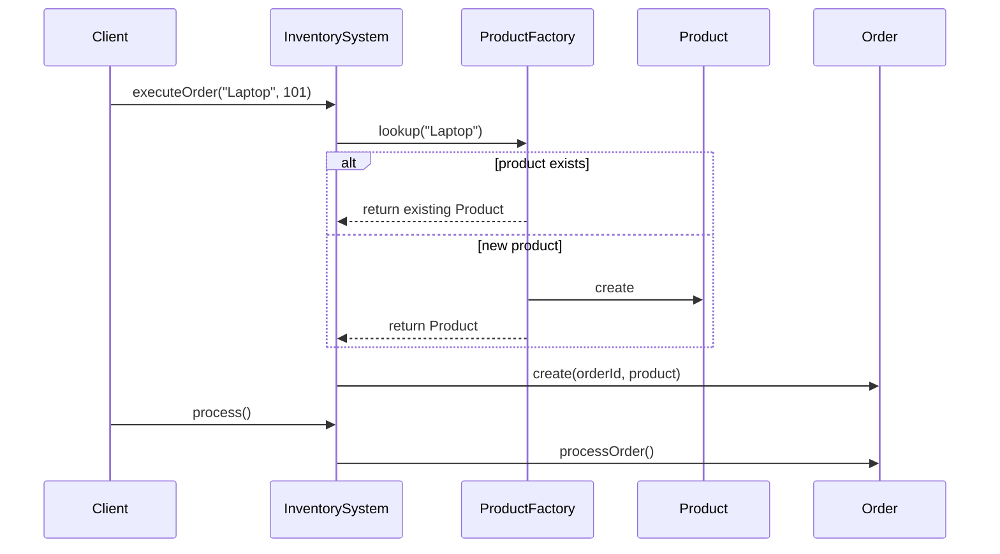
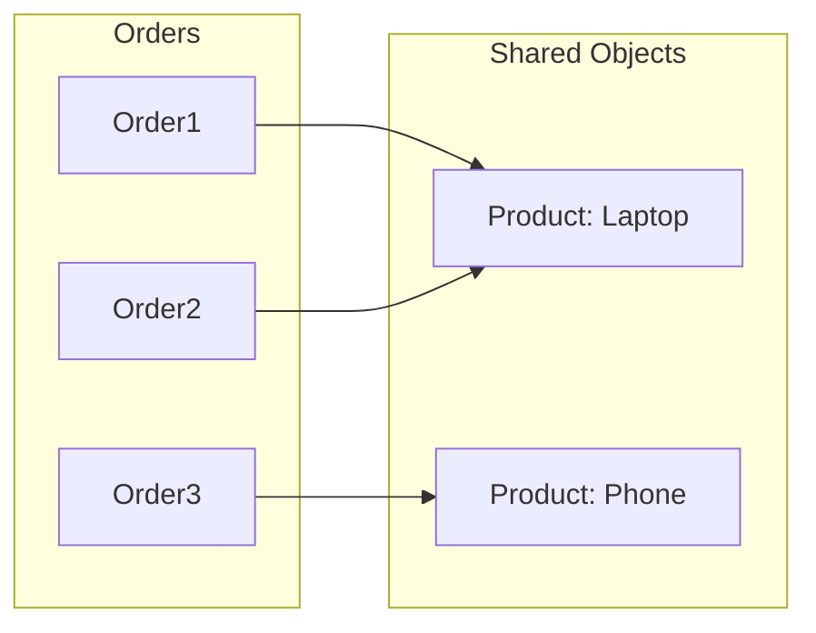
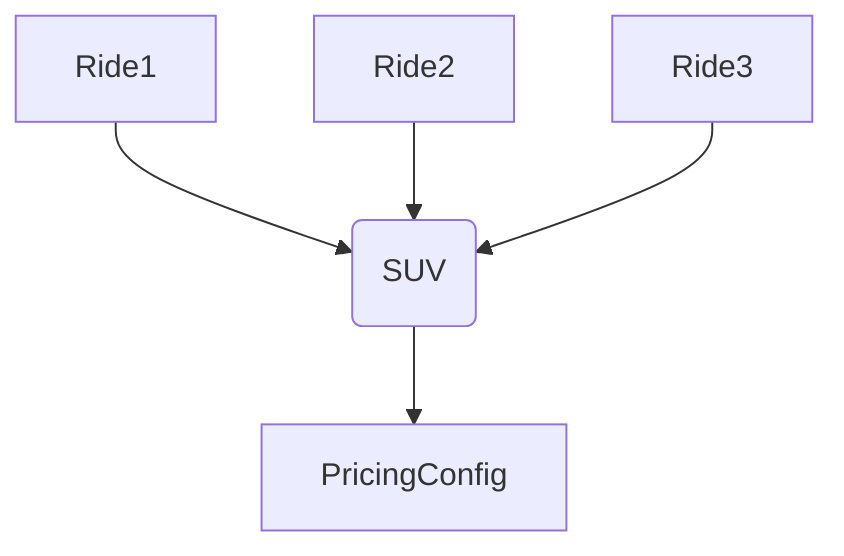
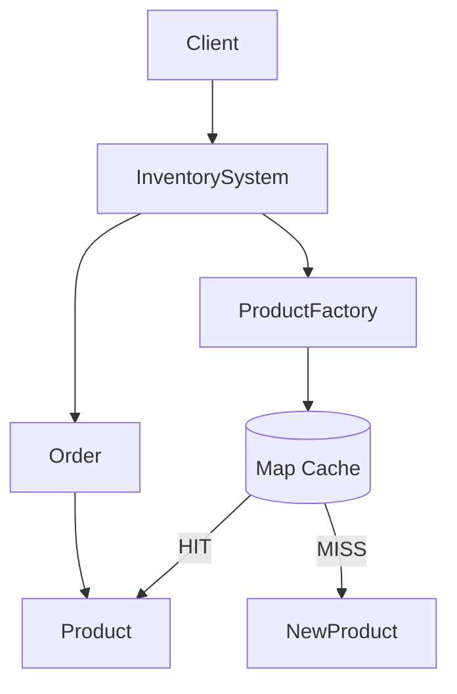

## Product Catalog Deduplication using Flyweight Pattern
# 🔷 1. FLYWEIGHT UML (CORE DESIGN)



---

## 🧠 Samajh kya aa raha hai?

👉 **Product = Flyweight (shared object)**
👉 **ProductFactory = cache manager**
👉 **Order = extrinsic state holder**
👉 **InventorySystem = orchestrator**

---

# 🔷 2. OBJECT RELATION FLOW (ARROWS 🔥)

```mermaid
graph TD

InventorySystem --> ProductFactory
ProductFactory -->|lookup(name)| Product

InventorySystem --> Order
Order --> Product
```

---

## 🧠 Meaning

* InventorySystem calls factory
* Factory returns shared Product
* Order uses that Product

---

# 🔷 3. EXECUTION FLOW (STEP-BY-STEP)



---

# 🔷 4. MEMORY OPTIMIZATION VIEW (VERY IMPORTANT)



---

## 🧠 Key Insight

👉 Multiple orders → SAME product object
👉 Memory saved 🔥

---

# 🔷 5. REAL SYSTEM MAPPING (SWIGGY / UBER)

---

## 🏗️ Uber Mapping



---

## 🧠 Meaning

* VehicleType = Flyweight
* Ride = Extrinsic

---

# 🔷 6. FULL SYSTEM FLOW (WITH CACHE)



---

# 🔥 INTERVIEW DRAWING (IMPORTANT)

Agar interviewer bole “draw Flyweight”

👉 Tu yeh draw kare:

```
Client
  ↓
InventorySystem
  ↓
ProductFactory ───► Map Cache
  ↓                    ↓
Order ───────────────► Product (shared)
```

---

# 🔥 GOLD UNDERSTANDING

👉 Flyweight = **Factory + Cache + Shared Object**

---

# ⚡ MOST IMPORTANT DIFFERENCE (INTERVIEW TRAP)

| Component | Role               |
| --------- | ------------------ |
| Product   | Intrinsic (shared) |
| Order     | Extrinsic (unique) |
| Factory   | Cache manager      |

---

# 🚀 NEXT LEVEL

Agar tu aur strong banna chahta hai:

* 🔥 Flyweight + Redis (distributed version)
* 🔥 Flyweight vs Cache vs Singleton (confusion clear)
* 🔥 Game engine level Flyweight (millions objects)

Bol: **“advanced flyweight”** 🚀
