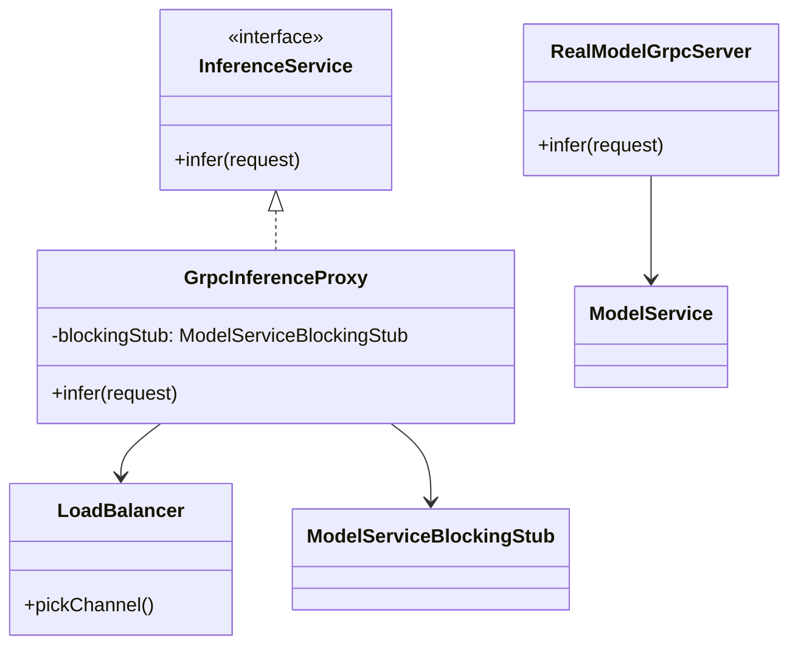

# Example 2 **Distributed Remote Proxy Using gRPC  : -**

**📊 UML – Distributed Remote Proxy**

```mermaid
classDiagram

class InferenceService {
    <<interface>>
    +infer(request)
}

class GrpcInferenceProxy {
    -blockingStub: ModelServiceBlockingStub
    +infer(request)
}

class RealModelGrpcServer {
    +infer(request)
}

class LoadBalancer {
    +pickChannel()
}

InferenceService <|.. GrpcInferenceProxy
GrpcInferenceProxy --> LoadBalancer
GrpcInferenceProxy --> ModelServiceBlockingStub
RealModelGrpcServer --> ModelService
```