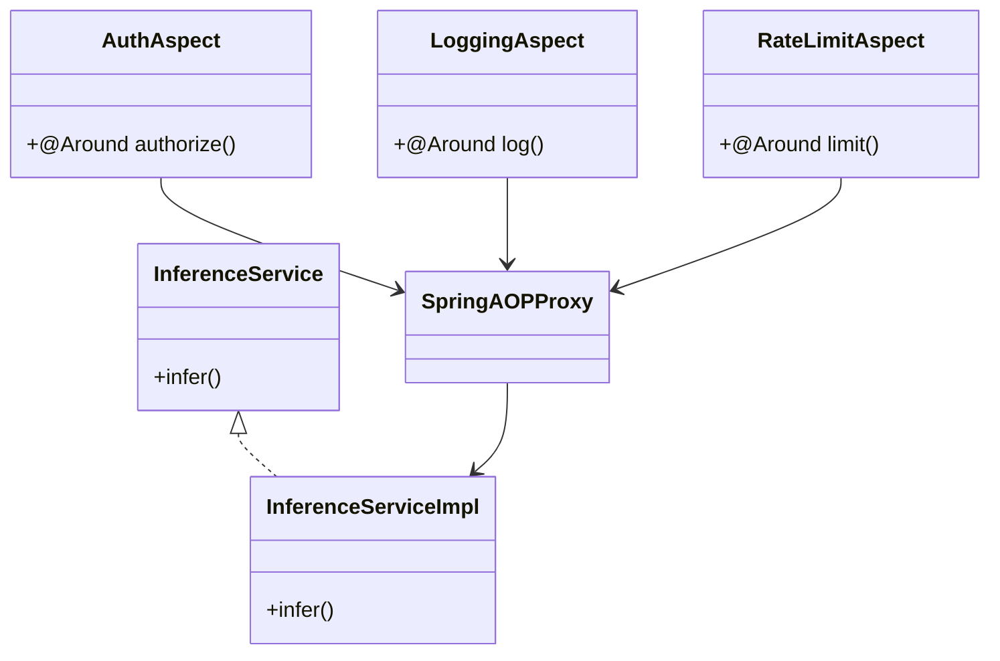
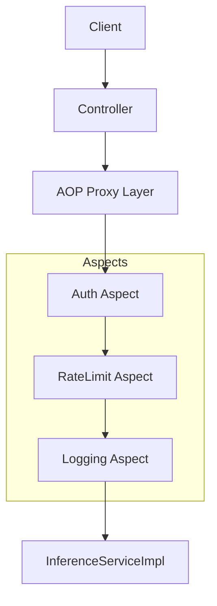

# Example 3 Spring Boot AOP-Based Proxy (Enterprise Grade)

📊 UML – AOP Proxy


Here’s a **FAANG-level, production-style Spring Boot AOP Proxy implementation** for your design 🚀
(clean, scalable, and interview-ready)

---

# 🏗️ 1️⃣ Project Structure (Mental Model)

```
com.example.inference
 ├── controller
 ├── service
 ├── aspect
 ├── config
 └── model
```

---

# 🧩 2️⃣ Core Interface

```java
package com.example.inference.service;

public interface InferenceService {
    String infer(String input);
}
```

---

# ⚙️ 3️⃣ Concrete Implementation (Real Service)

```java
package com.example.inference.service;

import org.springframework.stereotype.Service;

@Service
public class InferenceServiceImpl implements InferenceService {

    @Override
    public String infer(String input) {
        // Simulate heavy AI processing
        return "AI Result: " + input;
    }
}
```

---

# 🔐 4️⃣ Auth Aspect (Protection Proxy)

```java
package com.example.inference.aspect;

import org.aspectj.lang.ProceedingJoinPoint;
import org.aspectj.lang.annotation.*;
import org.springframework.stereotype.Component;

@Aspect
@Component
public class AuthAspect {

    @Around("execution(* com.example.inference.service.InferenceService.*(..))")
    public Object authorize(ProceedingJoinPoint joinPoint) throws Throwable {

        // Simulate auth check
        boolean isAuthorized = true; // Replace with JWT validation

        if (!isAuthorized) {
            throw new RuntimeException("Unauthorized Access");
        }

        return joinPoint.proceed();
    }
}
```

---

# 📊 5️⃣ Logging Aspect (Smart Proxy)

```java
package com.example.inference.aspect;

import org.aspectj.lang.ProceedingJoinPoint;
import org.aspectj.lang.annotation.*;
import org.springframework.stereotype.Component;

@Aspect
@Component
public class LoggingAspect {

    @Around("execution(* com.example.inference.service.InferenceService.*(..))")
    public Object log(ProceedingJoinPoint joinPoint) throws Throwable {

        long start = System.currentTimeMillis();

        Object result = joinPoint.proceed();

        long end = System.currentTimeMillis();

        System.out.println("Method: " + joinPoint.getSignature());
        System.out.println("Execution Time: " + (end - start) + " ms");

        return result;
    }
}
```

---

# 🚦 6️⃣ Rate Limiting Aspect

```java
package com.example.inference.aspect;

import org.aspectj.lang.ProceedingJoinPoint;
import org.aspectj.lang.annotation.*;
import org.springframework.stereotype.Component;

import java.util.concurrent.ConcurrentHashMap;
import java.util.concurrent.atomic.AtomicInteger;

@Aspect
@Component
public class RateLimitAspect {

    private final ConcurrentHashMap<String, AtomicInteger> counter = new ConcurrentHashMap<>();
    private static final int LIMIT = 5;

    @Around("execution(* com.example.inference.service.InferenceService.*(..))")
    public Object limit(ProceedingJoinPoint joinPoint) throws Throwable {

        String key = "global-user"; // Replace with user/tenant ID

        counter.putIfAbsent(key, new AtomicInteger(0));

        if (counter.get(key).incrementAndGet() > LIMIT) {
            throw new RuntimeException("Rate limit exceeded");
        }

        return joinPoint.proceed();
    }
}
```

---

# 🌉 7️⃣ Spring AOP Proxy (Auto-generated by Spring)

👉 No manual code needed
👉 Spring creates proxy using:

* JDK Dynamic Proxy (interface-based)
* CGLIB (class-based)

---

# 🌐 8️⃣ REST Controller (Entry Point)

```java
package com.example.inference.controller;

import com.example.inference.service.InferenceService;
import org.springframework.web.bind.annotation.*;

@RestController
@RequestMapping("/api/infer")
public class InferenceController {

    private final InferenceService inferenceService;

    public InferenceController(InferenceService inferenceService) {
        this.inferenceService = inferenceService;
    }

    @GetMapping
    public String infer(@RequestParam String input) {
        return inferenceService.infer(input);
    }
}
```

---

# ⚙️ 9️⃣ Main Application

```java
package com.example.inference;

import org.springframework.boot.SpringApplication;
import org.springframework.boot.autoconfigure.SpringBootApplication;

@SpringBootApplication
public class InferenceApplication {
    public static void main(String[] args) {
        SpringApplication.run(InferenceApplication.class, args);
    }
}
```

---

# 🧠 How This Maps to Proxy Pattern

| AOP Component    | Proxy Type       |
| ---------------- | ---------------- |
| AuthAspect       | Protection Proxy |
| LoggingAspect    | Smart Proxy      |
| RateLimitAspect  | Control Proxy    |
| Spring AOP Proxy | Dynamic Proxy    |

---

# 🔥 Execution Flow (Runtime)



---

# 🚀 FAANG-Level Enhancements (IMPORTANT)

If interviewer pushes deeper, say:

### ✅ Replace in-memory rate limit

* Redis + Token Bucket

### ✅ Auth

* JWT + Spring Security filter chain

### ✅ Logging

* SLF4J + ELK stack

### ✅ Metrics

* Micrometer + Prometheus + Grafana

### ✅ Distributed tracing

* OpenTelemetry

### ✅ Resilience

* Resilience4j (Circuit Breaker)

---

# 🎯 Killer Interview Line

> “Spring AOP internally uses dynamic proxies to implement cross-cutting concerns like authentication, logging, and rate limiting—making it a real-world implementation of the Proxy pattern.”

---

If you want next level:
👉 I can convert this into **annotation-driven (@Auth, @RateLimit)**
👉 or **Spring Security + filter chain vs AOP comparison (very important for interviews)** 😏
