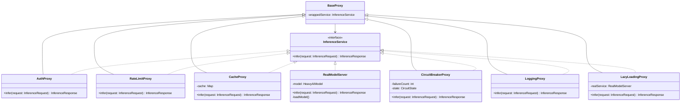
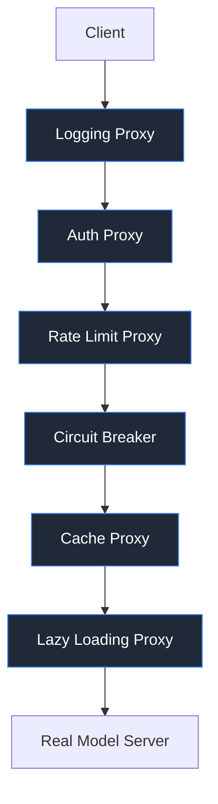

Let’s design something properly complex, interview-level SDE-2/SDE-3 type.

Example 1 :-

## 🚀 Project: Distributed AI Model Inference Platform

(Used internally by multiple microservices for LLM, CV, NLP inference)

### 🎯 Problem Statement

You’re building a **multi-tenant AI inference platform** where:

- Thousands of clients send inference requests
- Models are deployed across multiple GPU clusters
- Some models are heavy (10–40GB)
- Need:
    - Lazy loading
    - Rate limiting per tenant
    - Authentication
    - Caching
    - Circuit breaker
    - Logging & metrics
    - Access control
    - Failover routing

Direct access to model servers is dangerous and expensive.

So we use **Proxy Design Pattern** to control and enhance access to the Real Model Server.

# 🧠 Where Proxy Fits

We will use multiple types of proxy:

1. Virtual Proxy → Lazy model loading
2. Protection Proxy → Auth & RBAC
3. Caching Proxy → Response caching
4. Remote Proxy → Remote model invocation
5. Smart Proxy → Logging, rate limiting, metrics
6. Circuit Breaker Proxy → Fault tolerance

All layered together.

---

# 🏗 High Level Architecture

Client → API Gateway → Inference Proxy → Model Cluster

Proxy sits between client and real model execution.

# 🧩 Core Interfaces

```
interface InferenceService {
    InferenceResponse infer(InferenceRequest request);
}
```

Concrete:

- RealModelServer
- AuthProxy
- RateLimitProxy
- CacheProxy
- CircuitBreakerProxy
- LoggingProxy
- LazyLoadingProxy

---

# 📊 UML Diagram : -



# 🔥 Real World Execution Flow

Request comes:

1. LoggingProxy
2. AuthProxy
3. RateLimitProxy
4. CircuitBreakerProxy
5. CacheProxy
6. LazyLoadingProxy
7. RealModelServer

This is proxy chaining.

# Clean Mental Model



👉 This is basically:
Proxy chain = request processing pipeline

# 🧪 Complex Production-Grade Implementation (Java)

## 1️⃣ Core Interface

```java
public interface InferenceService {
    InferenceResponse infer(InferenceRequest request);
}
```

2️⃣ Real Model Server

```java
public class RealModelServer implements InferenceService {

    private HeavyAIModel model;
    private final String modelName;

    public RealModelServer(String modelName) {
        this.modelName = modelName;
    }

    private synchronized void loadModel() {
        if (model == null) {
            model = new HeavyAIModel(modelName);
            model.initialize();
        }
    }

    @Override
    public InferenceResponse infer(InferenceRequest request) {
        loadModel();
        return model.predict(request);
    }
}
```

3️⃣ Base Proxy

```java
public abstract class BaseProxy implements InferenceService {
    protected final InferenceService wrapped;

    protected BaseProxy(InferenceService wrapped) {
        this.wrapped = wrapped;
    }
}
```

4️⃣ Authentication Proxy (Protection Proxy)

```java
public class AuthProxy extends BaseProxy {

    private final AuthService authService;

    public AuthProxy(InferenceService wrapped, AuthService authService) {
        super(wrapped);
        this.authService = authService;
    }

    @Override
    public InferenceResponse infer(InferenceRequest request) {
        if (!authService.validate(request.getApiKey())) {
            throw new SecurityException("Unauthorized");
        }
        return wrapped.infer(request);
    }
}
```

5️⃣ Rate Limiting Proxy

```java
public class RateLimitProxy extends BaseProxy {

    private final RateLimiter limiter;

    public RateLimitProxy(InferenceService wrapped, RateLimiter limiter) {
        super(wrapped);
        this.limiter = limiter;
    }

    @Override
    public InferenceResponse infer(InferenceRequest request) {
        if (!limiter.allow(request.getTenantId())) {
            throw new RuntimeException("Rate limit exceeded");
        }
        return wrapped.infer(request);
    }
}
```

6️⃣ Caching Proxy

```java
public class CacheProxy extends BaseProxy {

    private final Map<String, InferenceResponse> cache = new ConcurrentHashMap<>();

    public CacheProxy(InferenceService wrapped) {
        super(wrapped);
    }

    @Override
    public InferenceResponse infer(InferenceRequest request) {
        String key = request.hashKey();
        return cache.computeIfAbsent(key, k -> wrapped.infer(request));
    }
}
```

7️⃣ Circuit Breaker Proxy

```java
public class CircuitBreakerProxy extends BaseProxy {

    private int failures = 0;
    private static final int THRESHOLD = 5;
    private boolean open = false;

    public CircuitBreakerProxy(InferenceService wrapped) {
        super(wrapped);
    }

    @Override
    public synchronized InferenceResponse infer(InferenceRequest request) {
        if (open) {
            throw new RuntimeException("Circuit Open");
        }
        try {
            InferenceResponse response = wrapped.infer(request);
            failures = 0;
            return response;
        } catch (Exception e) {
            failures++;
            if (failures >= THRESHOLD) {
                open = true;
            }
            throw e;
        }
    }
}
```

8️⃣ Logging Proxy

```java
public class LoggingProxy extends BaseProxy {

    public LoggingProxy(InferenceService wrapped) {
        super(wrapped);
    }

    @Override
    public InferenceResponse infer(InferenceRequest request) {
        long start = System.currentTimeMillis();
        InferenceResponse response = wrapped.infer(request);
        long end = System.currentTimeMillis();
        System.out.println("Latency: " + (end - start));
        return response;
    }
}
```

🏗 Proxy Assembly (Factory Style) : -

```java
public class InferenceProxyFactory {

    public static InferenceService build(String modelName) {
        InferenceService service = new RealModelServer(modelName);

        service = new CacheProxy(service);
        service = new CircuitBreakerProxy(service);
        service = new RateLimitProxy(service, new RedisRateLimiter());
        service = new AuthProxy(service, new JWTAuthService());
        service = new LoggingProxy(service);

        return service;
    }
}
```

# ⚙️ Why This Is Extremely Complex (Interview Talking Points)

- Multi-layer proxy chaining
- Thread safety
- Distributed rate limiting (Redis)
- Remote proxy extension (gRPC)
- Horizontal scaling
- Lazy GPU allocation
- Model cold-start optimization
- Circuit breaker state management
- Tenant isolation
- Observability (Prometheus, OpenTelemetry)
- Zero trust security model

---

# 🧠 Real Production Upgrade Ideas

If interviewer pushes further:

1. Replace in-memory cache with Redis
2. Distributed circuit breaker state
3. Async inference with CompletableFuture
4. Dynamic proxy generation using Java Reflection
5. Annotation-driven AOP style proxy
6. Load balancing across model replicas
7. Canary deployment support
8. Shadow traffic testing
9. Auto scaling hooks
10. GPU resource pool management

---

# 🎯 When To Use Proxy Pattern (Real SDE Insight)

Use Proxy when:

- Access control required
- Expensive object creation
- Remote invocation
- Logging/monitoring needed
- Caching required
- Failover handling needed
- Lazy initialization required

Avoid when:

- No behavior augmentation needed
- Simple delegation enough
- Decorator is more appropriate