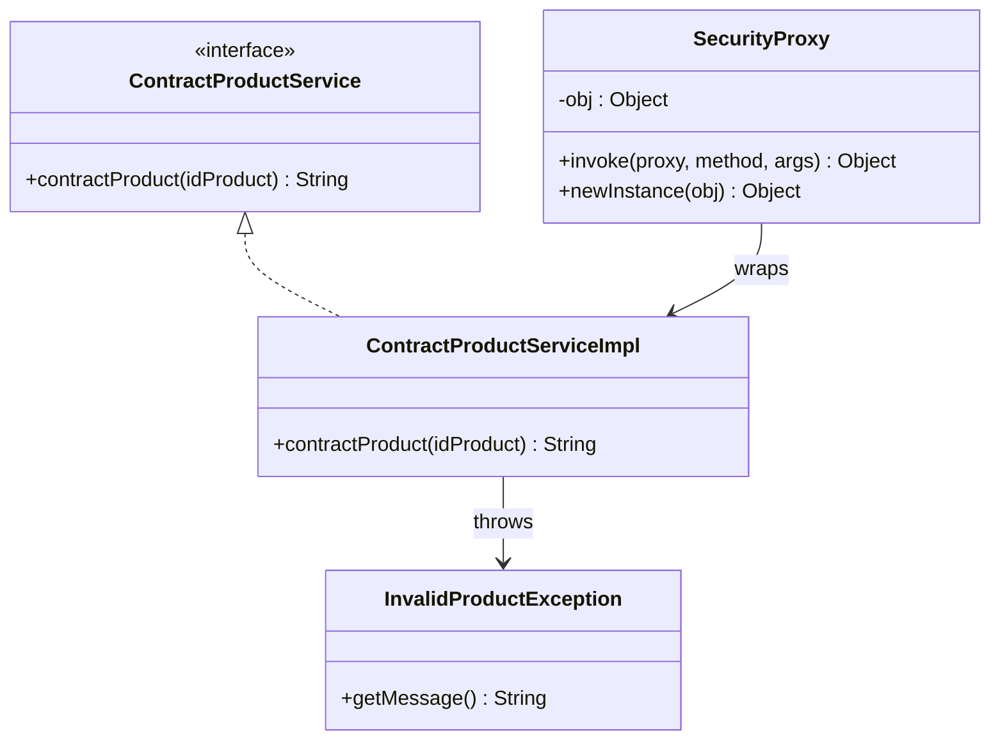
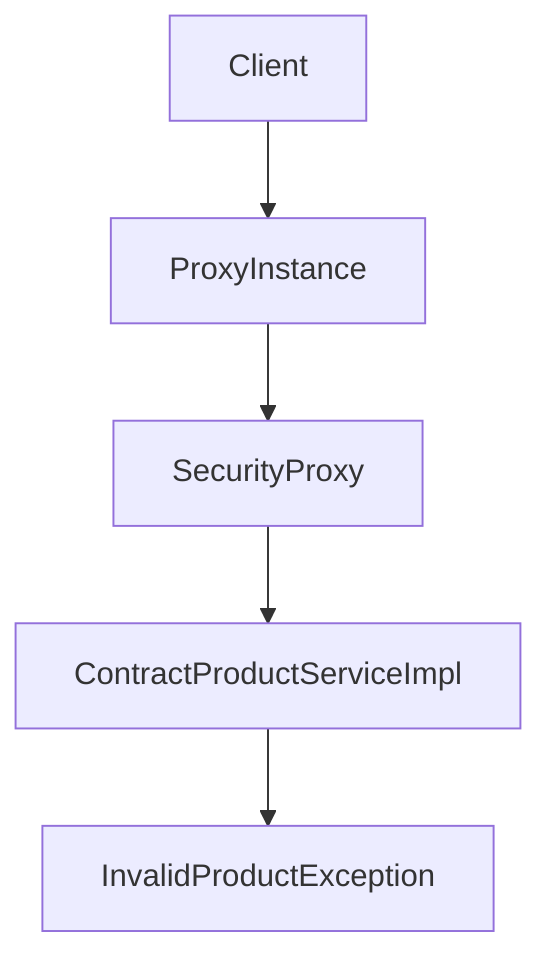
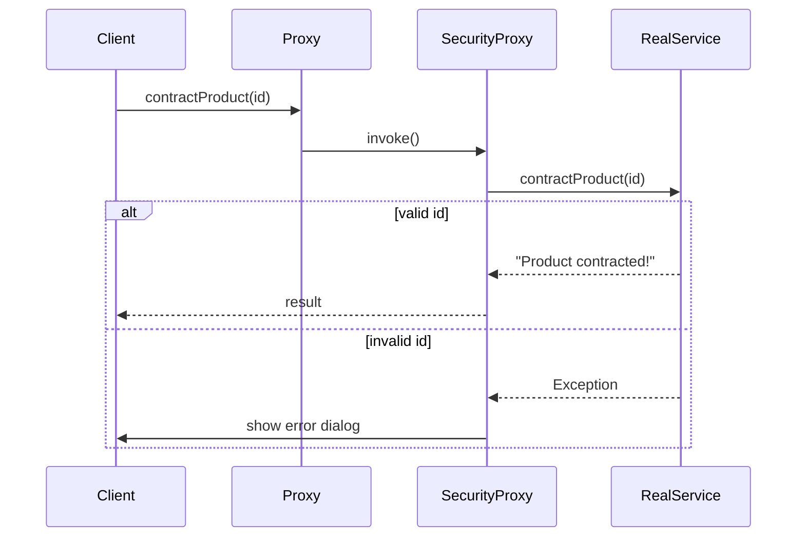
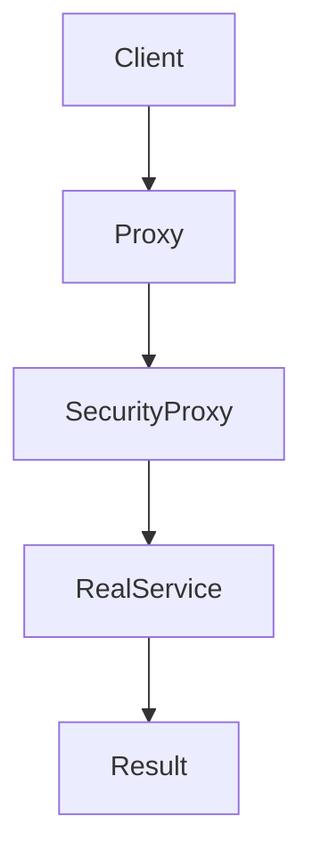
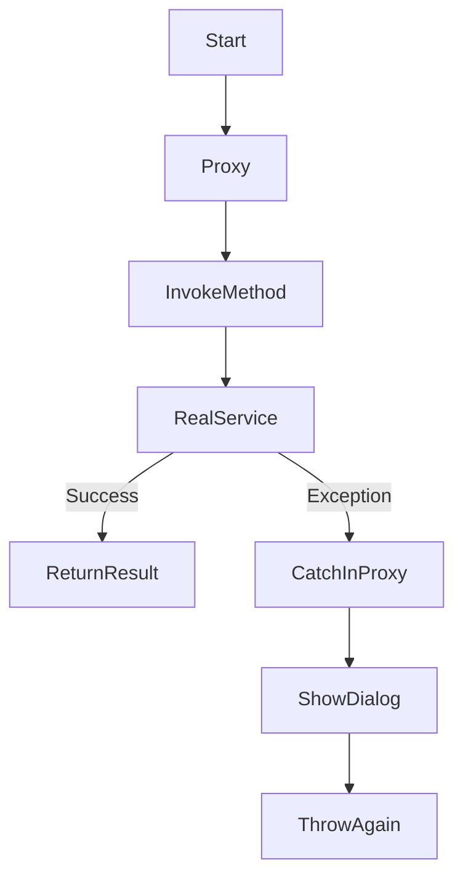
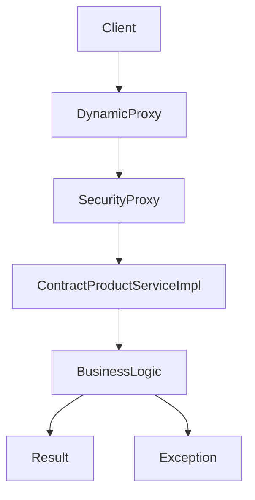

Perfect 🔥 — tu ab **Proxy Pattern (dynamic proxy)** ka UML chahta hai with proper arrows & relations.
Main tujhe **clean + interview-ready UML + flow diagrams** deta hoon for your exact code.

---

# 🔷 1. UML CLASS DIAGRAM (CORE PROXY DESIGN)



---

## 🧠 Samajh

👉 `ContractProductService` → interface
👉 `ContractProductServiceImpl` → real object
👉 `SecurityProxy` → proxy (dynamic)
👉 Proxy wraps real object

---

# 🔷 2. OBJECT RELATION FLOW (IMPORTANT 🔥)



---

## 🧠 Meaning

* Client doesn’t call real service directly
* Client → Proxy → Real Object

---

# 🔷 3. EXECUTION FLOW (SEQUENCE DIAGRAM 🔥)



---

# 🔷 4. CALL FLOW (SIMPLIFIED)



---

# 🔷 5. CONTROL FLOW WITH EXCEPTION 🔥



---

## 🧠 Insight

👉 Proxy adds:

* Exception handling
* UI feedback (JOptionPane)

---

# 🔷 6. FULL SYSTEM VIEW



---

# 🔥 INTERVIEW DRAWING (IMPORTANT)

👉 Board pe aise draw kar:

```text
Client
  ↓
Proxy (Dynamic Proxy)
  ↓
SecurityProxy (InvocationHandler)
  ↓
Real Service (ContractProductServiceImpl)
```

---

# 🔥 GOLD UNDERSTANDING

👉 Proxy ka role:

```text
Control access to real object
Add behavior before/after call
```

---

# ⚡ TYPE OF PROXY (VERY IMPORTANT)

👉 Tera example:

## ✅ **Dynamic Proxy (Java Reflection)**

---

# 🔥 WHAT PROXY IS DOING HERE

| Feature            | Role                 |
| ------------------ | -------------------- |
| Security           | Intercept call       |
| Exception handling | Catch + show message |
| Control            | Forward call         |

---

# 🔥 INTERVIEW LINE

> “This is a dynamic proxy using InvocationHandler, where method calls are intercepted before reaching the actual implementation. It allows adding cross-cutting concerns like security and exception handling without modifying the core service.”

---

# 🚀 NEXT LEVEL

Agar tu aur deep jaana chahta hai:

* 🔥 Proxy vs Decorator vs AOP (confusing 🔥)
* 🔥 Spring AOP internally same kaise hota hai
* 🔥 Real API Gateway proxy system

Bol: **“proxy deep dive”** 🚀
